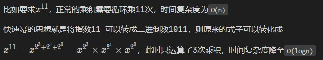

# 第二章、剑指offer(11~20)

## 11、旋转数组的最小数字

::: tip easy

把一个数组最开始的若干个元素搬到数组的末尾，我们称之为数组的旋转。

给你一个可能存在 **重复** 元素值的数组 `numbers` ，它原来是一个升序排列的数组，并按上述情形进行了一次旋转。请返回旋转数组的**最小元素**。例如，数组 `[3,4,5,1,2]` 为 `[1,2,3,4,5]` 的一次旋转，该数组的最小值为 1。

注意，数组 `[a[0], a[1], a[2], ..., a[n-1]]` 旋转一次 的结果为数组 `[a[n-1], a[0], a[1], a[2], ..., a[n-2]]` 。

```
示例 1：
输入：numbers = [3,4,5,1,2]
输出：1

示例 2：
输入：numbers = [2,2,2,0,1]
输出：0

提示：
- n == numbers.length
- 1 <= n <= 5000
- -5000 <= numbers[i] <= 5000
- numbers 原来是一个升序排序的数组，并进行了 1 至 n 次旋转
```

注意：本题与主站 154 题相同：https://leetcode-cn.com/problems/find-minimum-in-rotated-sorted-array-ii/

:::

归结到底还是查找数组最小值，通过的查找方法也适用

跟据题意，数组是升序->最小值->升序的规律，那么只需要拿第一个值记作n，遍历数组，出现的第一个小于n的数字即为最小值

特殊情况，遍历一遍没有发现比n小的数字，那么n就是最小值

```java
class Solution {
    public int minArray(int[] numbers) {
        int first = numbers[0];
        for (int i = 1; i < numbers.length; i++) {
            if(numbers[i] < first){
                return numbers[i];
            }
        }
        return first;
    }
}
```

## 12、矩阵中的路径

::: warning medium

给定一个 `m x n` 二维字符网格 `board` 和一个字符串单词 `word` 。如果 `word` 存在于网格中，返回 `true` ；否则，返回 `false` 。

单词必须按照字母顺序，通过相邻的单元格内的字母构成，其中“相邻”单元格是那些水平相邻或垂直相邻的单元格。同一个单元格内的字母不允许被重复使用。

例如，在下面的 3×4 的矩阵中包含单词 "ABCCED"（单词中的字母已标出）。


```
示例 1：
输入：board = [["A","B","C","E"],["S","F","C","S"],["A","D","E","E"]], word = "ABCCED"
输出：true

示例 2：
输入：board = [["a","b"],["c","d"]], word = "abcd"
输出：false

提示：
- m == board.length
- n = board[i].length
- 1 <= m, n <= 6
- 1 <= word.length <= 15
- board 和 word 仅由大小写英文字母组成
```

**注意**：本题与主站 79 题相同：https://leetcode-cn.com/problems/word-search/

:::

首先找到目标字符串首字母的格子，再遍历周边是否有第二个字母的格子，主要是终止条件的设置

```java
class Solution {
    boolean res = false;
    int n, m, len;
    boolean[][] f;
    char[] s;
    char[][] b;

    public boolean exist(char[][] board, String word) {
        b = board;
        s = word.toCharArray();
        // 目标串的长度
        len = s.length;
        n = board.length;
        m = board[0].length;
        // 标记搜索的过程中格子是否被使用过
        f = new boolean[n][m];

        // 找到与目标串第一个字符相同的格子，开始搜索
        for(int i = 0; i < n ; i ++){
            for(int j = 0; j < m; j ++){
                if(s[0] == board[i][j]){
                    f[i][j] = true;
                    dfs(1, i, j);
                    f[i][j] = false;
                }
                // 每次搜索后判断是否已经找到
                if(res){
                    return true;
                }
            }
        }
        return false;
    }

    public void dfs(int u, int i, int j){

        // u == len 终止条件
        // res  如果已经找到，则直接return (剪枝)

        // 这里要加res的原因主要是为了剪去不需要的搜索
        // 这里是优化了后面代码中的一个dfs搜索
        // 如果在某一次循环中找到了结果，就直接退出
        // 如果没加上res判断，由于要判断四个方格，程序会继续判断下一个方格，这里就是无用的搜索，直接剪去即可
        if(u == len || res){
            res = true;
            return;
        }

        // 方向数组
        int[] dx = {0, 1, 0, -1}, dy = {1, 0, -1, 0};

        for(int d = 0; d < 4; d ++){
            int x = i + dx[d], y = j + dy[d];

            // 坐标越界 或者 当前格子已经被使用了  就直接结束此次循环
            if(x < 0 || y < 0 || x >= n || y >= m || f[x][y]){
                continue;
            }

            if(b[x][y] == s[u]){
                // 标记被使用
                f[x][y] = true;
                // 这里找到答案回溯后，下一个循环会继续进入dfs函数
                // 也就是在下一个循环做无用的搜索，这里也是为什么要判断res的原因
                // 或者你可以在这行代码之后判断res，然后退出
                dfs(u + 1, x, y);
                // 恢复现场
                f[x][y] = false;
            }
        }
    }
}
```

### 知识点1、数组迷宫类遍历

使用以下语句即可清晰的依次遍历格子的上下左右4个临格，如果要遍历周边包括对角的8个格子也是同理的

```java
int[] dx = {0, 1, 0, -1}, dy = {1, 0, -1, 0};
// d的值为[0,3]
int x = i + dx[d], y = j + dy[d];
```

## 13、机器人的运动范围

::: warning medium

地上有一个m行n列的方格，从坐标 `[0,0]` 到坐标 `[m-1,n-1]` 。一个机器人从坐标 `[0, 0] `的格子开始移动，它每次可以向左、右、上、下移动一格（不能移动到方格外），也不能进入行坐标和列坐标的数位之和大于k的格子。例如，当k为18时，机器人能够进入方格 [35, 37] ，因为3+5+3+7=18。但它不能进入方格 [35, 38]，因为3+5+3+8=19。请问该机器人能够到达多少个格子？

```
示例 1：
输入：m = 2, n = 3, k = 1
输出：3

示例 2：
输入：m = 3, n = 1, k = 0
输出：1

提示：
- 1 <= n,m <= 100
- 0 <= k <= 20
```

:::

这一题相当于我们在一个矩阵中找到合适的点，求得总共有多少点即可

- 我们从（0，0）出发，首先需要满足的是在“矩阵”中，并且行坐标和列坐标的数位之和必须小于等于k,（base case）
- 如果满足上述条件，说明这个格子符合题意，我们直接res++
- 然后我们只需要调用我们的dfs函数，向他的上下左右四个方向分别寻找即可。

如果我们直接这样做，肯定会导致时间超出，因为我们没有做“剪枝”处理，我们走过的路肯定不能重复走啊对吧。所以我们需要标记我们走过的路，显然一个二维的Boolean类型的数组最为合适。我们只需要在走过之后，把当前坐标对应的数组的坐标置为true，下次判断前，我们先判断是否走过这条路即可

这一类问题主要就是2个点：

- 递归
- 剪枝

```java
class Solution {
    int res = 0;
    public int movingCount(int m, int n, int k) {
        //用来做标记的数组
        boolean[][] arr = new boolean[m][n];
        dfs(0,0,m,n,k,arr);
        return res;
    }
    public void dfs(int i, int j,int m,int n,int k,boolean[][] arr){
        //基本判断 + 判断是否走过这条路
        if(i >= m || i < 0 || j >= n || j < 0 || arr[i][j]){
            return;
        }
        //没有走过，先标记，在判断是否符合题意
        arr[i][j] = true;
        //求和
        int sum = i % 10 + j % 10 + i / 10 + j / 10;
        if(sum > k)return;
        //符合题意数量+1
        res ++;
        //直接大范围撒网
        dfs(i+1,j,m,n,k,arr);
        dfs(i-1,j,m,n,k,arr);
        dfs(i,j+1,m,n,k,arr);
        dfs(i,j-1,m,n,k,arr);
    }
}
```

## 14-1、剪绳子

::: warning medium

给你一根长度为 `n` 的绳子，请把绳子剪成整数长度的 `m` 段（m、n都是整数，n>1并且m>1），每段绳子的长度记为 `k[0],k[1]...k[m-1]` 。请问 `k[0]*k[1]*...*k[m-1]` 可能的最大乘积是多少？例如，当绳子的长度是8时，我们把它剪成长度分别为2、3、3的三段，此时得到的最大乘积是18。

```
示例 1：
输入: 2
输出: 1
解释: 2 = 1 + 1, 1 × 1 = 1

示例 2:
输入: 10
输出: 36
解释: 10 = 3 + 3 + 4, 3 × 3 × 4 = 36

提示：
2 <= n <= 58
```

注意：本题与主站 343 题相同：https://leetcode-cn.com/problems/integer-break/

:::

有两种算法，动态规划和贪心算法，两者中贪心算法的效率往往更高：

- 贪心算法不需要像动态规划一样保存所有的过程状态，只需要根据当前状态做出最优选择即可。这使得贪心算法的空间复杂度较低，且常常能够得到近似最优解
- 动态规划则需要将每一个可能的状态都保存下来，并且需要一个二维数组存储子问题的解，这使得它的空间复杂度较高，且常常需要较多的计算时间才能得到最优解

因此，在求解问题时，如果能够通过贪心策略保证每一步的最优解也是全局最优解，那么贪心算法的效率通常优于动态规划算法

但是，贪心算法并不是所有问题的最优解，对于一些需要考虑多个子问题之间的关系的问题，动态规划仍然是更好的选择

而剪绳子，通过规律能发现，全部剪成2和3的小段，乘积是最大的。也就是说只需要每次剪2或3即可，即可以使用贪心算法

```java
class Solution {
    public int cuttingRope(int n) {
        // 2和3时直接返回
        if (n == 2) {
            return 1;
        } else if(n == 3){
            return 2;
        }
        int[] dp = new int[n + 1];
        dp[1] = 1;
        dp[2] = 2;
        dp[3] = 3;
        // 大于3时，比较剪2和剪3哪个乘积更大
        for (int i = 4; i <= n; i++) {
            dp[i] = Math.max(2 * dp[i - 2], 3 * dp[i - 3]);
        }
        return dp[n];
    }
}
```

## 14-2、剪绳子Ⅱ

::: warning medium

给你一根长度为 `n` 的绳子，请把绳子剪成整数长度的 `m` 段（m、n都是整数，n>1并且m>1），每段绳子的长度记为 `k[0],k[1]...k[m - 1]` 。请问 `k[0]*k[1]*...*k[m - 1]` 可能的最大乘积是多少？例如，当绳子的长度是8时，我们把它剪成长度分别为2、3、3的三段，此时得到的最大乘积是18。

答案需要取模 1e9+7（1000000007），如计算初始结果为：1000000008，请返回 1。

```
示例 1：
输入: 2
输出: 1
解释: 2 = 1 + 1, 1 × 1 = 1

示例 2:
输入: 10
输出: 36
解释: 10 = 3 + 3 + 4, 3 × 3 × 4 = 36

提示：
2 <= n <= 1000
```

注意：本题与主站 343 题相同：https://leetcode-cn.com/problems/integer-break/

:::

和1的区别时n的范围更大了，因此int会越界。如果还是用1的代码，那么需要用BigInteger来做(不能边算边取模，因为涉及比较操作)

这里用贪心的另一个实现，有3切3，即可保证乘积最大

算法还是需要跟据题目的规律来做优化，通用的动态规划可以解决问题，但如果数据量一大很可能会不符合时间要求！

```java
class Solution {
    public int cuttingRope(int n) {
        if(n == 2) {
            return 1;
        }
        if(n == 3){
            return 2;
        }
        int mod = (int)1e9 + 7;
        long res = 1;
        while(n > 4) {
            res *= 3;
            res %= mod;
            n -= 3;
        }
        return (int)(res * n % mod);
    }
}
```

## 15、二进制中1的个数

::: tip easy

编写一个函数，输入是一个无符号整数（以二进制串的形式），返回其二进制表达式中数字位数为 '1' 的个数（也被称为 [汉明重量](http://en.wikipedia.org/wiki/Hamming_weight))）。

请注意，在某些语言（如 Java）中，没有无符号整数类型。在这种情况下，输入和输出都将被指定为有符号整数类型，并且不应影响您的实现，因为无论整数是有符号的还是无符号的，其内部的二进制表示形式都是相同的。

在 Java 中，编译器使用 [二进制补码](https://baike.baidu.com/item/二进制补码/5295284) 记法来表示有符号整数。因此，在上面的 **示例 3** 中，输入表示有符号整数 `-3`。

```
示例 1：
输入：n = 11 (控制台输入 00000000000000000000000000001011)
输出：3
解释：输入的二进制串 00000000000000000000000000001011 中，共有三位为 '1'。

示例 2：
输入：n = 128 (控制台输入 00000000000000000000000010000000)
输出：1
解释：输入的二进制串 00000000000000000000000010000000 中，共有一位为 '1'。

示例 3：
输入：n = 4294967293 (控制台输入 11111111111111111111111111111101，部分语言中 n = -3）
输出：31
解释：输入的二进制串 11111111111111111111111111111101 中，共有 31 位为 '1'。

提示：
输入必须是长度为 32 的 二进制串
```

注意：本题与主站 191 题相同：https://leetcode-cn.com/problems/number-of-1-bits/

:::

主要涉及位运算，简单回顾：

1. n&1，如果结果为1，说明n的末位是1；如果结果为0，说明n的末位是0
2. 带符号右移（>>），无符号右移（>>>）

基于这些点，只需要依次判断n的末位后，执行无符号右移即可

```java
public class Solution {
    // you need to treat n as an unsigned value
    public int hammingWeight(int n) {
        int res = 0;
        while(n != 0){
            res += n & 1;
            n >>>= 1;
        }
        return res;
    }
}
```

## 16、数值的整数次方

::: warning medium

实现 [pow(*x*, *n*)](https://www.cplusplus.com/reference/valarray/pow/) ，即计算 x 的 n 次幂函数（即，xn）。不得使用库函数，同时不需要考虑大数问题

```
示例 1：
输入：x = 2.00000, n = 10
输出：1024.00000

示例 2：
输入：x = 2.10000, n = 3
输出：9.26100

示例 3：
输入：x = 2.00000, n = -2
输出：0.25000
解释：2-2 = 1/22 = 1/4 = 0.25

提示：
- -100.0 < x < 100.0
- -2^31 <= n <= 2^31 -1
- -10^4 <= x^n <= 10^4
```

注意：本题与主站 50 题相同：https://leetcode-cn.com/problems/powx-n/

:::

虽然题中有递归标签，但不能使用递归来做。原因是n的范围很大，如果用递归必会导致`StackOverflowError`

于是尝试循环，但也不行，超时。因此普通的计算方法行不通，然后发现有一种方法快速幂

### 知识点2、快速幂

快速幂是一种用于计算幂的算法，相对于一般的幂运算方法，它可以极大地提高计算效率。

快速幂算法的基本思想是，将指数 n 认为是 2 进行二进制拆分，将底数不断平方，而每次将指数除以 2，这样可以在指数 n 的二进制表示中快速找到每一位对应的幂，从而得出最终的结果。这个算法的时间复杂度为 O(log n)。在计算机科学的一些场景中，比如密码学、图论、高精度运算等，快速幂都得到了广泛的应用。



```java
class Solution {
    public double myPow(double x, int n) {
        if(x == 0) return 0;
        // n可能为-2^31，涉及取反操作，取反后依旧是原值导致错误，所以必须是long
        long b = n;
        double res = 1.0;
        if(b < 0) {
            x = 1 / x;
            b = -b;
        }
        while(b > 0){
            // 最后一位为1，需要乘上该位上的权重
            if((b & 1) == 1){
                res *= x;
            }
            x *= x;
            b >>>= 1;
        }
        return res;
    }
}
```

## 17、打印从1到最大的n位数

::: tip easy

输入数字 `n`，按顺序打印出从 1 到最大的 n 位十进制数。比如输入 3，则打印出 1、2、3 一直到最大的 3 位数 999。

```
示例 1:
输入: n = 1
输出: [1,2,3,4,5,6,7,8,9]

说明：
- 用返回一个整数列表来代替打印
- n 为正整数
```

:::

只要找到最大值，然后从1开始遍历即可

最大值 = 10^n -1，同时最大值也是数组的长度

```java
class Solution {
    public int[] printNumbers(int n) {
        int[] res = new int[(int) Math.pow(10, n) - 1];
        for (int i = 1; i <= res.length; i++) {
            res[i - 1] = i;
        }
        return res;
    }
}
```

## 18、删除链表的节点

::: tip easy

给定单向链表的头指针和一个要删除的节点的值，定义一个函数删除该节点。

返回删除后的链表的头节点。

**注意：**此题对比原题有改动

```
示例 1:
输入: head = [4,5,1,9], val = 5
输出: [4,1,9]
解释: 给定你链表中值为 5 的第二个节点，那么在调用了你的函数之后，该链表应变为 4 -> 1 -> 9.

示例 2:
输入: head = [4,5,1,9], val = 1
输出: [4,5,9]
解释: 给定你链表中值为 1 的第三个节点，那么在调用了你的函数之后，该链表应变为 4 -> 5 -> 9.

说明：
- 题目保证链表中节点的值互不相同
- 若使用 C 或 C++ 语言，你不需要 free 或 delete 被删除的节点
```

:::

遍历链表，找到目标节点n，修改其父节点p的next字段，p.next = n.next，<font color="orange">注意这里目标节点n也可能是头节点</font>

```java
class Solution {
    public ListNode deleteNode(ListNode head, int val) {
        ListNode point = head;
        if(point.val == val){
            head = point.next;
        }
        while(point.next != null){
            ListNode next = point.next;
            if(next.val == val){
                point.next = next.next;
                break;
            }
            point = point.next;
        }
        return head;
    }
}
```

## 19、正则表达式匹配

::: danger hard

请实现一个函数用来匹配包含`'. '`和`'*'`的正则表达式。模式中的字符`'.'`表示任意一个字符，而`'*'`表示它前面的字符可以出现任意次（含0次）。在本题中，匹配是指字符串的所有字符匹配整个模式。例如，字符串`"aaa"`与模式`"a.a"`和`"ab*ac*a"`匹配，但与`"aa.a"`和`"ab*a"`均不匹配。

```
示例 1:
输入: s = "aa"，p = "a"
输出: false
解释: "a" 无法匹配 "aa" 整个字符串。

示例 2:
输入: s = "aa"，p = "a*"
输出: true
解释: 因为 '*' 代表可以匹配零个或多个前面的那一个元素, 在这里前面的元素就是 'a'。因此，字符串 "aa" 可被视为 'a' 重复了一次。

示例 3:
输入: s = "ab"，p = ".*"
输出: true
解释: ".*" 表示可匹配零个或多个（'*'）任意字符（'.'）。

示例 4:
输入: s = "aab"，p = "c*a*b"
输出: true
解释: 因为 '*' 表示零个或多个，这里 'c' 为 0 个, 'a' 被重复一次。因此可以匹配字符串 "aab"。

示例 5:
输入: s = "mississippi"，p = "mis*is*p*."
输出: false

- s 可能为空，且只包含从 a-z 的小写字母。
- p 可能为空，且只包含从 a-z 的小写字母以及字符 . 和 *，无连续的 *。
```

注意：本题与主站 10 题相同：https://leetcode-cn.com/problems/regular-expression-matching/

:::

主要难点在`*`号上，如何用代码来实现`*`号的匹配规则。

另外就是动态规划

### 知识点3、动态规划

动态规划（英语：Dynamic programming，简称 DP），是一种在数学、管理科学、计算机科学、经济学和生物信息学中使用的，通过把原问题分解为相对简单的子问题的方式求解复杂问题的方法。动态规划常常适用于有重叠子问题和最优子结构性质的问题。

<font color="#dd0000">动态规划最核心的思想，就在于**拆分子问题，记住过往，减少重复计算**。</font>

因此通过会设计一个数组或二维数组来记录子问题的结果，然后跟据子问题的结果来得出最终结果

如[斐波那契数列](/md/algorithm/offer/2023-05-10-1-剑指offer(03~10).html#_10-1、斐波那契数列)，其实就是最简单的动态规划。虽然没有设置数组来记录，但是有两个变量，因为题目的解题思路，两个变量足够得出答案

因此实现动态规划，需要跟据题意理出这几个点：

- 子问题拆分，通常字符串则拆分成字符，数组则按照元素来，或者明显的递归
- 记忆过往，通常是数组，也可以用集合
- 利用子问题答案求解

```java
class Solution {
    public boolean isMatch(String A, String B) {
        char[] str = A.toCharArray(),pattern = B.toCharArray();
        int m = str.length, n = pattern.length;
        // dp数组的下标代表字符串和正则串的长度，如行下标为0，列下标为2，表示字符串前0个字符和正则串前2个字符的匹配情况
        boolean[][] dp = new boolean[m + 1][n + 1];
        // 空字符串和空正则串，必定是匹配的
        dp[0][0] = true;
        // 空字符串和非空正则串，需要验证，如c*也能匹配空字符串
        for (int i = 1; i <= n; i++) {
            if (pattern[i - 1] == '*') {
                // 此处取减2是因为*号前面必定有另一个字符，而针对空字符串，*必定代表出现0次，因此直接取前面的状态即可
                dp[0][i] = dp[0][i - 2];
            }
        }
        // 两者皆是非空时
        for (int i = 1; i <= m; i++) {
            for (int j = 1; j <= n; j++) {
                if (str[i - 1] == pattern[j - 1] || pattern[j - 1] == '.') {
                    // 当前两个字符相等，或者正则串字符为. 则继承上一个长度的匹配情况
                    dp[i][j] = dp[i - 1][j - 1];
                } else if (pattern[j - 1] == '*'){
                    // 如果为*
                    if (pattern[j - 2] == str[i - 1] || pattern[j - 2] == '.') {
                        dp[i][j] |= dp[i][j - 1]; // a* counts as single a
                        dp[i][j] |= dp[i - 1][j]; // a* counts as multiple a
                        dp[i][j] |= dp[i][j - 2]; // a* counts as empty
                    } else{
                        dp[i][j] = dp[i][j - 2];   // a* only counts as empty
                    }
                }
            }
        }
        return dp[m][n];
    }
}
```

## 20、表示数值的字符串

::: warning medium

请实现一个函数用来判断字符串是否表示**数值**（包括整数和小数）

**数值**（按顺序）可以分成以下几个部分：

1. 若干空格
2. 一个 **小数** 或者 **整数**
3. （可选）一个 `'e'` 或 `'E'` ，后面跟着一个 **整数**
4. 若干空格

**小数**（按顺序）可以分成以下几个部分：

1. （可选）一个符号字符（`'+'` 或 `'-'`）
2. 下述格式之一：
   1. 至少一位数字，后面跟着一个点 `'.'`
   2. 至少一位数字，后面跟着一个点 `'.'` ，后面再跟着至少一位数字
   3. 一个点 `'.'` ，后面跟着至少一位数字

**整数**（按顺序）可以分成以下几个部分：

1. （可选）一个符号字符（`'+'` 或 `'-'`）
2. 至少一位数字

部分**数值**列举如下：

- `["+100", "5e2", "-123", "3.1416", "-1E-16", "0123"]`

部分**非数值**列举如下：

- `["12e", "1a3.14", "1.2.3", "+-5", "12e+5.4"]`

```
示例 1：
输入：s = "0"
输出：true

示例 2：
输入：s = "e"
输出：false

示例 3：
输入：s = "."
输出：false

示例 4：
输入：s = "    .1  "
输出：true

提示：
- 1 <= s.length <= 20
- s仅含英文字母（大写和小写），数字（0-9），加号 '+' ，减号 -' ，空格 ' ' 或者点 '.'
```

:::

只需要跟据题意编写if-else即可

### 知识点4、判断字符串是否是数值

使用apache commons lang包中的[NumberUtils](/md/utils/2023-04-26-2-commonslang3.html#_3-1-numberutils)即可，无需自行封装

```java
class Solution {
    public boolean isNumber(String s) {
        String str = s.trim();
        boolean numFlag = false;
        boolean eFlag = false;
        boolean dianFlg = false;
        for (int i = 0; i < str.length(); i++) {
            char ch = str.charAt(i);
            if (Character.isDigit(ch)) {
                numFlag = true;
            } else if (ch == '.' && !dianFlg && !eFlag && ((i + 1 < str.length() && Character.isDigit(str.charAt(i + 1)) || (i != 0 && numFlag)))) {
                dianFlg = true;
            } else if ((ch == 'e' || ch == 'E') && !eFlag && numFlag) {
                eFlag = true;
                numFlag = false;
            } else if ((ch == '-' || ch == '+') && (i == 0 || str.charAt(i - 1) == 'e' || str.charAt(i - 1) == 'E')) {

            } else {
                return false;
            }

        }
        return numFlag;
    }
}
```