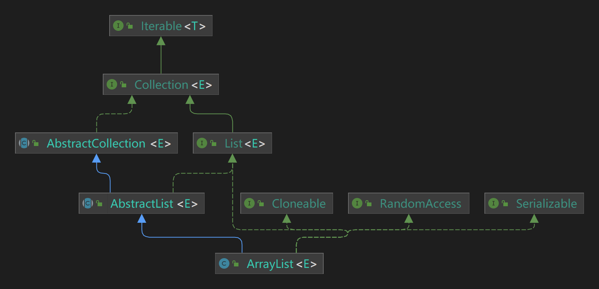

ArrayList是一个基于数组实现的动态数组，是Java集合框架中的一部分。它可以自动扩容来适应元素的增加，也支持随机访问、插入、删除等操作。与普通的数组相比，ArrayList更加灵活，可以在任意位置插入或删除元素，同时还提供了很多高级功能，如排序、查找等。ArrayList还可以存储任意类型的对象，包括基本类型的值，因此它被广泛应用于各种应用程序中，如Web应用、桌面应用等。总之，ArrayList是Java集合框架中的一个重要组件，可以方便地处理大量数据和对象。



ArrayList直接实现了4个接口，继承了AbstractList抽象类

- List
- Cloneable
- RadomAccess
- Serializable

其中有3个是标记接口，标记接口是一个空接口，没有任何方法或字段。它只是作为一个标记，表示它的实现类具有一定的属性或特点。实现了该接口的类将被赋予特定的语义意义。

## 一、RandomAccess

RandomAccess标记接口表示实现此接口的类可以使用随机访问优化算法来访问集合中的元素，即可以通过索引直接访问集合中的元素，而不需要按顺序遍历整个集合，这对于大型集合而言能够提高访问效率。

例如，实现RandomAccess接口的List实例可以使用get()方法进行随机访问，而不像非RandomAccess的List实例需要使用迭代器或for循环逐个遍历获取元素。

## 二、Cloneable

Cloneable标记接口表示类的实例是可克隆的，以向Object.clone()方法表示该方法创建该类实例副本是合法的

::: danger

### 问题1 不实现Cloneable接口会怎么样

> Q：上述提到，Cloneable是表示clone方法是合法的，那么不实现Cloneable直接调clone会发生什么？

如果调用了一个未实现Cloneable类的实例的clone方法，会抛出CloneNotSupportedException异常

```java
class CloneObject{
    @Override
    protected Object clone() throws CloneNotSupportedException {
        return super.clone();
    }
}
```

尝试调用clone：

```java
@Test
public void cloneTest() throws CloneNotSupportedException {
    CloneObject object = new CloneObject();
    // java.lang.CloneNotSupportedException: com.hkb.CloneObject
    Object clone = object.clone();
}
```

而实现Cloneable接口后，再次调用，正常执行

此处还有一个点，Object的clone方法是protected级别，因此需要<font color="orange">重写</font>后才能调用到

:::

## 三、Serializable

Serializable标记接口表示了一个类可以被序列化，即可以将其对象的状态转换为字节流以便于存储或传输。如果一个类需要被序列化，就必须将其实现Serializable接口。实现Serializable接口的类可以被序列化，但是需要注意的是，该类的所有非transient成员变量都需要是可序列化的，否则会发生异常。

<font color="orange">目前来说，Java的序列化已经不常用了，更多是使用Json等更简洁、易读的方式</font>

## 四、构造器

依照Collection注释上写的规范，集合必须提供两个构造：

- 无参构造
- 同元素类型E(或者? extends E)的集合构造

`ArrayList`除了上述两个构造之外，还提供了初始容量的构造

1. 无参构造

```java
private static final Object[] DEFAULTCAPACITY_EMPTY_ELEMENTDATA = {};
/**
 * 构造初始容量为10的空列表
 */
public ArrayList() {
    this.elementData = DEFAULTCAPACITY_EMPTY_ELEMENTDATA;
}
```

::: danger

### 问题2 初始容量为10

> Q：注释上说的初始容量为10，但为啥给的确是空数组？

在`ensureCapacityInternal`方法中，当空集合add第一个元素时，会执行扩容操作(减少内存浪费的时间)，扩容为10

:::

2. 指定初始容量构造

```java
/**
 * 构造具有指定初始容量的空列表
 *
 * @param  initialCapacity list的初始容量
 * @throws IllegalArgumentException 如果指定的初始容量为负
 */
public ArrayList(int initialCapacity) {
    if (initialCapacity > 0) {
        this.elementData = new Object[initialCapacity];
    } else if (initialCapacity == 0) {
        this.elementData = EMPTY_ELEMENTDATA;
    } else {
        throw new IllegalArgumentException("Illegal Capacity: "+ initialCapacity);
    }
}
```

3. 指定集合构造

```java
/**
 * 按照集合的迭代器返回的顺序构造包含指定集合的元素的列表
 *
 * @param c 要将其元素放入此列表中的集合
 * @throws NullPointerException 如果指定的集合为 null
 */
public ArrayList(java.util.Collection<? extends E> c) {
    elementData = c.toArray();
    if ((size = elementData.length) != 0) {
        // c.toArray might (incorrectly) not return Object[] (see 6260652)
        if (elementData.getClass() != Object[].class)
            elementData = Arrays.copyOf(elementData, size, Object[].class);
    } else {
        // replace with empty array.
        this.elementData = EMPTY_ELEMENTDATA;
    }
}
```

::: danger

### 问题3 toArray不是Object

> Q：在ArrayList的集合构造中，有判断toArray方法返回的数组是否是Object[]，注释中提及可能会错误的返回非Object[]，那么具体是哪些场景？


:::

## 五、ArrayList字段解读

1. 和初始化相关的3个字段

```java
/**
 * 初始容量10
 */
private static final int DEFAULT_CAPACITY = 10;

/**
 * 共享的空数组实例，用于空实例
 */
private static final Object[] EMPTY_ELEMENTDATA = {};

/**
 * 共享的空数组实例，用于默认容量的空实例
 * 我们将其与EMPTY_ELEMENTDATA区分开来，以了解添加第一个元素时要扩容多少
 */
private static final Object[] DEFAULTCAPACITY_EMPTY_ELEMENTDATA = {};
```

2. 元素存储数组

```java
/**
 * 存储数组列表元素的数组缓冲区，ArrayList的容量就是该数组的长度
 * 所有空且elementData == DEFAULTCAPACITY_EMPTY_ELEMENTDATA的ArrayList，
 * 会在第一个元素插入时扩容成DEFAULT_CAPACITY
 * 非private，以简化近类访问
 */
transient Object[] elementData;
```

3. 元素存储数量

```java
/**
 * 数组列表的大小（它包含的元素数）
 */
private int size;
```

4. 最大数组容量，[Collection 问题2-为什么要减8 | technology-inn](https://www.huangkebing.com/blogs/JDK8/util/Collection&AbstractCollection.html#问题2-为什么是要减8)

```java
/**
 * 要分配的数组的最大大小，某些 VM 会在数组中保留一些标头字。尝试分配更大的阵列可能会导致OutOfMemoryError：请求的数组大小超过 VM 限制
 * Collection中有介绍
 */
private static final int MAX_ARRAY_SIZE = Integer.MAX_VALUE - 8;
```

::: danger

### 问题4 两个空数组

> Q：EMPTY_ELEMENTDATA和DEFAULTCAPACITY_EMPTY_ELEMENTDATA，为什么要设计两个空数组？

DEFAULTCAPACITY_EMPTY_ELEMENTDATA用于表示通过无参构造创建的容量为10的空集合

EMPTY_ELEMENTDATA用于表示容量为0的空集合

设计两个空数组用来区分两种不同情况的空集合

:::

## 六、 元素数量方法

元素数量相关的`size`和`isEmpty`

1. size 获取元素数量，即size字段

```java
/**
 * 返回size，即集合中的元素个数
 *
 * @return size
 */
public int size() {
    return size;
}
```

2. isEmpty 判断元素是否为空，即size是否为0

```java
/**
 * 如果集合中不包含元素，即size为0，返回true
 *
 * @return true/false
 */
public boolean isEmpty() {
    return size == 0;
}
```

## 七、下标查询方法

通过元素查询下标的方法`indexOf`和`lastIndexOf`以及基于indexOf实现的`contains`

1. indexOf 查询指定元素的第一次出现下标，基于遍历

```java
/**
 * 返回此列表中指定元素第一次出现的索引满足条件：(o==null ? get(i)==null : o.equals(get(i)))
 * 如果此列表中不包含该元素，则返回-1
 */
public int indexOf(Object o) {
    if (o == null) {
        for (int i = 0; i < size; i++)
            if (elementData[i]==null)
                return i;
    } else {
        for (int i = 0; i < size; i++)
            if (o.equals(elementData[i]))
                return i;
    }
    return -1;
}
```

2. lastIndexOf 查询指定元素的最后一次出现下标，基于后序遍历

```java
/**
 * 返回此列表中指定元素最后一次出现的索引满足条件：(o==null ? get(i)==null : o.equals(get(i)))
 * 如果此列表中不包含该元素，则返回-1
 */
public int lastIndexOf(Object o) {
    if (o == null) {
        for (int i = size-1; i >= 0; i--)
            if (elementData[i]==null)
                return i;
    } else {
        for (int i = size-1; i >= 0; i--)
            if (o.equals(elementData[i]))
                return i;
    }
    return -1;
}
```

3. contains 查询元素是否在集合中，基于indexOf

```java
/**
 * 判断集合中是否包含指定的元素o
 * 通过indexOf实现，如果indexOf的结果为-1则>=0不满足为false。反之为true
 *
 * @param o 要测试其在此列表中是否存在的元素
 * @return true/false
 */
public boolean contains(Object o) {
    return indexOf(o) >= 0;
}
```

## 八、元素拷贝方法

`toArray`和`clone`，注意均是浅拷贝

1. toArray，无参版本，返回Object[]

```java
/**
 * 返回一个数组，该数组按正确的顺序（从第一个元素到最后一个元素）包含此列表中的所有元素
 * 返回的数组将是“安全的”，此方法必须分配一个新数组
 * 因此，调用方可以自由修改返回的数组(这里的修改如果指的是不可变对象的替换，如果修改了可变对象的值依旧会影响原集合)
 * 此方法充当基于数组和基于集合的 API 之间的桥梁
 *
 * @return 以正确顺序包含此列表中所有元素的数组
 */
public Object[] toArray() {
    return Arrays.copyOf(elementData, size);
}
```

2. toArray，有参版本

```java
/**
 * 返回一个数组，其中包含此列表中所有元素的正确顺序（从第一个到最后一个元素）;返回数组的运行时类型是指定数组的运行时类型。
 * 如果列表适合指定的数组，则在其中返回该列表。否则，将分配一个具有指定数组的运行时类型和此列表大小的新数组。
 *
 * 如果列表适合指定的数组，并留出空间（即数组的元素比列表多），则紧跟在集合末尾之后的数组中的元素设置为null。
 * 仅当调用方知道列表不包含任何 null 元素时，这在确定列表的长度时才很有用。
 *
 * @param a 要存储列表元素的数组（如果它足够大）;否则，将为此目的分配相同运行时类型的新数组
 * @return 包含列表元素的数组
 * @throws ArrayStoreException 如果指定数组的运行时类型不是此列表中每个元素的运行时类型的超类型
 * @throws NullPointerException 如果指定的数组为空
 */
@SuppressWarnings("unchecked")
public <T> T[] toArray(T[] a) {
    if (a.length < size)
        // 数量不足存放时，创建一个运行时类型的新数组
        return (T[]) Arrays.copyOf(elementData, size, a.getClass());
    // 数量足够时，直接使用原数组
    System.arraycopy(elementData, 0, a, 0, size);
    // 有多的元素时，最后一个集合元素之后的元素置为null
    if (a.length > size)
        a[size] = null;
    return a;
}
```

3. clone

```java
/**
 * 返回此 ArrayList 实例的浅拷贝副本。
 *
 * @return 此ArrayList的一个拷贝副本
 */
public Object clone() {
    try {
        ArrayList<?> v = (ArrayList<?>) super.clone();
        v.elementData = Arrays.copyOf(elementData, size);
        v.modCount = 0;
        return v;
    } catch (CloneNotSupportedException e) {
        throw new InternalError(e);
    }
}
```

::: tip

### 备注1 集合的拷贝注意点

ArrayList中的clone、toArray，均是浅拷贝，即集合里的对象实例是同一个！

<font color="#16b777">因此如果集合中存放的是String、Integer等不可变对象，那么是没问题的，</font>

<font color="#dd0000">但如果存放了可变对象并修改了可变对象中的字段，那么原集合、集合副本(clone)、集合元素数组(toArray)中的实例均会受影响；替换对象实例则只会影响替换的容器</font>

```java
@Test
public void cloneAndToArrayTest(){
    ArrayList<Inner> inners = new ArrayList<>();
    inners.add(new Inner(1));
    Object[] objects = inners.toArray();
    // 原先的内容:[Inner{number=1}]
    // 原先的内容:[Inner{number=1}]
    System.out.println("原先的内容:" + inners);
    System.out.println("原先的内容:" + Arrays.toString(objects));
    ArrayList<Inner> clone = (ArrayList<Inner>) inners.clone();
    // 修改clone副本的中对象实例的字段
    Inner inner = clone.get(0);
    inner.setNumber(0);
    // 变更后内容:[Inner{number=0}]
    // 变更后内容:[Inner{number=0}]
    System.out.println("变更后内容:" + inners);
    System.out.println("变更后内容:" + Arrays.toString(objects));
    // 修改clone副本中的对象实例
    clone.remove(inner);
    clone.add(new Inner(2));
    // 变更后内容:[Inner{number=0}]
    // 变更后内容:[Inner{number=0}]
    System.out.println("变更后内容:" + inners);
    System.out.println("变更后内容:" + Arrays.toString(objects));
}
```

:::

## 九、容量调整方法

在源码中发现了两个冷门的方法，一个用于缩容`trimToSize`另一个用于扩容`ensureCapacity`。之所以冷门，是因为我们经常会用List去接收ArrayList实例，而这两个方法并没有在List中定义，所以我们使用方法时，idea的方法提示框不会有这两个方法！

1. 缩容方法trimToSize()，作用是把数组的容量缩小为实际数量size。实际业务中，为了避免频繁查询数据库，经常会把数据库中的数据缓存到内存中，通过调用此方法可以节约出一些内存，但我觉得意义不大

```java
/**
 * 将此ArrayList实例的容量修剪为列表的当前大小。应用程序可以使用此操作来最小化ArrayList 实例的存储。
 * 能想到的场景，存放一部分数据在List中用做应用缓存，可以在数据加载后执行一下trimToSize()节约部分内存
 * 如果是经常修改的List，则没有意义调用此方法
 */
public void trimToSize() {
    modCount++;
    if (size < elementData.length) {
        elementData = (size == 0) ? EMPTY_ELEMENTDATA : Arrays.copyOf(elementData, size);
    }
}
```

2. 扩容方法ensureCapacity()，需要提供一个初始值，类似的可以通过指定初始容量的构造器实现，相比之下感觉构造器的方式更直白一些

```java
/**
 * 如有必要，增加此ArrayList实例的容量，以确保它至少可以容纳最小容量参数指定的元素数
 * 个人认为，指定初始容量的构造器可以实现类似的功能
 *
 * @param minCapacity 所需的最小容量
 */
public void ensureCapacity(int minCapacity) {
    // 如果是默认空表，则minExpand为10；否则为0
    int minExpand = (elementData != DEFAULTCAPACITY_EMPTY_ELEMENTDATA) ? 0 : DEFAULT_CAPACITY;
    // 执行最小容量>minExpand执行扩容
    if (minCapacity > minExpand) {
        ensureExplicitCapacity(minCapacity);
    }
}
```

## 十、set&get方法

`set`和`get`方法算是一对方法，set是修改指定下标的元素，get是获取指定下标的元素

1. set 将指定下标index替换为指定元素element，并返回原值

```java
/**
 * 将此列表中指定位置的元素替换为指定的元素。
 *
 * @param index 要替换的元素的索引
 * @param element 要存储在指定位置的元素
 * @return 先前位于指定位置的元素
 * @throws IndexOutOfBoundsException 数组下标越界移除
 */
public E set(int index, E element) {
    rangeCheck(index);

    E oldValue = elementData(index);
    elementData[index] = element;
    return oldValue;
}
```

rangeCheck()在设计上比较巧妙。因为数组通过下标访问时如果下标为负数，会抛出异常，所以无需判断下标为负的情况

<font color="#16b777">在日常开发中，很多时间都在写if，但经常能看到很多没必要的if，或者换个思路就能简化的if，让代码更简洁</font>

```java
/**
 * 检查给定索引是否在范围内。如果不是，则引发相应的运行时异常
 * 需要校验和size的大小关系，因为数组的容量是大于size的，当index>=size但小于数组长度时并不会抛出异常，但不符合预期
 * 不检查索引是否为负数：它总是在数组访问之前使用，如果索引为负数，则会抛出 ArrayIndexOutOfBoundsException。
 */
private void rangeCheck(int index) {
    if (index >= size)
        throw new IndexOutOfBoundsException(outOfBoundsMsg(index));
}

E elementData(int index) {
    return (E) elementData[index];
}
```

2. get 获取指定下标的元素

```java
/**
 * 返回此列表中指定位置的元素。
 *
 * @param  index 要返回的元素的索引
 * @return 此列表中指定位置的元素
 * @throws IndexOutOfBoundsException 数组下标越界
 */
public E get(int index) {
    rangeCheck(index);
    return elementData(index);
}
```

## 十一、add方法

`add`有两个版本:

- 一个是插入到数组末尾的，只需要关注是否需要扩容，插入直接通过下标插入到尾部

- 另一个是插入到指定位置，需要校验下标以及是否需要扩容，通过System.arraycopy这一native方法实现将数组元素往后移动一位

两者虽然都是新增元素，但性能云泥之别。因为数组的特性，往数组中间加元素需要涉及数组位移。所以<font color="#dd0000">如果没有特殊需求都一律使用插到数组末尾的版本，如果一定要插到中间可以考虑用LinkedList</font>

1. add 追加元素到末尾版本

```java
/**
 * 将指定的元素追加到此列表的末尾
 *
 * @param e 要附加到此列表的元素
 * @return true，如果添加成功
 */
public boolean add(E e) {
    // 检查容量，不管是否触发扩容，都会影响modCount
    ensureCapacityInternal(size + 1);
    elementData[size++] = e;
    return true;
}
```

2. add 插入到指定位置版本

```java
/**
 * 在此列表中的指定位置插入指定的元素。将当前位于该位置的元素（如果有）和任何后续元素向右移动
 *
 * @param index 要在其中插入指定元素的索引
 * @param element 要插入的元素
 * @throws IndexOutOfBoundsException 数组下标越界
 */
public void add(int index, E element) {
    rangeCheckForAdd(index);
    // 检查容量，不管是否触发扩容，都会影响modCount
    ensureCapacityInternal(size + 1);
    // 入参的含义为：原数组、原数组的起始位置、目标数组、目标数组的起始位置、长度
    // 此处即将下标为[index,size-1]的元素往后移动一个位置
    System.arraycopy(elementData, index, elementData, index + 1, size - index);
    elementData[index] = element;
    size++;
}
```

非常清晰的看到，插入到指定位置的版本多了一次`System.arraycopy`操作

然后看下add版的下标校验的方法`rangeCheckForAdd`

```java
/**
 * add和addAll使用的 rangeCheck 版本
 * 此处条件是index>size,因为涉及要新增，会在原集合上多一个元素
 * 需要校验负数是因为如果不校验，可能会引起不必要的扩容
 */
private void rangeCheckForAdd(int index) {
    if (index > size || index < 0)
        throw new IndexOutOfBoundsException(outOfBoundsMsg(index));
}
```

::: danger

### 问题5 rangeCheck和rangeCheckForAdd

> Q：rangeCheck和rangeCheckForAdd有什么区别？为什么rangeCheckForAdd需要对负数做校验？为什么需要写两个版本的下标校验？

rangraneckForAdd只用于add或者addAll方法，rangraneck用于除add和addAll外的其他方法

此外还有判断条件不同：

- rangeCheck是index>=size，只包含现有的元素且未对负数做校验
- rangeCheckForAdd是index>size，因为是add系列方法，多判断了一位，且有负数校验

rangeCheckForAdd做负数校验，起初怀疑是因为要调用System.arraycopy()，负数会有问题，故写了测试代码：

```java
public void addTest(){
    int[] ints = new int[10];
    System.arraycopy(ints, -5, ints, 3, 2);
}
```

发现同样会抛出异常和elementData[-5]一样，所以不是该方法的问题。

后来发现，如果不做负数校验，那么通过rangeCheck后，add方法会执行扩容那会就会有一定概率发生扩容，随后执行System.arraycopy()报错，也就是说无效扩容了(按照空参构造的设计，存在一定时间内存的浪费)

至于为什么要写两个版本的校验，是应用场景不同的原因。add方法涉及到扩容，而其他的方法不会

:::

## 十二、扩容机制

我们都知道ArrayList会扩容成1.5倍，那么到底是如何实现的？

这里只介绍`add`方法导致的自动扩容，除add外第九节中提到的`ensureCapacity`方法会能触发扩容，但扩容方法是同一个

1. ensureCapacityInternal

```java
// minCapacity为所需的最小容量，如目前size=9，通过add方法新增一个元素，那么minCapacity会给10
// 首先检查了数组是否是DEFAULTCAPACITY_EMPTY_ELEMENTDATA实例，即通过空参构造创建的，若是则minCapacity最小值为10
private void ensureCapacityInternal(int minCapacity) {
    // 如果是空参构造创建的集合，minCapacity最小为10
    if (elementData == DEFAULTCAPACITY_EMPTY_ELEMENTDATA) {
        minCapacity = Math.max(DEFAULT_CAPACITY, minCapacity);
    }
    ensureExplicitCapacity(minCapacity);
}
```

2. ensureExplicitCapacity

```java
// modCount自增，也就是说不管有没有执行扩容，均会影响modCount的值
// 如果minCapacity大于当前数组的长度，则执行扩容操作
private void ensureExplicitCapacity(int minCapacity) {
    modCount++;
    // overflow-conscious code
    if (minCapacity - elementData.length > 0)
        grow(minCapacity);
}
```

3. grow

```java
/**
 * 增加容量以确保它至少可以容纳最小容量参数指定的元素数
 * 扩容时，通常情况下新容量=旧容量的1.5倍；但当新容量小于minCapacity时会扩容为minCapacity；当新容量大于MAX_ARRAY_SIZE只扩容到最大值
 *
 * @param minCapacity 所需的最小容量
 */
private void grow(int minCapacity) {
    int oldCapacity = elementData.length;
    // 新容量是老容量的1.5倍
    int newCapacity = oldCapacity + (oldCapacity >> 1);
    // 新容量小于minCapacity，oldCapacity=0，或者minCapacity通过方法指定的一个较大值
    if (newCapacity - minCapacity < 0)
        newCapacity = minCapacity;
    // 新容量大于MAX_ARRAY_SIZE，只扩容到最大值
    if (newCapacity - MAX_ARRAY_SIZE > 0)
        newCapacity = hugeCapacity(minCapacity);
    // 执行扩容
    elementData = Arrays.copyOf(elementData, newCapacity);
}
```

4. hugeCapacity 

```java
// 扩容后容量大于MAX_ARRAY_SIZE，执行容量上限兼容
// 关于ArrayList容量最大值，其实还是Integer.MAX_VALUE
private static int hugeCapacity(int minCapacity) {
    if (minCapacity < 0)
        throw new OutOfMemoryError();
    // 如果minCapacity即最小需求容量大于MAX_ARRAY_SIZE，则扩容为Integer最大值，否则为Integer最大值-8
    // 为了兼容部分vm，但如果MAX_ARRAY_SIZE不满足了只能扩容到Integer最大值
    return (minCapacity > MAX_ARRAY_SIZE) ? Integer.MAX_VALUE : MAX_ARRAY_SIZE;
}
```

## 十三、remove&clear方法

`remove`有两个版本，分别是移除指定下标的元素，和移除给定的元素；`clear`即清空集合

remove绝大部分情况会涉及数组位移，除非你总是移除最后一个。<font color="#16b777">所以如果使用ArrayList，尽可能少的执行remove，如果要remove多个元素，可以批量移除(removeAll或stream)</font>

1. remove 移除指定下标的元素

```java
/**
 * 删除此列表中指定位置的元素。将任何后续元素向左移动（从其索引中减去一个）
 *
 * @param index 要删除的元素的索引
 * @return 从列表中删除的元素
 * @throws IndexOutOfBoundsException 数组下标越界
 */
public E remove(int index) {
    rangeCheck(index);
    modCount++;
    E oldValue = elementData(index);
    int numMoved = size - index - 1;
    // 排除等于0的情况，等于0即移除最后一个元素，无需移动数组
    if (numMoved > 0)
        System.arraycopy(elementData, index+1, elementData, index, numMoved);
    // 最后一个元素置为null
    elementData[--size] = null;
    return oldValue;
}
```

2. remove 移除给定元素，先找到指定元素的下标，然后通过下标来移除

```java
/**
 * 从此列表中删除指定元素的第一个匹配项（如果存在）。如果列表不包含该元素，则它保持不变。
 * 更正式地说，删除索引为 i 最小的元素，使得(o==null?get(i)==null:o.equals(get(i)))（如果存在这样的元素）。
 * 如果此列表包含指定的元素（或者等效地，如果此列表由于调用而更改），则返回 true。
 *
 * @param o 要从此列表中删除的元素（如果存在）
 * @return 如果此列表包含指定的元素，则为 true
 */
public boolean remove(Object o) {
    // 跟据null和非null分成两个查找逻辑，查找到目标元素的index，然后执行类似下标移除的逻辑
    if (o == null) {
        for (int index = 0; index < size; index++)
            if (elementData[index] == null) {
                fastRemove(index);
                return true;
            }
    } else {
        for (int index = 0; index < size; index++)
            if (o.equals(elementData[index])) {
                fastRemove(index);
                return true;
            }
    }
    return false;
}
```

移除逻辑和下标remove类似，有两个区别：没有下标检查因为下标是通过遍历产生的必定不会越界，不需要返回旧值

```java
/*
 * 跳过边界检查且不返回已删除值的专用删除方法
 */
private void fastRemove(int index) {
    modCount++;
    int numMoved = size - index - 1;
    if (numMoved > 0)
        System.arraycopy(elementData, index+1, elementData, index, numMoved);
    elementData[--size] = null;
}
```

3. clear 清空方法

这个方法在Collection接口中就有定义，抽象实现类中是通过迭代器来实现的。但到了ArrayList，因为支持了随机访问，完全可以通过下标来实现

但是我们可以发现，clear之后，集合中的元素都变为null了，但<font color="#dd0000">内部数组的长度并没有发生变化</font>！

```java
/**
 * 从此列表中删除所有元素。此调用返回后，该列表将为空。
 */
public void clear() {
    modCount++;
    for (int i = 0; i < size; i++)
        elementData[i] = null;
    size = 0;
}
```

## 十四、addAll方法

`addAll`也分为两个版本，插入到尾部和插入到指定位置，同样的尽量使用插入到尾部版本

1. addAll 尾部追加版本

先转成数组，然后扩容，最后将数组添加到尾部，修正size

```java
/**
 * 将指定集合中的所有元素追加到此列表的末尾，顺序与指定集合的迭代器返回这些元素的顺序相同
 *
 * @param c 包含要添加到此列表的元素的集合
 * @return 如果此列表因调用而更改，则为 true
 * @throws NullPointerException 如果指定的集合为 null
 */
public boolean addAll(java.util.Collection<? extends E> c) {
    Object[] a = c.toArray();
    int numNew = a.length;
    ensureCapacityInternal(size + numNew);
    System.arraycopy(a, 0, elementData, size, numNew);
    size += numNew;
    return numNew != 0;
}
```

::: danger

### 问题6 为什么不判空

> Q：为什么不对集合c先做判空呢？如果集合c为空，那么扩容判断、数组拷贝不是白执行了吗？

如果集合c为空，扩容判断、数组拷贝确实是白执行了。而在JDK14中，这个方法有优化：

```java
public boolean addAll(Collection<? extends E> c) {
    Object[] a = c.toArray();
    modCount++;
    int numNew = a.length;
    if (numNew == 0)
        return false;
    Object[] elementData;
    final int s;
    if (numNew > (elementData = this.elementData).length - (s = size))
        elementData = grow(s + numNew);
    System.arraycopy(a, 0, elementData, s, numNew);
    size = s + numNew;
    return true;
}
```

但是我们是不会去随意升级JDK版本的，所以<font color="#dd0000">当我们执行addAll时，如果不能确保入参集合一定不为空的，最好加上空校验</font>

:::

2. addAll 插入到指定位置版本

多了下标校验和移动原数组两个步骤，从性能角度看<font color="#dd0000">能插入到尾部就不要插到指定位置</font>

```java
/**
 * 从指定位置开始，将指定集合中的所有元素插入到此列表中
 * 将当前位于该位置的元素（如果有）和任何后续元素向右移动（增加其索引）
 * 新元素将按照指定集合的迭代器返回的顺序显示在列表中
 *
 * @param index 插入指定集合中的第一个元素的索引
 * @param c 包含要添加到此列表的元素的集合
 * @return 如果此列表因调用而更改，则为 true
 * @throws IndexOutOfBoundsException 数组小标越界
 * @throws NullPointerException 如果指定的集合为 null
 */
public boolean addAll(int index, java.util.Collection<? extends E> c) {
    rangeCheckForAdd(index);
    Object[] a = c.toArray();
    int numNew = a.length;
    ensureCapacityInternal(size + numNew);
    // 先移动原数组，腾出位置
    int numMoved = size - index;
    if (numMoved > 0)
        System.arraycopy(elementData, index, elementData, index + numNew, numMoved);
    // 拷贝数据
    System.arraycopy(a, 0, elementData, index, numNew);
    size += numNew;
    return numNew != 0;
}
```

## 十五、removeAll&retainAll方法

`removeAll`和`retainAll`，可以说是一对方法，实现逻辑一致，均是先判空，随后执行batchRemove，唯一区别是方法的第二个入参相反，因此两个方法逻辑也是相反的

1. removeAll

```java
/**
 * 从此列表中删除指定集合中包含的所有元素
 *
 * @param c 包含要从此列表中删除的元素的集合
 * @return {@code true} 如果此列表由于调用而更改
 * @throws ClassCastException 如果此列表的元素的类与指定的集合不兼容
 * @throws NullPointerException 如果此列表包含 null 元素，并且指定的集合不允许 null 元素，或者如果指定的集合为 null
 * @see java.util.Collection#contains(Object)
 */
public boolean removeAll(java.util.Collection<?> c) {
    Objects.requireNonNull(c);
    return batchRemove(c, false);
}
```

2. retainAll

```java
/**
 * 仅保留此列表中包含在指定集合中的元素
 *
 * @param c 包含要保留在此列表中的元素的集合
 * @return {@code true} 如果此列表由于调用而更改
 * @throws ClassCastException 如果此列表的元素的类与指定的集合不兼容
 * @throws NullPointerException 如果此列表包含 null 元素，并且指定的集合不允许 null 元素，或者如果指定的集合为 null
 * @see java.util.Collection#contains(Object)
 */
public boolean retainAll(java.util.Collection<?> c) {
    Objects.requireNonNull(c);
    return batchRemove(c, true);
}
```

直接来看batchRemove，注意到是循环调用集合c的contains方法，即双循环，因此<font color="#1e9fff">能不用就不用，如果非要用，建议集合c可以传Set</font>

```java
private boolean batchRemove(java.util.Collection<?> c, boolean complement) {
    final Object[] elementData = this.elementData;
    // r代表当前遍历到下标，w表示处理后数组当前的元素下标
    int r = 0, w = 0;
    boolean modified = false;
    try {
        for (; r < size; r++)
            // 跟据传入条件判断是否保留，留下的元素从头开始保存
            if (c.contains(elementData[r]) == complement)
                elementData[w++] = elementData[r];
    } finally {
        // 保持与 AbstractCollection 的行为兼容性，即使 c.contains()抛出异常
        // 如果中途抛出异常了，则没有遍历完，将没有遍历的部分拷贝到处理后的元素后面，并修正w
        if (r != size) {
            System.arraycopy(elementData, r, elementData, w, size - r);
            w += size - r;
        }
        // 如果w != size,说明有元素被去掉了，将空余位置置为null，修正modCount、size和变更标志
        if (w != size) {
            for (int i = w; i < size; i++)
                elementData[i] = null;
            modCount += size - w;
            size = w;
            modified = true;
        }
    }
    return modified;
}
```

## 十六、Java8新增方法

Java8新增的方法均与函数式接口有关，此外这些方法都对modCount做了校验

有`forEach`、`replaceAll`、`sort`和`removeIf`

首先来看3个在实现上类似的，`forEach`、`replaceAll`和`sort`

forEach的入参是Consumer，replaceAll的入参是UnaryOperator，sort的入参是Comparator，均是函数式接口

1. forEach

```java
@Override
public void forEach(Consumer<? super E> action) {
    Objects.requireNonNull(action);
    final int expectedModCount = modCount;
    @SuppressWarnings("unchecked")
    final E[] elementData = (E[]) this.elementData;
    final int size = this.size;
    for (int i=0; modCount == expectedModCount && i < size; i++) {
        action.accept(elementData[i]);
    }
    if (modCount != expectedModCount) {
        throw new ConcurrentModificationException();
    }
}
```

2. replaceAll

```java
@Override
@SuppressWarnings("unchecked")
public void replaceAll(UnaryOperator<E> operator) {
    Objects.requireNonNull(operator);
    final int expectedModCount = modCount;
    final int size = this.size;
    for (int i=0; modCount == expectedModCount && i < size; i++) {
        elementData[i] = operator.apply((E) elementData[i]);
    }
    if (modCount != expectedModCount) {
        throw new ConcurrentModificationException();
    }
    modCount++;
}
```

3. sort

```java
@Override
@SuppressWarnings("unchecked")
public void sort(Comparator<? super E> c) {
    final int expectedModCount = modCount;
    Arrays.sort((E[]) elementData, 0, size, c);
    if (modCount != expectedModCount) {
        throw new ConcurrentModificationException();
    }
    modCount++;
}
```

这里注意，forEach没有执行modCount++

因为forEach即不会导致集合顺序变化，也不会修改集合中的元素(指换一个元素，修改可变对象的字段依旧是可以的)

而replaceAll会修改集合中的元素，sort会修改集合元素的顺序。

最后是removeIf，分为两部分执行，先找要移除的元素然后统一移除，类似的stream.filter可以实现该功能

```java
@Override
public boolean removeIf(Predicate<? super E> filter) {
    Objects.requireNonNull(filter);
    // 确定要删除哪些元素 在此阶段从过滤器Predicate引发的任何异常将使集合保持不变
    int removeCount = 0;
    final BitSet removeSet = new BitSet(size);
    final int expectedModCount = modCount;
    final int size = this.size;
    for (int i=0; modCount == expectedModCount && i < size; i++) {
        @SuppressWarnings("unchecked")
        final E element = (E) elementData[i];
        if (filter.test(element)) {
            removeSet.set(i);
            removeCount++;
        }
    }
    if (modCount != expectedModCount) {
        throw new ConcurrentModificationException();
    }

    // 将剩余元素移到已删除元素留下的空间上
    final boolean anyToRemove = removeCount > 0;
    if (anyToRemove) {
        final int newSize = size - removeCount;
        for (int i=0, j=0; (i < size) && (j < newSize); i++, j++) {
            i = removeSet.nextClearBit(i);
            elementData[j] = elementData[i];
        }
        for (int k=newSize; k < size; k++) {
            elementData[k] = null;
        }
        this.size = newSize;
        if (modCount != expectedModCount) {
            throw new ConcurrentModificationException();
        }
        modCount++;
    }

    return anyToRemove;
}
```

## 十七、Itr

ArrayList的Iterator

首先看定义的字段，相当于存了两个下标指针

```java
/**
 * 要返回的下一个元素的索引
 */
int cursor;
/**
 * 返回的最后一个元素的索引;-1为默认值，代表还没有元素返回
 */
int lastRet = -1;
/**
 * 创建迭代器时的modCount快照
 */
int expectedModCount = modCount;
```

