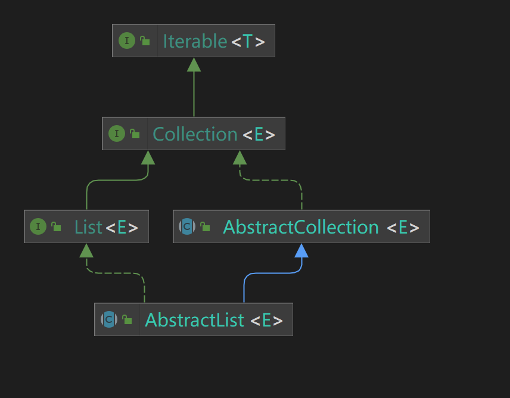

List接口在Collection的基础上，定义了List独有的方法，也是List的特性


通过继承树，可以看到

- List继承了[Collection](https://www.huangkebing.com/blogs/JDK8/util/Collection&AbstractCollection.html)
- List有一个抽象子类AbstractList

## 一、List

这里主要列举一下List相比Collection新定义的方法

1. get

```java
E get(int index);
```

2. set

```java
E set(int index, E element);
```

3. add

```java
void add(int index, E element);
```

4. remove

```java
E remove(int index);
```

5. subList

```java
List<E> subList(int fromIndex, int toIndex);
```

6. indexOf

```java
int indexOf(Object o);
```

7. lastIndexOf

```java
int lastIndexOf(Object o);
```

8. addAll

```java
boolean addAll(int index, Collection<? extends E> c);
```

9. replaceAll

```java
default void replaceAll(UnaryOperator<E> operator) {
    Objects.requireNonNull(operator);
    final ListIterator<E> li = this.listIterator();
    while (li.hasNext()) {
        li.set(operator.apply(li.next()));
    }
}
```

10. sort

```java
default void sort(Comparator<? super E> c) {
    Object[] a = this.toArray();
    Arrays.sort(a, (Comparator) c);
    ListIterator<E> i = this.listIterator();
    for (Object e : a) {
        i.next();
        i.set((E) e);
    }
}
```

11. listIterator

```java
ListIterator<E> listIterator();

ListIterator<E> listIterator(int index);
```

## 二、AbstractList字段解读

提供了一个用于实现fast-fail机制的字段：

```java
/**
 * 此列表在结构上被修改的次数。结构修改是指更改列表大小或以其他方式干扰列表，使正在进行的迭代可能会产生不正确结果的修改。
 * 如果此字段的值意外更改，迭代器（或列表迭代器）将抛出 {@code ConcurrentModificationException} 以响应 {@code next}、{@code remove}、{@code previous}、{@code set} 或 {@code add} 操作。 
 * 这提供了fast-fail机制，而不是在迭代期间面对并发修改时的非确定性行为。
 *
 * 子类使用此字段是可选的。如果子类希望提供fast-fail机制，则只需在其 {@code add（int， E）} 和 {@code remove（int）} 方法（以及它覆盖的任何其他导致列表结构修改的方法）中递增此字段。 
 * 对 {@code add（int， E）} 或 {@code remove（int）} 的单个调用必须向此字段递增不超过1，否则迭代器（和列表迭代器）将抛出虚假的 {@code ConcurrentModificationExceptions}。  
 * 如果实现不希望提供故障快速迭代器，则可以忽略此字段。
 */
protected transient int modCount = 0;
```

::: tip

### 备注1 fast-fail

`fast-fail` 机制是指当在迭代过程中发现集合的结构被修改（如删除或添加）时，迭代器会立即抛出 ConcurrentModificationException 异常，防止程序继续迭代并对集合进行修改，从而避免出现预期之外的行为。这是为了增强程序的健壮性和安全性。

例如，在一个for循环中，如果使用迭代器来迭代某个集合，同时在循环中进行集合的元素的添加或删除，那么迭代器会快速响应，并抛出ConcurrentModificationException 异常，以避免对被迭代的集合造成不必要的影响。fast-fail 机制在集合类中广泛应用，如 ArrayList、LinkedList、HashSet、HashMap 等。它是基于已有集合数据结构实现的，在迭代器中添加了一些检查代码，以便快速检测到集合结构的变化。

:::

## 三、AbstractList方法解读

和AbstractCollection类似，先略过