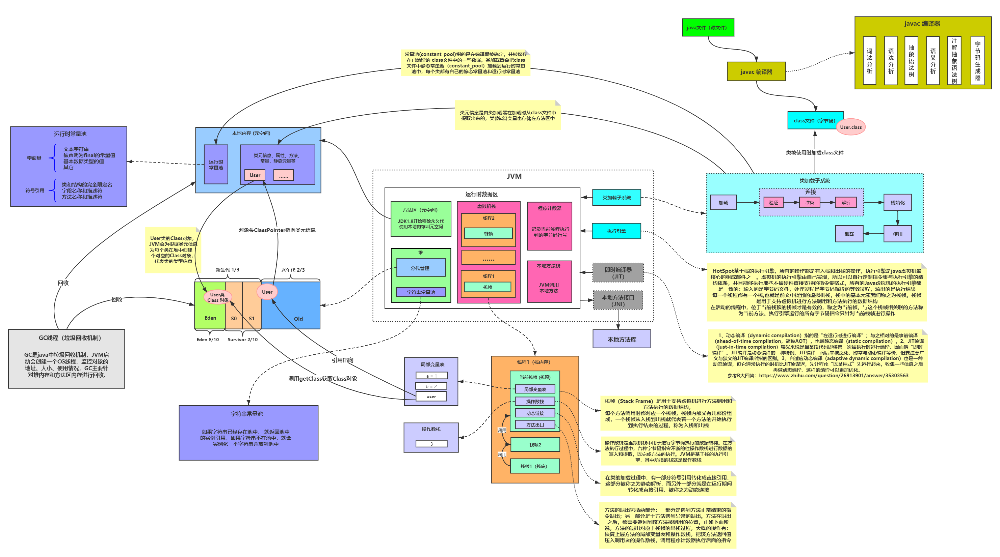

# 概览图&前言

读周志明老师的《深入理解Java虚拟机：JVM高级特性与实践（第3版）》读书笔记。以及淘到的一张概览图：

在记录过程中着重记录一些实现细节和疑问。而如果涉及到JVM参数会先跳过，最后再统一整理并进行实战，也方便日后自己来查找

# 第一章、走近Java

## 1.1 概述

## 1.2 Java技术体系

## 1.3 Java发展史

## 1.4 Java虚拟机家族

## 1.5 展望Java技术的未来

## 1.6 实战：自己编译JDK