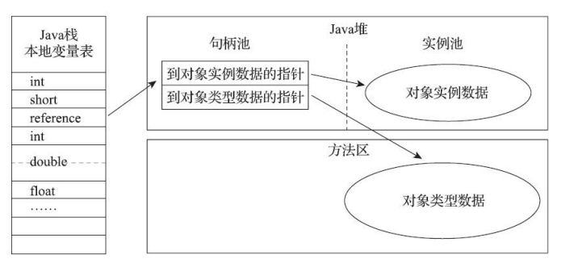
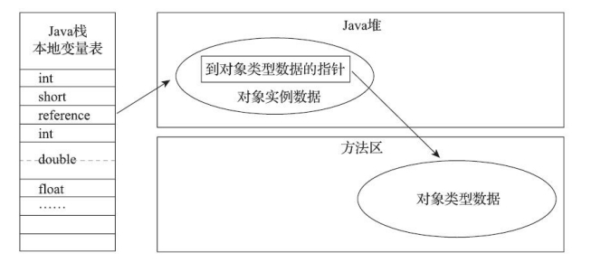

# 第二章、Java内存区域与内存溢出异常

一般来说，和C、C++不同，Java是由虚拟机管理内存，不需要开发者去操心。但当出现问题时(比如常见的内存溢出、泄露)，如果对JVM不了解就很难去排查问题

## 2.1 概述

## 2.2 运行时数据区域

跟据《Java虚拟机规范》的规定，Java虚拟机所管理的内存将会包括以下几个运行时数据区域。开始对这几个区域做详细的学习。


### 2.2.1 程序计数器

程序计数器是程序控制流的指示器，分支、循环、跳转、异常处理、线程恢复等基础功能都依赖程序计数器来完成。每个线程的程序计数器都独立存储、互不影响，故称为<font color="red">线程私有区域</font>。

如果线程正在执行一个Java方法，那么计数器中记录的是正在执行的虚拟机字节码指令的地址。如果正在执行本地方法，计数器的值应该为空。

::: tip 正在执行的虚拟机字节码指令的地址这个地址具体是什么呢？

虚拟机字节码指令的地址通常是指字节码流中每条指令的位置。这个地址是相对于方法的起始位置的偏移量，以字节为单位。用于在运行时执行和跟踪代码。如这段代码：

```java
public class Example {
    public static void main(String[] args) {
        int a = 5;
        int b = 10;
        int result = addNumbers(a, b);
        System.out.println("Result: " + result);
    }

    public static int addNumbers(int x, int y) {
        return x + y;
    }
}
```

通过javap反编译字节码

```java
public class Example {
  public Example();
    Code:
       0: aload_0
       1: invokespecial #1    // Method java/lang/Object."<init>":()V
       4: return

  public static void main(java.lang.String[]);
    Code:
       0: iconst_5
       1: istore_1
       2: bipush        10
       4: istore_2
       5: iload_1
       6: iload_2
       7: invokestatic  #2   // Method addNumbers:(II)I
      10: istore_3
      11: getstatic     #3  // Field java/lang/System.out:Ljava/io/PrintStream;
      14: new           #4   // class java/lang/StringBuilder
      17: dup
      18: ldc           #5   // String Result:
      20: invokespecial #6    // Method java/lang/StringBuilder."<init>":(Ljava/lang/String;)V
      23: iload_3
      24: invokevirtual #7    // Method java/lang/StringBuilder.append:(I)Ljava/lang/StringBuilder;
      27: invokevirtual #8    // Method java/lang/StringBuilder.toString:()Ljava/lang/String;
      30: invokevirtual #9    // Method java/io/PrintStream.println:(Ljava/lang/String;)V
      33: return

  public static int addNumbers(int, int);
    Code:
       0: iload_0
       1: iload_1
       2: iadd
       3: ireturn
}
```

iconst_5其地址是0，istore_1其地址是1，这就是程序计数器中保存的内容。<font color="green">而这个偏移量，就是栈顶栈帧中的方法正在执行的位置</font>

:::

### 2.2.2 Java虚拟机栈

Java虚拟机栈是<font color="red">线程私有</font>的，其生命周期和线程相同。每个方法被执行的时候，Java虚拟机都会同步创建一个栈帧，用于存储<font color="red">局部变量表、操作数栈、动态连接、方法出口</font>等信息。每个方法被调用直至执行完毕就对应了一个栈帧在虚拟机栈中入栈到出栈的过程。

如果线程请求的栈深度大于虚拟机所允许的深度，将抛出StackOverflowError。如果Java虚拟机栈容量可以动态扩展，当栈扩展时无法申请到足够的内存会排除OutOfMemoryError。

这里有特别备注，HotSpot虚拟机的栈容量是不可以动态扩展的，也就是说不会因为无法扩展出现OOM。但如果线程申请栈空间时失败，仍然会出现OOM。另外关于栈帧会在第八章中详细讲解。

### 2.2.3 本地方法栈

和Java虚拟机栈类似，区别在于本地方法栈用于执行本地方法(即native)。《Java虚拟机规范》对本地方法栈中方法使用的语言、使用方式与数据结构并没有任何强制规定，具体的虚拟机可以自由实现。如HotSpot中就把本地方法栈和虚拟机栈合二为一。

本地方法栈和Java虚拟机栈一样，也会在栈深度溢出或扩展失败时分别抛出StackOverflowError和OutOfMemoryError异常。

### 2.2.4 Java堆

堆是所有线程共享的一块区域，也是出问题最多、最复杂的区域，<font color="red">堆的唯一目的就是存放对象实例</font>。堆的设计很复杂，分代划分、缓冲区等等，但无论怎么设计，堆存储的始终是对象的实例这些设计只是为了更好地回收内存、更快的分配内存。另外堆还涉及GC算法，这些都会在后续章节中详细讲解。

如果Java堆无法完成内存分配且无法再扩展时，会抛出OutOfMemoryError异常。

### 2.2.5 方法区

方法区时所有线程共享的区域，用于存储已被虚拟机加载的<font color="red">类型信息、常量、静态变量、即时编译器编译后的代码缓存</font>等数据。如果方法区无法满足新的内存分配需求时，将抛出OutOfMemoryError异常。

::: tip 关于方法区，经常能听到另外几个名词：永久代、元空间，这些到底有什么异同？另外存储的类型信息、常量、静态变量这些对应到代码又是哪些内容呢？

方法区

- 在Class文件中除了类的字段、方法、接口等描述信息外，还有一项信息是常量池，用来存储编译期间生成的字面量和符号引用。
- 在方法区中有一个非常重要的部分就是运行时常量池，它是每一个类或接口的常量池的运行时表示形式，在类和接口被加载到JVM后，对应的运行时常量池就被创建出来。当然并非Class文件常量池中的内容才能进入运行时常量池，在运行期间也可将新的常量放入运行时常量池中，比如String的intern方法。
- 在JVM规范中，没有强制要求方法区必须实现垃圾回收。

而永久代是HotSpot(Java7及之前)对方法区这一概念的实现，元空间则是Java8之后对方法区的实现

至于永久代和元空间的区别，说法都类似，都是说内存区域、垃圾回收、空间大小等方面，暂时先不去深究

:::

### 2.2.6 运行时常量池

运行时常量池是方法区的一部分。Class文件中包含<font color="red">类的版本、字段、方法和接口等描述信息以及常量池表</font>。常量池表用于存放编译期生成的各种字面量与符号引用，这部分内容将在类加载后存放到方法区的运行时常量池中。

运行时常量池相对于Class文件常量池的另外一个重要特征是具备动态性，运行期间也可以将新的常量放入池中，如String的intern方法

当常量池无法再申请到内存时，会抛出OutOfMemoryError

### 2.2.7 直接内存

JDK1.4中引入了NIO，引入了一种基于通道与缓冲区的I/O方式，它可以使用Native函数库直接分配堆外内存，然后通过一个存储在Java堆里面的DirectByteBuffer对象作为这块内存的引用进行操作。

直接内存的分配不会受堆内存大小的限制，但如果程序占用内存超过物理内存后(如堆外内存泄露)，还是会抛出OutOfMemoryError

## 2.3 HotSpot虚拟机对象探秘

这一节主要介绍HotSpot虚拟机在Java堆中对象分配、布局和访问的全过程

### 2.3.1 对象的创建

这一节讲述了new一个普通对象时是一个怎么样的过程，可以概括为这几步：

1. 检查符号引用：当Java虚拟机遇到一条字节码new指令时，首先将去检查这个指令的参数是否能在常量池中定位到一个类的符号引用，并检查这个符号引用代表的类是否已被加载、解析和初始化过。如果没有，那必须先执行相应的类加载过程。类加载检查通过后，虚拟机将为新生对象分配内存，对象所需内存的大小在类加载完成后便可确定
2. 分配内存
3. 初始化分配得空间为零值（不包括对象头）：这一步保证了对象的实例字段在Java代码中可以不赋初始值就直接使用，使程序能访问到这些字段的数据类型所对应的零值
4. 对象头设置：对象是哪个对象的实例、如何找到类的元数据信息、对象的哈希码、对象的GC分代年龄等。存放在对象的对象头之中
5. 执行构造函数

这里提到的内存分配方式有两种：

- 指针碰撞：堆中内存是绝对规整的，使用过的内存在一边，空闲的内存在另一边，中间放着一个指针作为分界点。分配内存仅仅就是把指针向空闲空间方向挪动一段与对象大小相等的距离。分配内存时效率较高。
- 空闲列表：堆内存不是规整的，已被使用的内存和空闲的内存交错在一起。就需要维护一个列表，记录哪些内存块是可用的，在分配的时候从列表中找到一块足够大的空间划分为对象实例。分配内存时效率较低。

选择哪种方法区别于使用的垃圾收集器是否具备空间压缩整理能力。当使用Serial、ParNew等具备压缩能力的收集器时，采用指针碰撞；使用CMS这种基于清楚算法的收集器时，理论上就要使用空闲列表

::: tip CMS分配缓冲区

文中提到，CMS是理论上使用空闲列表。实际上为了能在多数情况下分配得更快，设计了分配缓冲区。通过空闲列表拿到一大块分配缓冲区之后，在它里面仍然可以使用指针碰撞方式来分配。

:::

### 2.3.2 对象的内存布局

对象在堆内存中的存储布局可以划分为：对象头、实例数据和对齐填充

对象头包括两类信息，第一类是用于存储对象自身的运行时数据，如哈希码、GC分代年龄、锁状态标记、线程持有的锁、偏向线程ID、偏向时间戳等。被称为Mark Word，其存储内容：

| 存储内容                                            | 标志位 | 状态             |
| --------------------------------------------------- | ------ | ---------------- |
| 对象哈希码(25位)、对象分代年龄(4位)、1个比特位固定0 | 01     | 未锁定           |
| 指向锁记录的指针                                    | 00     | 轻量级锁定       |
| 指向重量级锁的指针                                  | 10     | 膨胀(重量级锁定) |
| 空，不需要记录信息                                  | 11     | GC标记           |
| 偏向线程ID、偏向时间戳、对象分代年龄                | 01     | 可偏向           |

另外一部分是类型指针，即对象指向它的类型元数据的指针。

实例数据是对象真正存储的有效信息，即我们在程序代码里定义的各种类型的字段内容。字段存储顺序会收到虚拟机分配策略参数(-XX: FieldsAllocaltionStyle)和字段在Java源码中定义顺序的影响。HotSpot虚拟机默认的分配顺序为longs/doubles、ints、shorts/chars、bytes/booleans、oops。<font color="orange">相同宽度的字段总是被分配到一起，且父类中定义的变量会出现在子类之前(如果+XX: CompactFields参数值为true，那么子类之中较窄的变量也允许插入父类变量的空隙之中)</font>

对齐填充，起占位符的作用。HotSpot虚拟机的自动内存管理系统要求对象起始地址必须是8字节的整数倍。因此如果对象实例数据部分没有对齐就需要使用对齐填充来补全至8字节的整数倍。

::: tip 一些想法

这里遇到太多的陌生名字了，比如说类型元数据。如果一个一个查太耗费时间，目前的想法是先把整本书过一遍，再回过头来看

:::

### 2.3.3 对象的访问定位

Java程序通过栈上的引用(reference)来访问堆中的对象实例。通过引用主流的两种访问方式：使用句柄和直接指针。

<font color="red">使用句柄</font>，Java堆中将可能会划分出一块内存来作为句柄池，引用中存储的是对象的句柄地址，句柄中包含了对象实例数据与类型数据各自具体的地址信息



<font color="red">直接指针</font>，Java堆中对象的内存布局就必须考虑如何放置访问类型数据的相关信息，引用中存储的直接就是对象地址



句柄最大的好处是当对象被移动时，只需要改变句柄中的实例数据指针，而引用本身不需要变动。而直接指针的好处就是快。

HotSpot主要使用直接指针(有例外情况，如使用Shenandoah收集器也会有一次额外的转发)

## 2.4 实战：OutOfMemoryError异常

这里主要看内存溢出时，每个区域的特征、怎么样的代码可能会导致内存溢出以及如何处理。只记录一下结论

Java堆溢出时：异常堆栈信息Java.lang.OutOfMemoryError会提示Java heap space。排查通常就是将堆dump出来，使用软件分析什么导致堆溢出，是内存泄露、内存不够，还是程序业务逻辑不当

虚拟机栈和本地方法栈溢出：不论是由于栈帧太大还是虚拟机栈容量太小，HotSpot虚拟机抛出的都是StackOverflowError异常。通过栈深度是足够正常使用的。文中提到windows32位操作系统在线程过多时可能会导致操作系统假死，当然正常来说程序都是部署在linux

直接内存溢出：也是OutOfMemoryError，但从dump的堆中看不出明显问题