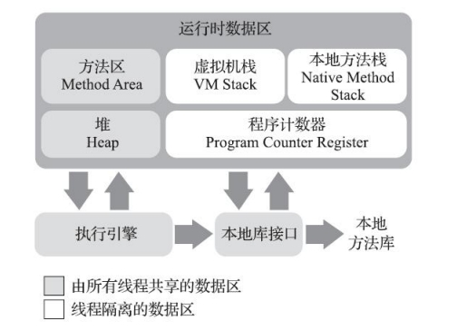

# 第二章、Java内存区域与内存溢出异常

一般来说，和C、C++不同，Java是由虚拟机管理内存，不需要开发者去操心。但当出现问题时(比如常见的内存溢出、泄露)，如果对JVM不了解就很难去排查问题

## 2.1 运行时数据区域

跟据《Java虚拟机规范》的规定，Java虚拟机所管理的内存将会包括以下几个运行时数据区域。开始对这几个区域做详细的学习。



### 2.1.1 程序计数器

程序计数器是程序控制流的指示器，分支、循环、跳转、异常处理、线程恢复等基础功能都依赖程序计数器来完成。每个线程的程序计数器都独立存储、互不影响，故称为线程私有区域。

如果线程正在执行一个Java方法，那么计数器中记录的是正在执行的虚拟机字节码指令的地址。如果正在执行本地方法，计数器的值应该为空。

::: danger 疑问1

正在执行的虚拟机字节码指令的地址这个地址具体是什么呢？

:::

::: tip 解答1

虚拟机字节码指令的地址通常是指字节码流中每条指令的位置。这个地址是相对于方法的起始位置的偏移量，以字节为单位。用于在运行时执行和跟踪代码。如这段代码：

```java
public class Example {
    public static void main(String[] args) {
        int a = 5;
        int b = 10;
        int result = addNumbers(a, b);
        System.out.println("Result: " + result);
    }

    public static int addNumbers(int x, int y) {
        return x + y;
    }
}
```

通过javap反编译字节码

```java
public class Example {
  public Example();
    Code:
       0: aload_0
       1: invokespecial #1    // Method java/lang/Object."<init>":()V
       4: return

  public static void main(java.lang.String[]);
    Code:
       0: iconst_5
       1: istore_1
       2: bipush        10
       4: istore_2
       5: iload_1
       6: iload_2
       7: invokestatic  #2   // Method addNumbers:(II)I
      10: istore_3
      11: getstatic     #3  // Field java/lang/System.out:Ljava/io/PrintStream;
      14: new           #4   // class java/lang/StringBuilder
      17: dup
      18: ldc           #5   // String Result:
      20: invokespecial #6    // Method java/lang/StringBuilder."<init>":(Ljava/lang/String;)V
      23: iload_3
      24: invokevirtual #7    // Method java/lang/StringBuilder.append:(I)Ljava/lang/StringBuilder;
      27: invokevirtual #8    // Method java/lang/StringBuilder.toString:()Ljava/lang/String;
      30: invokevirtual #9    // Method java/io/PrintStream.println:(Ljava/lang/String;)V
      33: return

  public static int addNumbers(int, int);
    Code:
       0: iload_0
       1: iload_1
       2: iadd
       3: ireturn
}
```

iconst_5其地址是0，istore_1其地址是1，这就是程序计数器中保存的内容。<font color="green">而这个偏移量，就是栈顶栈帧中的方法正在执行的位置</font>

:::

### 2.1.2 Java虚拟机栈

Java虚拟机栈是线程私有的，其生命周期和线程相同。每个方法被执行的时候，Java虚拟机都会同步创建一个栈帧，用于存储局部变量表、操作数栈、动态连接、方法出口等信息。每个方法被调用直至执行完毕就对应了一个栈帧在虚拟机栈中入栈到出栈的过程。

如果线程请求的栈深度大于虚拟机所允许的深度，将抛出StackOverflowError。如果Java虚拟机栈容量可以动态扩展，当栈扩展时无法申请到足够的内存会排除OutOfMemoryError。

这里有特别备注，HotSpot虚拟机的栈容量是不可以动态扩展的，也就是说不会因为无法扩展出现OOM。但如果线程申请栈空间时失败，仍然会出现OOM。另外关于栈帧会在第八章中详细讲解。

### 2.1.3 本地方法栈

和Java虚拟机栈类似，区别在于本地方法栈用于执行本地方法(即native)。《Java虚拟机规范》对本地方法栈中方法使用的语言、使用方式与数据结构并没有任何强制规定，具体的虚拟机可以自由实现。如HotSpot中就把本地方法栈和虚拟机栈合二为一。

本地方法栈和Java虚拟机栈一样，也会在栈深度溢出或扩展失败时分别抛出StackOverflowError和OutOfMemoryError异常。

### 2.1.4 Java堆

堆是所有线程共享的一块区域，也是出问题最多、最复杂的区域，堆的唯一目的就是存放对象实例。堆的设计很复杂，分代划分、缓冲区等等，但无论怎么设计，堆存储的始终是对象的实例这些设计只是为了更好地回收内存、更快的分配内存。另外堆还涉及GC算法，这些都会在后续章节中详细讲解。

如果Java堆无法完成内存分配且无法再扩展时，会抛出OutOfMemoryError异常。

### 2.1.5 方法区

方法区时所有线程共享的区域，用于存储已被虚拟机加载的类型信息、常量、静态变量、即时编译器编译后的代码缓存等数据。如果方法区无法满足新的内存分配需求时，将抛出OutOfMemoryError异常。

::: danger 疑问2

关于方法区，经常能听到另外几个名词：永久代、元空间，这些到底有什么异同？另外存储的类型信息、常量、静态变量这些对应到代码又是哪些内容呢？

:::

::: tip 解答2

方法区（Method Area）、元空间（Metaspace）和永久代（Permanent Generation）是与Java虚拟机内存区域相关的概念，它们在不同的Java虚拟机实现中有一些区别。以下是它们之间的主要区别：

1. **永久代（Permanent Generation）：**
   - **概念：** 在Java虚拟机的早期版本（Java 7及之前）中存在永久代，用于存储类的元数据、静态变量、常量池等信息。
   - **大小固定：** 永久代的大小在启动时就被固定，因此存在内存溢出的可能性。
   - **垃圾回收：** 永久代使用传统的垃圾回收器，例如Serial GC和Parallel GC。

2. **方法区（Method Area）：**
   - **概念：** 方法区是Java虚拟机规范中的一部分，包括永久代。在Java 8及之后的版本，永久代被元空间所取代，但方法区的概念仍然存在。
   - **存储内容：** 方法区用于存储类的元数据信息、静态变量、常量池等。
   - **垃圾回收：** 方法区使用不同的垃圾回收策略，通常使用CMS GC或G1 GC。

3. **元空间（Metaspace）：**
   - **概念：** 元空间是Java虚拟机在Java 8及之后版本中引入的概念，用于替代永久代。
   - **动态大小：** 元空间的大小不再是固定的，它可以根据应用程序的需求动态调整。
   - **垃圾回收：** 元空间通常不进行垃圾回收，而是通过本地内存管理来释放不再使用的内存。
   - **存储位置：** 元空间的元数据存储在本地内存（native memory）中，而不是Java虚拟机的堆内存中。

总体而言，Java 8及之后版本移除了永久代，引入了元空间作为存储类的元数据的替代。这样的改变使得内存管理更加灵活，并且更容易避免由于永久代固定大小而导致的内存溢出问题。

在Java虚拟机中，方法区和永久代（或在Java 8及以后的版本中的元空间）主要用于存储类相关的信息，但它们存储的具体内容有一些区别。以下是它们的主要内容：

### 方法区（Method Area）：
1. **类的元数据信息：** 包括类的名称、父类的名称、类的字段、方法信息等。
2. **静态变量：** 类级别的静态变量存储在方法区。
3. **常量池（Runtime Constant Pool）：** 类中的常量，如字符串常量、final常量等，存储在常量池中。
4. **即时编译器编译后的代码：** 方法区可以包含即时编译器（Just-In-Time Compiler，JIT）生成的本地机器代码。

### 永久代（在Java 7及之前的版本中）：
1. **类的元数据信息：** 类的结构、字段、方法等。
2. **静态变量：** 类级别的静态变量。
3. **常量池：** 存储字符串常量、final常量等。
4. **运行时常量池：** 是常量池的一部分，用于存储运行时产生的一些常量。
5. **方法区的内部数据结构：** 包括虚拟机加载的类的字段、方法信息，以及一些运行时常量池的数据结构。

### 方法区中的非永久代部分（在Java 7及之前的版本中）：
在方法区中的非永久代部分主要包括除永久代之外的其他一些数据，如：
1. **直接运行时常量池：** 在运行时，存储运行时产生的一些常量。
2. **JIT编译器生成的代码：** 即时编译器编译后的本地机器代码。
3. **其他类加载器加载的类信息：** 例如，通过自定义类加载器加载的类信息。

需要注意的是，在Java 8及以后的版本中，永久代被元空间（Metaspace）取代。元空间不再是虚拟机的一部分，而是使用本地内存来存储类的元数据。这使得元空间更加灵活，不再受到永久代大小的限制。在这种情况下，元空间中存储的内容与永久代类似，主要包括类的元数据、静态变量、常量池等。

:::


