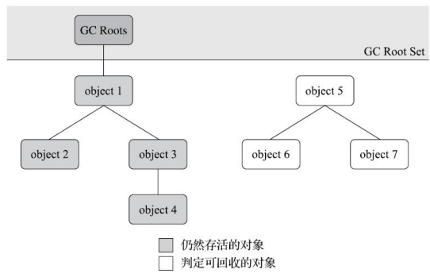
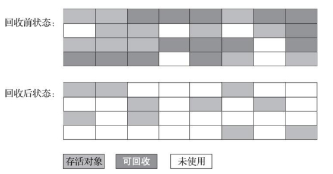
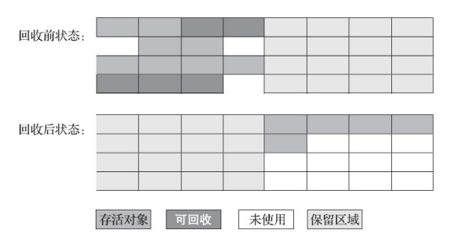
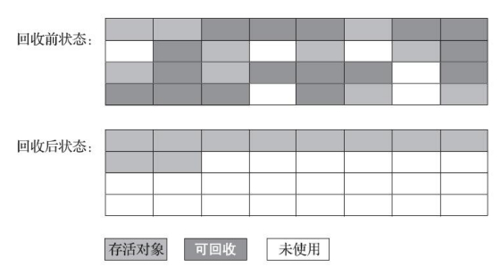

# 第三章、垃圾收集器与内存分配策略

## 3.1 对象已死

垃圾收集器对堆中对象回收前，第一件事情就是要确定这些对象中哪些已经不可能再被任何途径使用了

### 3.1.1 引用计数器法

在对象中添加一个引用计数器，每当有一个地方引用它时，计数器值就加一；当引用失效时，计数器值就减一；任何时刻计数器为零的对象就是不可能再被使用的。

在Java领域，至少主流的Java虚拟机都没有选用引用计数器法。主要原因是，看似简单的算法有很多例外情况要考虑，必须配合大量额外处理才能保证正确地工作，如：

循环引用问题：对象objA和对象objB都有字段instance，令objA.instance = objB，objB.instance = objA。此外，两个对象再无引用。那么实际上这两个对象已经不可能再被访问，但它们互相引用着对方，导致它们的引用计数都不为零，引用计数算法也就无法回收它们

### 3.1.2 可达性分析算法

通过一系列称为GC Roots的根对象作为起始节点集，从这些节点开始，跟据引用关系向下搜索，搜索过程所走过的路径称为引用链(Reference Chain)，如果某个对象到GC Roots间没有任何引用链相连，或者说从GC Roots到这个对象不可达时，则证明此对象是不可能再被使用

如图所示，object 5、6、7，虽然互有关联，但它们到GC Roots是不可达的，因此它们将会被判定为可回收对象

### 3.1.3 再谈引用

JDK1.2之前，如果reference类型的数据中存储的数值代表的是另一块内存的起始地址，就称该reference数据是代表某块内存、某个对象的引用。

JDK1.2之后，Java对引用的概念进行了扩充，分为强引用、软引用、弱引用和虚引用，引用强度依次逐渐渐弱

- 强引用：即`Object obj = new Object()`这种引用关系，无论任何情况下，只要强引用关系还存在，垃圾收集器就永远不会回收掉被引用的对象
- 软引用：`SoftReference`非必须但还有用的对象，在系统将要发生OOM异常前，会把这些对象列进回收范围之中进行第二次回收，如果这次回收还没有足够的内存，才会抛出OOM异常
- 弱引用：`WeakReference`非必须对象比软引用更弱一些，被弱引用关联的对象只能生存到下一次垃圾收集发生。GC时，无论内存是否足够，都会回收掉只被弱引用关联的对象
- 虚引用：`PhantomReference`，一个对象是否有虚引用的存在，完全不会对其生存时间构成影响，也无法通过虚引用来取得一个对象实例。虚引用的唯一目的是为了能在这个对象被收集器回收时收到一个系统通知

### 3.1.4 生存还是死亡？

对象通过finalize()方法自救，如果对象在进行可达性分析后发现没有与GC Roots相连接的引用链，会被第一次标记，随后进行依次筛选。

筛选的条件是此对象是否有必要执行finalize()方法，加入对象没有覆盖finalize()方法或者finalize()方法已经被虚拟机调用过，均视为没有必要执行，这时候对象就要被回收了

如果有必要执行finalize()，该对象会被放入F-Queue中，由一条虚拟机自动建立的、低调度优先级的Finalizer线程去执行它们的finalize()方法(这里提到Finalizer线程并不一定会等待方法运行结束)。

如果finalize()方法重新和引用链上的任何一个对象建立关联，那么第二次标记时会将它移出即将回收的集合；如果没有连接，那么就要被回收。finalize()方法的运行代价高昂、不确定性大，无法保证各个对象的调用顺序，如今已被官方明确声明为不推荐使用的语法

### 3.1.5 回收方法区

方法区回收两部分内容：废弃的常量和不再使用的类型

回收废弃常量和Java堆中的对象类似，如一个字符串Java，如果没有任何字符串对象引用常量池中的Java，且虚拟机中也没有其他地方引用这个字面量。那么Java常量就会被清理出常量池。常量池中其他类(接口)、方法、字段的符号引用也与此类似

不再使用的类条件就比较苛刻，需要同时满足以下三个条件：

- 该类所有的实例都已经被回收
- 加载该类的类加载器已经被回收
- 该类对应的java.lang.Class对象没有在任何地方被引用

此外是否对类型进行回收，还取决于虚拟机参数：`-Xnoclassgc`

## 3.2 垃圾回收算法

这里介绍的算法均属于追踪式垃圾收集的范畴

### 3.2.1 分代收集理论

分代收集名为理论，实质上是一套符合大多数程序运行实际情况的经验法则，它建立在两个分代假说之上：

- 弱分代假说：绝大多数对象都是朝生夕灭的
- 强分代假说：熬过越多次垃圾收集过程的对象就越难以消亡

这两个分代假说共同奠定了多款常用的垃圾收集器的一致的涉及原则：收集器应该将Java堆划分出不同的区域(新生代、老年代)，然后将回收对象依据其年龄分配到不同的区域之中存储。

在Java堆划分出不同的区域之后，垃圾收集器才可以每次只回收其中某一个或者某些部分的区域，如：Minor GC、Major GC、Full GC。也才能够针对不同的区域安排与里面存储对象存亡特征相匹配的垃圾收集算法，如：标记-复制算法、标记-清除算法、标记-整理算法。

但随着分代收集理论的发展，也暴露出一些问题，比如跨代引用问题。加入要进行一次只局限于新生代区域内的收集(Minor GC)，但新生代中的对象完全有可能被老年代所引用。为了找出该区域中的存货对象，不得不在固定的GC Roots之外，再额外遍历整个老年代中所有对象来确保可达性分析结果的正确性。

为了解决这个问题，诞生了第三条经验法则：跨代引用假说，跨代引用相对于同代引用来说仅占极少数。

依据这条假说，只需要再新生代上建立一个全局的数据结构(记忆集)，这个结构把老年代划分成若干小块，标志出老年代的哪一块内存会存在跨代引用。发生Minor GC时，只有包含跨代引用的内存里的对象才会加入GC Roots进行扫描。

::: tip GC名词

关于Minor GC、Major GC等名词的定义

- 部分收集(Partial GC)：指目标不是完整收集整个Java堆的垃圾收集，还可以细分为：
  - 新生代收集(Minor GC/Young GC)：指目标只是新生代的垃圾收集
  - 老年代收集(Major GC/Old GC)：指目标只是老年代的垃圾收集。只有CMS收集器会有单独收集老年代的行为。
  - 混合收集(Mixed GC)：指目标是收集整个新生代以及部分老年代的垃圾收集。目前只有G1收集器会有这种行为
- 整堆收集(Full GC)：收集整个Java堆和方法区的垃圾收集

:::

### 3.2.2 标记-清除算法

最早出现也是最基础的垃圾收集算法是“标记-清除”算法。分为标记、清除两个阶段：首先标记处所有需要回收的对象，标记完成后，统一回收掉所有被标记的对象(也可以反过来，标记存活的对象，统一回收所有未被标记的对象)

有两个主要的缺点：

- 执行效率不稳定：如果Java堆中包含大量对象，而且其中大部分是需要被回收的，这时必须进行大量标记和清除的动作。简单说就是标记、清除过程的执行效率都随对象增长而降低
- 内存空间的碎片化：标记、清除后会产生大量不连续的内存碎片，空间碎片太多可能会导致程序运行过程中需要分配较大对象时无法找到足够的连续内存而不得不提前触发另一次垃圾收集动作

### 3.2.3 标记-复制算法

为了解决标记-清除算法面对大量可回收对象时效率低的问题。将可用内存按容量划分为大小相等的两块，每次只使用其中一块。当这一块的内存用完了，就将还存活的对象复制到另外一块上面，然后再把已使用过的内存空间一次清理掉。

优点：对于多数对象都是可回收的情况，算法需要复制的就是占少数的存活对象；分配内存时也不用考虑有空间碎片的情况，需要移动堆顶指针，按顺序分配即可

缺点：如果内存中多数对象都是存活的，这种算法将会产生大量的内存间复制的开销；此外代价是将可用内存缩小为原来的一半

现在的商用Java虚拟机大多都优先采用了这种收集算法去回收新生代。1989年，Andrew Appel针对具备朝生夕灭特点的对象，提出了一种更优化的搬去复制分代策略，称为Appel式回收，HotSpot虚拟机的Serial、ParNew等新生代收集器均采用了这种策略来涉及新生代的内存布局。

Appel式回收将新生代分为一块较大的Eden区和两块较小的Survivor区。每次分配内存只使用Eden和其中一块Survivor。发生垃圾收集时，将Eden和Survivor中仍然存活的对象一次性复制到另外一块Survivor空间上，然后清理掉Eden和已用过的那块Survivor空间

HotSpot虚拟机默认Eden和Survivor的大小比例是8:1，也就是说新生代的可用内存空间为整个新生代的90%。另外当Survivor空间不足以容纳一次Minor GC后存活的对象时，就需要依赖其他内存区域(大多就是老年代)进行分配担保

### 3.2.4 标记-整理算法

在老年代一般不能直接选用标记-复制算法，老年代对象的存活率通常比较高。而标记-复制算法在对象存活率高时要进行较多的复制，效率降低；更关键的是如果不想浪费50%的空间，就需要有额外的空间进行分配担保，以应对被使用的内存中所有对象都存活的极端情况。

标记-整理算法：标记之后，让所有存活的对象都向内存空间一端移动，然后直接清理掉边界以外的内存

和标记-清除算法就区别在于标记-整理算法是移动式的，而是否移动回收后的存活对象是一项优缺点并存的风险决策：

- 如果移动存活对象，那么像老年代每次回收都有大量对象存活，移动存活对象还需要更新所有引用，是一种极为负重的操作
- 如果不移动，势必产生空间碎片化问题，需要引入更为复杂的内存分配器和内存访问器。而访问内存环节增加额外的负担，势必会直接影响应用程序的吞吐量

针对这一问题没有兼备的办法，只有取舍。HotSpot中关注吞吐量的Parallel Scavenge收集器是基于标记-整理算法的，而关注延迟的CMS收集器则是基于标记-清除算法的。

此外CMS收集器并非完全基于标记-清除，CMS收集器平时多数时间采用标记-清除算法，暂时容忍内存碎片的存在，直到内存空间的碎片化程度已经大到影响对象分配时，再采用标记-整理算法收集一次，获得规整的内存空间。

## 3.3 HotSpot的算法细节实现

### 3.3.1 根节点枚举

::: tip 什么是根节点枚举？

根节点枚举就是找出所有的GC Roots

:::

::: tip 哪些对象可以作为GC Roots？

- 在虚拟机栈（栈帧中的本地变量表）中引用的对象，譬如各个线程被调用的方法堆栈中使用到的参数、局部变量、临时变量等。
- 在方法区中常量引用的对象，譬如字符串常量池（String Table）里的引用。
- 在本地方法栈中JNI（即通常所说的Native方法）引用的对象。
- Java虚拟机内部的引用，如基本数据类型对应的Class对象，一些常驻的异常对象（比如NullPointExcepiton、OutOfMemoryError）等，还有系统类加载器。
- 所有被同步锁（synchronized关键字）持有的对象。
- 反映Java虚拟机内部情况的JMXBean、JVMTI中注册的回调、本地代码缓存等。

总的来说，固定可作为GC Roots的节点主要在全局性的引用（例如常量或类静态属性）与执行上下文（例如栈帧中的本地变量表）中

:::

枚举根节点必须在一个能确保一致性的快照中进行，在整个分析期间整个执行系统看起来就像被冻结在某个时间点上，不可以出现分析过程中对象引用关系还在不断变化的情况，这点不满足的话分析结果准确性就无法得到保证

为了保证这一要求，所有收集器在根节点枚举这一步骤时必须暂停用户线程。但也引入了新的问题：根节点枚举的效率必须要高。如果效率很低，那么每次全体用户线程暂停都需要等待很长时间，这会严重影响程序性能。

效率问题HotSpot的解决方案：使用一组称为OopMap的数据结构。一旦类加载动作完成的时候，HotSpot就会把对象内什么偏移量上是什么类型的数据计算出来，在即时编译过程中，也会在特定的位置记录下栈里和寄存器里哪些位置是引用。这样收集器在扫描时就可以直接得知这些信息

::: tip 根节点枚举小结

执行可达性分析的前提就是要找出所有的GC Roots(也叫做根节点枚举)。而根节点枚举要求运行环节对象引用关系不变，也就是说需要暂停所有用户线程。而为了保证程序的性能，引入了OopMap来保存对象地址，以便快速的定位GC Roots，是一种空间换时间的办法

:::

### 3.3.2 安全点

引入OopMap后又引入了新的问题：可能导致引用关系变化或者说导致OopMap内容变化地指令非常多，如果为每一条指令都生成对应地OopMap，那将会需要大量地额外存储空间，导致垃圾收集的空间成本变高

为了解决该问题引入安全点：虚拟机只会在特定的位置记录这些信息，这些特定的位置被称为安全点。因为安全点的存在，用户程序执行时并非在代码指令流的任何位置都能够停顿下来开始垃圾收集，而是必须指定到安全点之后才能够暂停

安全点位置选择：安全点位置的选取基本上是以“是否具有让程序长时间执行的特性”为标准进行选取的，长时间执行的最明显特征就是指令序列的复用，例如方法调用、循环跳转、异常跳转等都属于指令序列复用，所以只有具有这些功能的指令才会产生安全点

线程中断方式：如何在垃圾收集发生时让所有线程都跑到最近的安全点然后停顿下来？这里有两种方案可供选择：

- 抢先式中断：先把所有用户线程全部中断，如果发现有用户线程中断的地方不在安全点上，就恢复这条线程执行，让它一会再重新中断，直到跑到安全点上。几乎没有虚拟机实现采用抢先式中断来暂停线程响应GC事件
- 主动式中断：当垃圾收集需要中断线程的时候，不直接对线程操作，仅仅简单地设置一个标志位，各个线程执行过程时会不停地主动去轮询这个标志，一旦发现中断标志为true时，就自己在最近地安全点上主动中断挂起

而主动式中断又引入新的问题：轮询的效率。HotSpot使用内存保护陷阱的方式，把轮询操作精简至只有一条汇编指令的程度。当需要暂停用户线程时，虚拟机把0x160100的内存页设置为不可读，那线程执行到test指令时就会产生一个自陷异常信号，然后在预先注册的异常处理器中挂起线程实现等待，这样仅通过一条汇编指令便完成安全点轮询和触发线程中断了。

简单来说当用户线程抵达安全点时，

### 3.3.3 安全区域

新问题引入：如果用户线程处于Sleep状态或者Blocked状态，这时候线程无法响应虚拟机的中断状态，不能再走到安全点去中断自己