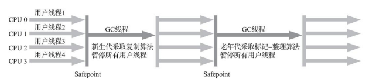

# 第三章、垃圾收集器与内存分配策略

## 3.1 概述

## 3.2 对象已死

垃圾收集器对堆中对象回收前，第一件事情就是要确定这些对象中哪些已经不可能再被任何途径使用了

### 3.2.1 引用计数器法

在对象中添加一个引用计数器，每当有一个地方引用它时，计数器值就加一；当引用失效时，计数器值就减一；任何时刻计数器为零的对象就是不可能再被使用的。

在Java领域，至少主流的Java虚拟机都没有选用引用计数器法。主要原因是，看似简单的算法有很多例外情况要考虑，必须配合大量额外处理才能保证正确地工作，如：

循环引用问题：对象objA和对象objB都有字段instance，令objA.instance = objB，objB.instance = objA。此外，两个对象再无引用。那么实际上这两个对象已经不可能再被访问，但它们互相引用着对方，导致它们的引用计数都不为零，引用计数算法也就无法回收它们

### 3.2.2 可达性分析算法

通过一系列称为GC Roots的根对象作为起始节点集，从这些节点开始，跟据引用关系向下搜索，搜索过程所走过的路径称为引用链(Reference Chain)，如果某个对象到GC Roots间没有任何引用链相连，或者说从GC Roots到这个对象不可达时，则证明此对象是不可能再被使用


如图所示，object 5、6、7，虽然互有关联，但它们到GC Roots是不可达的，因此它们将会被判定为可回收对象

### 3.2.3 再谈引用

JDK1.2之前，如果reference类型的数据中存储的数值代表的是另一块内存的起始地址，就称该reference数据是代表某块内存、某个对象的引用。

JDK1.2之后，Java对引用的概念进行了扩充，分为强引用、软引用、弱引用和虚引用，引用强度依次逐渐渐弱

- 强引用：即`Object obj = new Object()`这种引用关系，无论任何情况下，只要强引用关系还存在，垃圾收集器就永远不会回收掉被引用的对象
- 软引用：`SoftReference`非必须但还有用的对象，在系统将要发生OOM异常前，会把这些对象列进回收范围之中进行第二次回收，如果这次回收还没有足够的内存，才会抛出OOM异常
- 弱引用：`WeakReference`非必须对象比软引用更弱一些，被弱引用关联的对象只能生存到下一次垃圾收集发生。GC时，无论内存是否足够，都会回收掉只被弱引用关联的对象
- 虚引用：`PhantomReference`，一个对象是否有虚引用的存在，完全不会对其生存时间构成影响，也无法通过虚引用来取得一个对象实例。虚引用的唯一目的是为了能在这个对象被收集器回收时收到一个系统通知

### 3.2.4 生存还是死亡？

对象通过finalize()方法自救，如果对象在进行可达性分析后发现没有与GC Roots相连接的引用链，会被第一次标记，随后进行依次筛选。

筛选的条件是此对象是否有必要执行finalize()方法，加入对象没有覆盖finalize()方法或者finalize()方法已经被虚拟机调用过，均视为没有必要执行，这时候对象就要被回收了

如果有必要执行finalize()，该对象会被放入F-Queue中，由一条虚拟机自动建立的、低调度优先级的Finalizer线程去执行它们的finalize()方法(这里提到Finalizer线程并不一定会等待方法运行结束)。

如果finalize()方法重新和引用链上的任何一个对象建立关联，那么第二次标记时会将它移出即将回收的集合；如果没有连接，那么就要被回收。<font color="orange">finalize()方法的运行代价高昂、不确定性大，无法保证各个对象的调用顺序，如今已被官方明确声明为不推荐使用的语法</font>

### 3.2.5 回收方法区

方法区回收两部分内容：废弃的常量和不再使用的类型

回收废弃常量和Java堆中的对象类似，如一个字符串Java，如果没有任何字符串对象引用常量池中的Java，且虚拟机中也没有其他地方引用这个字面量。那么Java常量就会被清理出常量池。常量池中其他类(接口)、方法、字段的符号引用也与此类似

不再使用的类条件就比较苛刻，需要同时满足以下三个条件：

- 该类所有的实例都已经被回收
- 加载该类的类加载器已经被回收
- 该类对应的java.lang.Class对象没有在任何地方被引用

此外是否对类型进行回收，还取决于虚拟机参数：`-Xnoclassgc`

## 3.3 垃圾回收算法

这里介绍的算法均属于追踪式垃圾收集的范畴

### 3.3.1 分代收集理论

分代收集名为理论，实质上是一套符合大多数程序运行实际情况的经验法则，它建立在两个分代假说之上：

- <font color="red">弱分代假说</font>：绝大多数对象都是朝生夕灭的
- <font color="red">强分代假说</font>：熬过越多次垃圾收集过程的对象就越难以消亡

这两个分代假说共同奠定了多款常用的垃圾收集器的一致的涉及原则：收集器应该将Java堆划分出不同的区域(新生代、老年代)，然后将回收对象依据其年龄分配到不同的区域之中存储。

在Java堆划分出不同的区域之后，垃圾收集器才可以每次只回收其中某一个或者某些部分的区域，如：Minor GC、Major GC、Full GC。也才能够针对不同的区域安排与里面存储对象存亡特征相匹配的垃圾收集算法，如：标记-复制算法、标记-清除算法、标记-整理算法。

但随着分代收集理论的发展，也暴露出一些问题，比如跨代引用问题。加入要进行一次只局限于新生代区域内的收集(Minor GC)，但新生代中的对象完全有可能被老年代所引用。为了找出该区域中的存货对象，不得不在固定的GC Roots之外，再额外遍历整个老年代中所有对象来确保可达性分析结果的正确性。

为了解决这个问题，诞生了第三条经验法则：<font color="red">跨代引用假说</font>，跨代引用相对于同代引用来说仅占极少数。

依据这条假说，只需要再新生代上建立一个全局的数据结构(记忆集)，这个结构把老年代划分成若干小块，标志出老年代的哪一块内存会存在跨代引用。发生Minor GC时，只有包含跨代引用的内存里的对象才会加入GC Roots进行扫描。

::: tip GC名词

关于Minor GC、Major GC等名词的定义

- 部分收集(Partial GC)：指目标不是完整收集整个Java堆的垃圾收集，还可以细分为：
  - 新生代收集(Minor GC/Young GC)：指目标只是新生代的垃圾收集
  - 老年代收集(Major GC/Old GC)：指目标只是老年代的垃圾收集。只有CMS收集器会有单独收集老年代的行为。
  - 混合收集(Mixed GC)：指目标是收集整个新生代以及部分老年代的垃圾收集。目前只有G1收集器会有这种行为
- 整堆收集(Full GC)：收集整个Java堆和方法区的垃圾收集

:::

### 3.3.2 标记-清除算法

最早出现也是最基础的垃圾收集算法是“标记-清除”算法。分为标记、清除两个阶段：首先标记处所有需要回收的对象，标记完成后，统一回收掉所有被标记的对象(也可以反过来，标记存活的对象，统一回收所有未被标记的对象)

有两个主要的缺点：

- 执行效率不稳定：如果Java堆中包含大量对象，而且其中大部分是需要被回收的，这时必须进行大量标记和清除的动作。简单说就是标记、清除过程的执行效率都随对象增长而降低
- 内存空间的碎片化：标记、清除后会产生大量不连续的内存碎片，空间碎片太多可能会导致程序运行过程中需要分配较大对象时无法找到足够的连续内存而不得不提前触发另一次垃圾收集动作


### 3.3.3 标记-复制算法

为了解决标记-清除算法面对大量可回收对象时效率低的问题。将可用内存按容量划分为大小相等的两块，每次只使用其中一块。当这一块的内存用完了，就将还存活的对象复制到另外一块上面，然后再把已使用过的内存空间一次清理掉。

优点：对于多数对象都是可回收的情况，算法需要复制的就是占少数的存活对象；分配内存时也不用考虑有空间碎片的情况，需要移动堆顶指针，按顺序分配即可

缺点：如果内存中多数对象都是存活的，这种算法将会产生大量的内存间复制的开销；此外代价是将可用内存缩小为原来的一半


现在的商用Java虚拟机大多都优先采用了这种收集算法去回收新生代。1989年，Andrew Appel针对具备朝生夕灭特点的对象，提出了一种更优化的搬去复制分代策略，称为Appel式回收，HotSpot虚拟机的Serial、ParNew等新生代收集器均采用了这种策略来涉及新生代的内存布局。

Appel式回收<font color="orange">将新生代分为一块较大的Eden区和两块较小的Survivor区</font>。每次分配内存只使用Eden和其中一块Survivor。发生垃圾收集时，将Eden和Survivor中仍然存活的对象一次性复制到另外一块Survivor空间上，然后清理掉Eden和已用过的那块Survivor空间

HotSpot虚拟机默认Eden和Survivor的大小比例是8:1，也就是说新生代的可用内存空间为整个新生代的90%。另外当Survivor空间不足以容纳一次Minor GC后存活的对象时，就需要依赖其他内存区域(大多就是老年代)进行分配担保

### 3.3.4 标记-整理算法

在老年代一般不能直接选用标记-复制算法，老年代对象的存活率通常比较高。而标记-复制算法在对象存活率高时要进行较多的复制，效率降低；更关键的是如果不想浪费50%的空间，就需要有额外的空间进行分配担保，以应对被使用的内存中所有对象都存活的极端情况。

标记-整理算法：标记之后，让所有存活的对象都向内存空间一端移动，然后直接清理掉边界以外的内存


和标记-清除算法就区别在于标记-整理算法是移动式的，而是否移动回收后的存活对象是一项优缺点并存的风险决策：

- 如果移动存活对象，那么像老年代每次回收都有大量对象存活，移动存活对象还需要更新所有引用，是一种极为负重的操作
- 如果不移动，势必产生空间碎片化问题，需要引入更为复杂的内存分配器和内存访问器。而访问内存环节增加额外的负担，势必会直接影响应用程序的吞吐量

针对这一问题没有兼备的办法，只有取舍。HotSpot中关注吞吐量的Parallel Scavenge收集器是基于标记-整理算法的，而关注延迟的CMS收集器则是基于标记-清除算法的。

此外CMS收集器并非完全基于标记-清除，CMS收集器平时多数时间采用标记-清除算法，暂时容忍内存碎片的存在，直到内存空间的碎片化程度已经大到影响对象分配时，再采用标记-整理算法收集一次，获得规整的内存空间。

## 3.4 HotSpot的算法细节实现

### 3.4.1 根节点枚举

::: tip 什么是根节点枚举？

根节点枚举就是找出所有的GC Roots

:::

::: tip 哪些对象可以作为GC Roots？

- 在虚拟机栈（栈帧中的本地变量表）中引用的对象，譬如各个线程被调用的方法堆栈中使用到的参数、局部变量、临时变量等。
- 在方法区中常量引用的对象，譬如字符串常量池（String Table）里的引用。
- 在本地方法栈中JNI（即通常所说的Native方法）引用的对象。
- Java虚拟机内部的引用，如基本数据类型对应的Class对象，一些常驻的异常对象（比如NullPointExcepiton、OutOfMemoryError）等，还有系统类加载器。
- 所有被同步锁（synchronized关键字）持有的对象。
- 反映Java虚拟机内部情况的JMXBean、JVMTI中注册的回调、本地代码缓存等。

总的来说，固定可作为GC Roots的节点主要在全局性的引用（例如常量或类静态属性）与执行上下文（例如栈帧中的本地变量表）中

:::

<font color="orange">枚举根节点必须在一个能确保一致性的快照中进行</font>，在整个分析期间整个执行系统看起来就像被冻结在某个时间点上，不可以出现分析过程中对象引用关系还在不断变化的情况，这点不满足的话分析结果准确性就无法得到保证

为了保证这一要求，所有收集器在根节点枚举这一步骤时必须暂停用户线程。但也引入了新的问题：根节点枚举的效率必须要高。如果效率很低，那么每次全体用户线程暂停都需要等待很长时间，这会严重影响程序性能。

效率问题HotSpot的解决方案：使用一组称为OopMap的数据结构。一旦类加载动作完成的时候，HotSpot就会把对象内什么偏移量上是什么类型的数据计算出来，在即时编译过程中，也会在特定的位置记录下栈里和寄存器里哪些位置是引用。这样收集器在扫描时就可以直接得知这些信息

::: tip 根节点枚举小结

执行可达性分析的前提就是要找出所有的GC Roots(也叫做根节点枚举)。而根节点枚举要求运行环节对象引用关系不变，也就是说需要暂停所有用户线程。而为了保证程序的性能，引入了OopMap来保存对象地址，以便快速的定位GC Roots，是一种空间换时间的办法

:::

### 3.4.2 安全点

引入OopMap后又引入了新的问题：可能导致引用关系变化或者说导致OopMap内容变化地指令非常多，如果为每一条指令都生成对应地OopMap，那将会需要大量地额外存储空间，导致垃圾收集的空间成本变高

为了解决该问题引入安全点：虚拟机只会在特定的位置记录这些信息，这些特定的位置被称为安全点。因为安全点的存在，用户程序执行时并非在代码指令流的任何位置都能够停顿下来开始垃圾收集，而是必须指定到安全点之后才能够暂停

安全点位置选择：安全点位置的选取基本上是以“是否具有让程序长时间执行的特性”为标准进行选取的，长时间执行的最明显特征就是指令序列的复用，例如<font color="red">方法调用、循环跳转、异常跳转</font>等都属于指令序列复用，所以只有具有这些功能的指令才会产生安全点

线程中断方式：如何在垃圾收集发生时让所有线程都跑到最近的安全点然后停顿下来？这里有两种方案可供选择：

- <font color="red">抢先式中断</font>：先把所有用户线程全部中断，如果发现有用户线程中断的地方不在安全点上，就恢复这条线程执行，让它一会再重新中断，直到跑到安全点上。几乎没有虚拟机实现采用抢先式中断来暂停线程响应GC事件
- <font color="red">主动式中断</font>：当垃圾收集需要中断线程的时候，不直接对线程操作，仅仅简单地设置一个标志位，各个线程执行过程时会不停地主动去轮询这个标志，一旦发现中断标志为true时，就自己在最近地安全点上主动中断挂起

而主动式中断又引入新的问题：轮询的效率。HotSpot使用内存保护陷阱的方式，把轮询操作精简至只有一条汇编指令的程度。当需要暂停用户线程时，虚拟机把0x160100的内存页设置为不可读，那线程执行到test指令时就会产生一个自陷异常信号，然后在预先注册的异常处理器中挂起线程实现等待，这样仅通过一条汇编指令便完成安全点轮询和触发线程中断了。

::: tip 安全点小结

用户线程只有抵达安全点后才能够暂停，而所有用户线程都暂停后会执行OopMap的生成或更新。而暂停的方式采用主动式中断，在抵达安全点时轮询状态，为了提高效率设计了内存保护陷阱。

:::

### 3.4.3 安全区域

安全点新问题引入：如果用户线程处于Sleep状态或者Blocked状态，这时候线程无法响应虚拟机的中断状态，不能再走到安全点去中断自己

安全区域：指能够确保在某一段代码片段之中，引用关系不会发生变化。因此，在这个区域中任意地方开始垃圾收集都是安全的。我们也可以把安全区域看作被扩展拉伸了的安全点

当用户线程执行到安全区域里面的代码时，首先会标识自己已经进入了安全区域，那样当这段时间里虚拟机要发起垃圾收集时就不必去管这些已声明在安全区域内的线程了。当线程要离开安全区域时，它要检查虚拟机是否已经完成了根节点枚举。如果完成了，就可以离开；否则就必须等待，直到受到可以离开安全区域的信号为止

### 3.4.4 记忆集与卡表

在部分区域收集时，如新生代收集时，为了避免把整个老年代都加进GC Roots扫描范围，引入了记忆集的概念

记忆集是一种用于记录从非收集区域指向收集区域的指针集合的抽象数据结构，最简单的实现可以用非收集区域中所有含跨代引用的对象数据来实现这个数据结构，但空间占用和维护成本都很高昂。<font color="orange">而事实上，收集器只需要直到某一块非收集区域是否存在有指向了收集区域的指针，并不需要了解指针的全部细节。</font>常见的记录精度：

- 字长精度：每个记录精确到一个机器字长，该字包含跨代指针
- 对象精度：每个记录精确到一个对象，该对象里有字段含有跨代指针
- 卡精度：每个记录精确到一块内存区域，该区域内有对象含有跨代指针

其中，第三种卡精度所指的是用一种称为卡表的方式来实现的，也是目前最常用的一种记忆集的实现形式。<font color="orange">注意的是：记忆集是一种抽象的数据结构或者说是一种概念，而卡表是记忆集的具体实现</font>

卡表中的每个内存块称作卡页。HotSpot中使用的卡也是2的9次幂，即512字节，一个卡页的内存中通常包含不止一个对象，只要卡页内有一个对象的字段存在着跨代指针，那就将对应卡表的数组元素的值标识为1，称为这个元素变脏，没有则标识为0。在垃圾收集发生时，只要筛选出卡表中标识为1的卡页，就能轻易得出哪些内存块中包含跨代引用指针，把它们加入GC Roots中一并扫描

### 3.4.5 写屏障

记忆集引入的新问题：谁来维护记忆集？什么时候维护记忆集？

HotSpot虚拟机中通过写屏障维护卡表状态，写屏障可以看作在虚拟机曾面对<font color="orange">引用类型字段赋值</font>这个动作的AOP切面，在引用对象赋值时会产生一个环形通知，供程序执行额外的动作。赋值前的动作称为写前屏障，在赋值后的则称为写后屏障。

除了写屏障的开销外，卡表在高并发场景下还面临着伪共享问题(现代中央处理器的缓存系统中是以缓存行为单位存储的，当多线程修改互相独立的变量时，如果这些变量恰好共享同一个缓存行，就会彼此影响(写回、无效化或者同步)而导致性能降低)。

假设处理器的缓存行大小为64字节，由于一个卡表元素占1个字节，64个卡表元素将共享一个缓存行。这64个卡表元素对应的卡页总内存为32KB。如果说不同线程更新的对象正好处于这32KB的内存区域内，就会导致更新卡表时正好写入同一个缓存行而影响性能。JDK7之后，可以使用参数`-XX:+UseCondCardMark`决定是否开启卡表更新的条件判断，开始后会增加一次额外判断，但能避免伪共享问题，两者各有利弊

### 3.4.6 并发的可达性分析

可达性分析，根节点枚举这个步骤，由于GC Roots相比起整个Java堆中全部的对象是极少数，且在各种优化(如OopMap)的加持下，其停顿已经是非常短暂且相对固定的了。但从GC Roots再继续往下遍历对象图，这一步骤的停顿时间势必与Java堆容量直接成正比例关系。

而如果用户线程和可达性分析同时进行，会产生两类问题：

- 浮动垃圾：原本消亡的对象标记为存活，是可以容忍的，下次收集时清理掉即可
- 误收集：原本存活的对象标记为已消亡并回收了，这是很危险的

而针对误收集，文中用黑白灰色做了推理，简单概括就是：

```
存在该引用关系：A->B->C，此时已经扫描完A，正在扫描B
这时用户线程切断了B->C的引用关系，又增加了A->C的引用关系，即：C<-A->B
这时C就不会被标记为存活对象，从而产生误收集问题
```

而出现这种情况，需要同时满足两个条件：

- 赋值器插入了一条或多条从黑色对象到白色对象的新引用
- 赋值器删除了全部从灰色对象到该白色对象的直接或间接引用

避免这个问题，只需要破坏这两个条件中的任意一个，由此产生了两种方案：

- <font color="red">增量更新</font>：破坏第一个条件，当黑色对象插入新的指向白色对象的引用关系时，就将这个新插入的引用记录下来。等并发扫描结束之后，再将这些记录过的引用关系中的黑色对象为根，重新扫描一次。即黑色对象一旦新插入了指向白色对象的引用后，就变回灰色对象
- <font color="red">原始快照</font>：破快第二个条件，当灰色对象要删除指向白色对象的引用关系时，就将这个要删除的引用记录下来。等并发扫描结束之后，再将这些记录过的引用关系中的灰色对象为根，重新扫描一次。即无论引用关系删除与否，都会按照刚刚开始扫描那一刻的对象图快照来进行搜索

HotSpot中，CMS基于增量更新来做并发标记，而G1、Shenandoah则是基于原始快照

## 3.5 经典垃圾收集器

### 3.5.1 Serial收集器

Serial收集器是最基础、历史最悠久的收集器，曾经JDK1.3.1之前是HotSpot虚拟机新生代收集器的唯一选择。它只会使用要给处理器或一条收集线程去完成垃圾收集，更重要的是，必须暂停其他所有工作线程，直到它收集结束。



迄今为止，它依然是HotSpot虚拟机运行在客户端模式下的默认新生代收集器，因为其简单而高效；对于内存资源受限的环境，它是所有收集器里额外内存消耗最小的；对于单核处理器或处理器核心较少的环境，Serial收集器由于没有线程交互的开销，自然可以获得最高的单线程收集效率。

### 3.5.2 ParNew收集器

ParNew收集器实质上是Serial收集器的多线程并发版本，除了同时使用多条线程进行垃圾收集之外，其余的行为斗鱼Serial收集器完全一致。ParNew是JDK7之前的遗留系统中首选的新生代收集器，一个很重要的原因是除了Serial收集器之外，只有它能和CMS收集器配合工作

而G1出世后，ParNew合并入CMS，成为它专门处理新生代的组成部分。另外，ParNew在处理器核心数量越多的环境下，效果越好。

::: tip 并行与并发

- 并行：多条垃圾收集器线程之间的关系，说明同一时间有多条这样的线程在协同工作，通常默认此时用户线程是处于等待状态
- 并发：垃圾收集器与用户线程之间的关系，说明同一时间垃圾收集器线程与用户线程都在运行，但应用程序处理的吞吐量会受到一定影响

:::

### 3.5.3 Parallel Scavenge收集器

Parallel Scavenge收集器是一款新生代收集器，基于标记-复制算法，它的目标是达到一个可控制的吞吐量。吞吐量=运行用户代码时间/(运行用户代码时间+运行垃圾收集时间)，提供了两个参数用于精确控制吞吐量以及一个开关参数：

- -XX:MaxGCPauseMillis，控制最大垃圾收集停顿时间。垃圾收集停顿时间缩短是以牺牲吞吐量和新生代空间为代价换取的，系统把新生代调小一点，停顿时间短了，但垃圾收集也会更频繁
- -XX:GCTimeRatio，大于0小于100的整数，也模式值99，即允许1%(1/(1+99))的垃圾收集时间
- -XX:+UseAdaptiveSizePolicy，这个参数激活之后就不需要人工指定新生代小大、Eden与Survivor区的比例等细节参数，虚拟机会跟据当前系统的运行情况做自适应的调节策略，这一点也是它和ParNew收集器的一个重要区别

### 3.5.4 Serial Old收集器

Serial Old是Serial收集器的老年代版本，他同样是一个单线程收集器，使用标记-整理算法。主要意义是供客户端模式下的HotSpot虚拟机使用。在服务端模式下，可能有两种用途：

- 一种是JDK5以及之前的版本中与Parallel Scavenge收集器搭配使用(这里提到，Parallel Scavenge本身有PS MarkSweep收集器来进行老年代收集，并非直接调用Serial Old收集器，但是这个PS MarkSweep收集器与Serial Old的实现几乎是一样的)
- 另外一种就是作为CMS收集器发生失败时的后备预案，在并发收集发生Concurrent Mode Failure时使用

### 3.5.5 Parallel Old收集器

Parallel Old是Parallel Scavenge收集器的老年代版本，支持多线程并发收集，基于标记-整理算法。从JDK6开始提供，和Parallel Scavenge收集器是一个吞吐量优先的搭配组合，在注重吞吐量或者处理器资源较为稀缺的场合可以优先考虑这个组合。

### 3.5.6 CMS收集器

CMS(Concurrent Mark Sweep)收集器是一种以获取最短回收停顿时间为目标的收集器。目前很大一部分的Java应用集中在互联网网站或者基于浏览器的B/S系统的服务端上，这类应用通常都会比较关注服务的响应速度。CMS收集器就非常符合这类应用的需求。

基于标记-清除算法，其运作过程分为4个步骤：

- 初始标记：标记一下GC Roots能直接关联到的对象，需要暂停全部用户线程
- 并发标记：从GC Roots直接关联对象开始遍历整个对象图，耗时长但不需要停顿用户线程
- 重新标记：修正并发标记期间，产生的变动(参照3.3.6 并发的可达性分析)，需要暂停全部用户线程
- 并发清除：清理删除掉判断为已死亡的对象，不需要停顿用户线程

其中耗时最长的并发标记和并发清除阶段，垃圾收集器线程都可以与用户线程一起工作，所以从总体上来说，CMS收集器的内存回收过程是与用户线程一起并发执行的。

CMS收集器的主要优点：并发收集、低停顿，但至少有三个明显的缺点：

- <font color="orange">对处理器资源非常敏感</font>。虽然不会导致用户线程停顿，但会占用一部分CPU，因此大GC通常会导致程序吞吐量下降
  - 为了缓解这种情况，虚拟机提供了一种称为增量式并发收集器的CMS收集器变种，在并发标记、清理时让收集器线程、用户线程交替进行，以减少垃圾收集线程的独占资源时间，但整个垃圾收集的过程会更长
  - 时间证明增量式的CMS收集器效果很一般，JDK7开始已经被生命为deprecated，JDK9后被完全废弃
- <font color="orange">无法处理浮动垃圾</font>，参照3.3.6 并发的可达性分析。因为要预留足够内存空间提供给用户线程使用，因此CMS收集器不能像其他收集器那样等待到老年代几乎完全被填满了再进行收集，必须预留一部分空间供并发收集时的程序运作使用
  - JDK5的默认设置下，当老年代使用了68%就会激活CMS收集器
  - JDK6时，默认提高至92%。但如果CMS运行期间预留的内存无法满足程序分配新对象的需要，就会出现Concurrent Mode Failure，这时候虚拟机会冻结用户线程的执行，临时启用Serial Old收集器来重新进行老年代的垃圾收集，这样停顿的时候就很长了
- <font color="orange">基于标记-清除无法避免的内存碎片</font>，往往会出现老年代还有很多剩余空间，但就是无法找到足够大的连续空间来分配对象，而不得不提前触发一次Full GC的情况
  - -XX: +UseCMS-CompactAtFullCollection(默认开启，JDK9开始废弃)，不得不进行Full GC时开启内存碎片的合并整理过程，空间碎片问题解决，但停顿时间会变长
  - -XX: CMSFullGCsBefore-Compaction(JDK9开始废弃)，要求CMS收集器在执行过若干次不整理空间的Full GC后，下一次进入Full GC前会进行碎片整理(默认值为0，每次进入Full GC时都进行碎片整理)

### 3.5.7 Garbage First收集器

在G1收集器之前的所有其他收集器，垃圾收集的目标范围要么是整个新生代，要么就是整个老年代，要么就是整个Java堆。而G1跳出了这个樊笼，它可以面向堆内存任何部分来组成回收集进行回收，衡量标准不再是它属于哪个分代，而是哪块内存中存放的垃圾数量最多，回收收益最大，这就是G1收集器的Mixed GC模式

基于Region的堆内存布局是它能够实现这个目标的关键，虽然G1也仍是遵循分代收集理论设计的，但其堆内存的布局与其他收集器有非常明显的差异：

- G1不再坚持固定大小以及固定数量的分代区域划分，而是把连续的Java堆划分为多个大小相等的独立区域，每一个Region都可以跟据需要，扮演新生代的Eden、Survivor或者老年代空间。
- G1中还有一类特殊的Humongous区域，专门存储大对象，G1认为只要大小超过了一个Region容量一半的对象即可判定为大对象，Region大小通过参数`-XX:G1HeapRegionSize`，取值范围为1MB~32MB，且应为2的N次幂。而超过了整个Region容量的超级大对象，将会存放在N个连续的Humongous Region中，G1的大多数行为都把Humongous Region当成老年代的一部分
- G1将Region作为单次回收的最小单元，即每次收集到的内存空间都是Region大小的整数倍，这样可以有计划地避免在整个Java堆中进行全区域的垃圾收集
- G1收集器去跟踪各个Region的回收所获得的空间大小以及回收所需时间，然后在后台维护一个优先级列表，每次跟据用户设定允许的收集停顿时间(`-XX:MaxGCPauseMillis`，默认200ms)，优先处理回收价值收益最大的那些Region

而G1，从2004年发表第一篇论文到2012年4月发布，用将近10年的时间。其中有很多关键的细节问题需要妥善处理：

- <font color="red">Region里面存在跨Region引用如何解决？</font>使用记忆集避免全堆作为GC Roots扫描，但G1收集器上记忆集要复杂很多。他的每个Region都维护有自己的记忆集，这些记忆集会记录下别的Region指向自己的指针，并标记这些指针分别在哪些卡页的范围之内。G1的记忆集本质上是一种哈希表，Key是别的Region的起始地址，Value是一个集合，里面存储的元素是卡表的索引号。G1至少要耗费大约Java堆容量的10%~20%的额外内存来维持收集器工作
- <font color="red">并发标记阶段如何保证收集线程与用户线程互不干扰地运行？</font>见3.3.6节，G1通过原始快照来实现。此外，还有垃圾收集对用户线程新建对象内存分配的影响。G1为每一个Region设计了两个名为TAMS的指针，把Region中的一部分空间划分出来用于并发回收过程中的新对象分配，并发回收时新分配的对象地址都必须要在这两个指针位置以上，会默认视它们存活。但如果回收速度赶不上分配速度，G1也要冻结用户线程，执行Full GC
- <font color="red">怎样建立起可靠的停顿预测模型？</font>G1收集器的停顿预测模型是以衰减均值为理论基础来实现的，在垃圾收集中，G1收集器会记录每个Region的回收耗时、每个Region记忆集里的脏卡数量等各个可测量的步骤花费的成本，并分析得出平均值、标准偏差、置信度等统计信息。衰减均值更容易受到新数据的影响，即Region的统计状态越新越能决定其回收价值。然后通过这些信息预测回收哪些Region

如果不取计算用户线程运行过程中的动作，如使用写屏障维护记忆集的操作，G1收集器的运作过程大致可划分为以下四个步骤：

- 初始标记：标记GC Roots能直接关联到的对象，并且修改TAMS指针的值，需要停顿线程，而且是借用进行Minor GC的时候同步完成的，所以这个阶段实际并没有额外停顿
- 并发标记：从GC Roots开始对堆中对象进行可达性分析，耗时较长但可与用户程序并发执行。当对象图扫描完成后，还要重新处理原始快照(SATB)记录下的在并发时有引用变动的对象
- 最终标记：对用户线程做另一个短暂暂停，用于处理并发阶段结束后，遗留下来的最后那少量的原始快照(SATB)记录
- 筛选回收：负责更新Region的统计数据，对各个Region回收价值和成本进行排序，跟据用户所期望的停顿时间来指定回收计划。可以自由选择任意多个Region构成回收集，然后把决定回收的那一部分Region的存活对象复制到空的Region中，再清理掉整个九Region的全部空间。涉及存活对象的移动，必须暂停用户线程，由多条收集器线程并行完成

G1虽然可以由用户指定期望的停顿时间，但也不能指望停顿时间很短，通常是设置为100~300毫秒比较合理。如果停顿时间太短，导致每次选出的回收集只占堆内存很小的一部分，可能会使垃圾收集的速度赶不上分配器分配的速度，导致最终引发Full GC

相比CMS，G1的优点有很多，抛开创新性设计带来的红利不谈(如指定最大停顿时间、Region的内存布局)：

- G1从整体来看是基于标记-整理算法，从局部上看又是基于标记-复制算法，G1运作期间不会产生内存空间碎片，垃圾收集完成之后能提供规整的可用内存

当然，相比CMS而言也有缺点：

- 内存占用来说，G1的卡表实现更为复杂；堆中每个Region，无论扮演的是新生代还是老年代角色，都必须有一份卡表，这导致G1的记忆集可能会占整个堆容量的20%乃至更多的内存空间
- 执行负载来说，除了相同的写后屏障来更新维护卡表，G1还需要使用写前屏障来跟踪并发时的指针变化情况。由于G1对写屏障的复杂操作要比CMS消耗更多的运算资源，所以CMS的写屏障操作实现是直接的同步操作，而G1就不得不将实现类似于消息队列的结构来实现异步处理

## 3.6 低延迟垃圾收集器

衡量垃圾收集器的三大指标：<font color="orange">内存占用</font>、<font color="orange">吞吐量</font>和<font color="orange">延迟</font>，三者共同构成了一个不可能三角。同时具备三个方面都卓越的收集器几乎是不可能的，一个优秀的收集器通常最多可以同时达成其中的两项

### 3.6.1 Shenandoah收集器

Shenandoah是一款只有OpenJDK才会包含，而OracleJDK里反而不存在的收集器。其不仅要进行并发的垃圾标记，还要进行并发地进行对象清理后的整理动作。

与G1相比，相同点有：

- 基于Region的堆内存布局
- 有用于存放大对象的Humongous Region
- 默认的回收策略同样是优先处理回收价值最大的Region

而在内存管理方面，与G1至少有3个明显的不同之处：

- 支持并发的整理
- 默认不使用分代收集
- 摒弃了G1中耗费大量内存和计算资源维护的记忆集，改用连接矩阵

### 3.6.2 ZGC收集器

ZGC是一款在JDK11中新加入的具有实验性质的低延迟垃圾收集器。

ZGC也是基于Region的堆内存布局，但其Region具有动态性：

- 小型Region，放置小于256KB的小对象
- 中型Region，放置大于等于256KB但小于4MB的对象
- 大型Region，容量不固定，但必须为2MB的整数倍，用于防止4MB或以上的大对象，且每个大型Region中只会存放一个大对象

::: tip 说明

因Shenandoah收集器是openJDK12才开始引入的，ZGC是JDK11引入的，以及下一节中提到的Epsilon收集器。因为目前企业级基本都是JDK8，故这些新兴的垃圾收集暂时都不做过深入的了解。

::: 

## 3.7 选择合适的垃圾收集器

### 3.7.1 Epsilon收集器

JDK11出现的Epsilon，以不能够进行垃圾收集为卖点的垃圾收集器

如果应用只需要运行数分钟、甚至数秒，只要Java虚拟机能正确分配内存，在堆耗尽之前就会退出，那显然运行负载小、没有任何回收行为的Epsilon便是很恰当的选择

### 3.7.2 收集器的权衡

选择收集器应该注意三个因素：

1. <font color="red">应用程序的主要关注点是什么？</font>
   - 如果是数据分析、科学计算类的任务，目标是能尽快算出结果，那吞吐量就是主要关注点
   - 如果是SLA应用，那停顿时间直接影响服务质量，延迟就是主要关注点
   - 如果是客户端应用或嵌入式应用，那垃圾收集的内存占用则是不可忽视的
2. <font color="red">运行应用的基础设施如何？</font>
   - 处理器的架构、处理器数量、内存、操作系统等因素
3. <font color="red">使用JDK的发行商是什么？版本号是多少？</font>

### 3.7.3 虚拟机及垃圾收集器日志

### 3.7.4 垃圾收集器参数总结

## 3.8 实战：内存分配与回收策略

Java的自动内存管理，根本目标是自动给对象分配内存以及自动回收分配给对象的内存

### 3.8.1 对象优先在Eden分配

大多数情况下，对象在新生代Eden区中分配，当Eden区没有足够空间进行分配时，虚拟机将发起一次MinorGC

### 3.8.2 大对象直接进入老年代

HotSpot提供了`-XX:PretenureSizeThreshold`参数，指定大于该设置值的对象直接在老年代分配，以避免大对象在Eden和两个Survivor区之间来回复制，产生大量的内存复制操作

### 3.8.3 长期存活的对象将进入老年代

对象通常在Eden区诞生，如果经过第一次Minor GC后仍然存活，并且能够被Survivor容纳的话，该对象会被移动到Survivor空间中，并且将其对象年龄设为1。此后每熬过一次Minor GC，年龄就会增加1，当它的年龄增加到一定程度就会晋升到老年代(默认15)

### 3.8.4 动态对象年龄判定

如果在Survivor空间中相同年龄所有对象大小的总和大于Survivor空间的一半，年龄大于或等于该年龄的对象就可以直接进入老年代

### 3.8.5 空间分配担保

Minor GC之前，虚拟机必须先检查老年代最大可用的连续空间是否大于新生代所有对象总空间。如果这个条件成立，那么这一次Minor GC可以确保是安全的

如果不成立，则虚拟机会先查看`-XX:HandlePromotionFailure`参数的设置值是否允许担保失败。如果允许，那么会继续检查老年代最大可用的连续空间是否大于历次晋升到老年代对象的平均大小，如果大于，将进行一次Minor GC。如果小于或者该参数不允许担保，那么就进行一次Full GC

