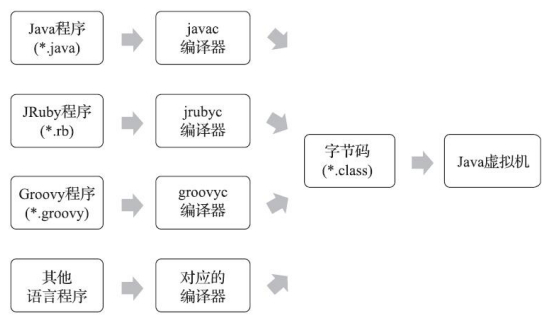

# 第六章、类文件结构

## 6.1 概述

计算机只认识0和1，所以我们写的程序需要被编译器翻译成0和1构成的二进制格式才能被计算机执行。而如今，计算机依然只认识0和1，但虚拟机以及大量建立在虚拟机之上的程序语言的蓬勃发展，把程序编译成二进制机器码已不再是唯一的选择，越来越多的程序语言选择了与操作系统和机器指令集无关的、平台中立的格式作为程序编译后的存储格式

## 6.2 无关性的基石

Java在刚刚诞生之时曾经提出过一个非常著名的宣传口号“一次编写，到处运行”，而不同平台的Java虚拟机，以及所有平台都统一支持的程序存储格式——字节码，是构成平台无关性的基石。

此外，还有语言无关性。时至今日，商业企业和开源机构以及在Java语言之外发展出一大批运行在Java虚拟机之上的语言，如Kotlin、Clojure、Groovy、JRuby、JPython、Scala等。而实现语言无关性的基础仍然是虚拟机和字节码存储格式。

## 6.3 Class类文件结构

Java能够一直保持着非常良好的向后兼容性，Class文件结构的稳定功不可没。Class文件结构的内容，绝大部分都是第一版《Java虚拟机规范》中就已经定义好的，内容虽然古老，但时至今日，Java发展经历了十余个大版本、无数小更新，那时定义的Class文件格式的各项细节几乎没有出现任何改变。尽管对Class文件格式进行了几次更新，但基本只是做新增、扩充功能，未对已定义的内容做出修改

Class文件是一组以8个字节为基础单位的二进制流，各个数据项目严格按照顺序紧凑地排列在文件之中，中间没有添加任何分隔符。当遇到需要占用8个字节以上空间的数据项时，则会按照高位在前的方式分割成若干个8个字节进行存储

跟据《Java虚拟机规范》的规定，Class文件格式采用一种类似于C语言结构体的伪结构来存储数据，只有两种数据类型：无符号数和表：

- 无符号数属于基本的数据类型，以u1、u2、u4、u8来分别代表1个字节、2个字节、4个字节和8个字节的无符号数。可以用来描述数字、索引引用、数量值或者按照UTF-8编码构成字符串值
- 表是由多个无符号数或者其他表作为数据项构成的符合数据类型，为了便于区分，所有表的命名都以“_info”结尾。用于描述有层次关系的符合结构的数据，整个Class文件本质上也可以视作为一张表，这张表由以下这些数据项按严格顺序排列构成

| 类型           | 名称                | 数量                  |
| -------------- | ------------------- | --------------------- |
| u4             | magic               | 1                     |
| u2             | minor_version       | 1                     |
| u2             | major_version       | 1                     |
| u2             | constant_pool_count | 1                     |
| cp_info        | constant_pool       | constant_pool_count-1 |
| u2             | access_flags        | 1                     |
| u2             | this_class          | 1                     |
| u2             | super_class         | 1                     |
| u2             | interfaces_count    | 1                     |
| u2             | interfaces          | interfaces_count      |
| u2             | fields_count        | 1                     |
| field_info     | fields              | fields_count          |
| u2             | methods_count       | 1                     |
| method_info    | methods             | methods_count         |
| u2             | attributes_count    | 1                     |
| attribute_info | attributes          | attributes_count      |

无论是无符号数还是表，当需要描述同一类型但数量不定的多个数据时，经常会使用一个前置的容量计数器加若干个连续的数据项的形式(如表格中的interfaces_count和interfaces)，这时候称这一系列连续的某一类型的数据为某一类型的集合

Class的结构没有分隔符号，所以表格中的数据项，无论是顺序还是数量，甚至于数据存储的字节序这样的细节，都是被严格限定的

### 6.3.1 魔数与Class文件的版本

每个Class文件的头4个字节成为魔数，用于确定这个文件是否为一个能被虚拟机接受的Class文件，用于安全校验。Class文件的魔数值为`0xCAFEBABE`(每个十六进制数为4位，共32为即4个字节)

魔数之后，第5、6个字节是次版本号，第7、8个字节是主版本号

关于主版本号，Java的版本号从45开始，JDK1.1之后的每个JDK大版本其主版本号向上加1，JDK1.2则为46，JDK1.8则为52。高版本的JDK可以向下兼容以前版本的Class文件，但不能运行高版本的Class文件

关于次版本号，Java2出现前被短暂使用过。从JDK1.2以后，直到JDK12之前此版本号均固定为0。JDK12后重新启用了副版本号，将它用于标识“技术预览版”功能特性的支持

### 6.3.2 常量池

主、次版本号之后是常量池入口，常量池中常量的数量是不固定的，所以在常量池入口需要一个u2，代表常量池容量计数器(constant_pool_count)。而这个容量计数是从1而不是0开始：如常量池容量为0x0016即22，代表常量池中有21项常量(即为constant_pool_count-1)

常量池中主要存放两大类常量：字面量和符号引用

- 字面量比较接近于Java语言层面的常量概念，如文本字符串、被声明为final的常量值
- 符号引用则属于编译原理方面的概念，主要包括被模块到处或者开放的包(Package)、类和接口的全限定名、字段的名称和描述符、方法的名称和描述符、方法句柄和方法类型、动态调用点和动态常量

Java的连接动作发生在虚拟机加载Class时，也就是说Class文件中不会保存各个方法、字段最终在内存中的布局信息。这些字段、方法的符号引用不经过虚拟机在运行期转换的话是无法得到真正的内存入口地址，也无法直接被虚拟机使用的。而当虚拟机做类加载时，将会从常量池获得对应的符号引用，再在类创建时或运行时解析、翻译到具体的内存地址之中。

常量池表有一个共同特点，表结构起始的第一位是个u1类型的标志位，代表当前常量属于哪种常量类型而常量池繁琐的点在于这些常量类型的数据结构完全不一样！如：CONSTANT_Utf8_info常量结构：

| 类型 | 名称   | 数量   | 说明          |
| ---- | ------ | ------ | ------------- |
| u1   | tag    | 1      | 标志位，1     |
| u2   | length | 1      | 常量字节长度  |
| u1   | bytes  | length | UTF-8缩略编码 |

Class文件中方法、字段等都引用了CONSTANT_Utf8_info。也就是说Java中的方法名、字段名的最大长度就是length的最大值，即u2的最大值65535，如果定义了超过64KB英文字符的变量或方法名，即使规则和全部字符都是合法的，也会无法编译

再如CONSTANT_Class_info常量结构：

| 类型 | 名称       | 数量 | 说明                                                         |
| ---- | ---------- | ---- | ------------------------------------------------------------ |
| u1   | tag        | 1    | 标志位，7                                                    |
| u2   | name_index | 1    | 指向常量池中一个CONSTANT_Utf8_info类型常量，代表了这个类或接口的全限定名 |

常量池各种类型的结构总表：

| 常量                             | 说明                         | 项目                        | 类型 | 描述                                                         |
| -------------------------------- | ---------------------------- | --------------------------- | ---- | ------------------------------------------------------------ |
| CONSTANT_Utf8_info               | UTF-8编码的字符串            | tag                         | u1   | 标志位，1                                                    |
|                                  |                              | length                      | u2   | UTF-8编码的字符串占用的字节数                                |
|                                  |                              | bytes                       | u1   | 长度为length的UTF-8编码的字符串                              |
| CONSTANT_Integer_info            | 整型字面量                   | tag                         | u1   | 标志位，3                                                    |
|                                  |                              | bytes                       | u4   | 按照高位在前存储的int值                                      |
| CONSTANT_Float_info              | 浮点型字面量                 | tag                         | u1   | 标志位，4                                                    |
|                                  |                              | bytes                       | u4   | 按照高位在前存储的float值                                    |
| CONSTANT_Long_info               | 长整型字面量                 | tag                         | u1   | 标志位，5                                                    |
|                                  |                              | bytes                       | u8   | 按照高位在前存储的long值                                     |
| CONSTANT_Double_info             | 双精度浮点数字面量           | tag                         | u1   | 标志位，6                                                    |
|                                  |                              | bytes                       | u8   | 按照高位在前存储的double值                                   |
| CONSTANT_Class_info              | 类或接口的符号引用           | tag                         | u1   | 标志位，7                                                    |
|                                  |                              | index                       | u2   | 指向全限定名常量项的索引                                     |
| CONSTANT_String_info             | 字符串类型字面量             | tag                         | u1   | 标志位，8                                                    |
|                                  |                              | index                       | u2   | 指向字符串字面量的索引                                       |
| CONSTANT_Fieldref_info           | 字段的符号引用               | tag                         | u1   | 标志位，9                                                    |
|                                  |                              | index                       | u2   | 指向声明字段的类或者接口描述符CONSTANT_Class_info的索引项    |
|                                  |                              | index                       | u2   | 指向字段描述符CONSTANT_NameAndType的索引项                   |
| CONSTANT_Methodref_info          | 类中方法的符号引用           | tag                         | u1   | 标志位，10                                                   |
|                                  |                              | index                       | u2   | 指向声明字段的类或者接口描述符CONSTANT_Class_info的索引项    |
|                                  |                              | index                       | u2   | 指向字段描述符CONSTANT_NameAndType的索引项                   |
| CONSTANT_InterfaceMethodref_info | 接口中方法的符号引用         | tag                         | u1   | 标志位，11                                                   |
|                                  |                              | index                       | u2   | 指向声明字段的类或者接口描述符CONSTANT_Class_info的索引项    |
|                                  |                              | index                       | u2   | 指向字段描述符CONSTANT_NameAndType的索引项                   |
| CONSTANT_NameAndType_info        | 字段或方法的部分符号引用     | tag                         | u1   | 标志位，12                                                   |
|                                  |                              | index                       | u2   | 指向该字段或方法名称常量项的索引                             |
|                                  |                              | index                       | u2   | 指向该字段或方法描述符常量项的索引                           |
| CONSTANT_MethodHandle_info       | 表示方法句柄                 | tag                         | u1   | 标志位，15                                                   |
|                                  |                              | reference_kind              | u1   | 值必须在1至9之间包括1和9，它决定了方法句柄的类型，方法句柄类型的值表示方法句柄的字节码行为 |
|                                  |                              | reference_index             | u2   | 值必须是对常量池的有效索引                                   |
| CONSTANT_MethodType_info         | 表示方法类型                 | tag                         | u1   | 标志位，16                                                   |
|                                  |                              | descriptor_index            | u2   | 值必须是对常量池的有效索引，常量池在索引处的项必须是CONSTANT_Utf8_info结构，表示方法的描述符 |
| CONSTANT_Dynamic_info            | 标识一个动态计算常量         | tag                         | u1   | 标志位，17                                                   |
|                                  |                              | bootstrap_method_attr_index | u2   | 值必须是对当前Class文件中引导方法表的bootstrap_methods[]数组的有效索引 |
|                                  |                              | name_and_type_index         | u2   | 值必须是对常量池的有效索引，常量池在索引处的项必须是CONSTANT_NameAndType_info结构，表示方法名和方法描述符 |
| CONSTANT_InvokeDynamic_info      | 标识一个动态方法调用点       | tag                         | u1   | 标志位，18                                                   |
|                                  |                              | bootstrap_method_attr_index | u2   | 值必须是对当前Class文件中引导方法表的bootstrap_methods[]数组的有效索引 |
|                                  |                              | name_and_type_index         | u2   | 值必须是对常量池的有效索引，常量池在索引处的项必须是CONSTANT_NameAndType_info结构，表示方法名和方法描述符 |
| CONSTANT_Module_info             | 标识一个模块                 | tag                         | u1   | 标志位，19                                                   |
|                                  |                              | name_index                  | u2   | 值必须是对常量池的有效索引，常量池在索引处的项必须是CONSTANT_Utf8_info结构，表示模块名字 |
| CONSTANT_Package_info            | 标识一个模块中开放或导出的包 | tag                         | u1   | 标志位，20                                                   |
|                                  |                              | name_index                  | u2   | 值必须是对常量池的有效索引，常量池在索引处的项必须是CONSTANT_Utf8_info结构，表示包名称 |

::: tip 总结

使用javap -verbose class，可以翻译字节码，通过输出的内容配合字节码和以上说明就可以掌握字节码了

:::

