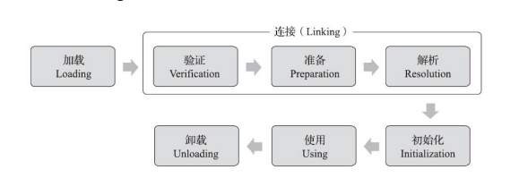

# 第七章、虚拟机类加载机制

## 7.1 概述

Java虚拟机把描述类的数据从Class文件加载到内存，并对数据进行校验、转换解析和初始化，最终形成可以被虚拟机直接使用的Java类型，这个过程被称作虚拟机的类加载机制

Java的类型加载、连接和初始化过程都是在程序运行期间完成的，这种策略让Java语言进行提前编译会面临额外的困难，也会让类加载时稍微增加一些性能开销，但是却为Java应用提供了极高的扩展性和灵活性，Java天生可以动态扩展的语言特性就是依赖运行期动态加载和动态连接这个特点实现的

例如，编写一个面向接口的应用程序，可以等到运行时再指定其实际的实现类，用户可以通过Java预置的或自定义类加载器，让某个本地的应用程序在运行时从网络或其他地方上加载一个二进制流作为其程序代码的一部分

为了避免语言表达中可能产生的偏差，在正式开始本章以前，有两个语言上的约定：

- 每个Class文件都有代表着Java语言中的一个类或接口的可能，后文中直接对类型的描述都同时蕴含着类和接口的可能性
- Class文件并非特指某个存在于具体磁盘中的文件，而应当时一串二进制字节流

## 7.2 类加载的时机

一个类型从被加载到虚拟机内存中开始，到卸载出内存为止，它的整个生命周期将会经历加载、验证、准备、解析、初始化、使用和卸载七个阶段，其中验证、准备、解析三个部分统称为连接

加载、验证、准备、初始化和卸载这五个阶段的顺序是确定的，类型的加载过程必须按照这种顺序按部就班地开始。而解析阶段在某些特定情况下可以在初始化阶段之后再开始，这是为了支持Java语言的运行时绑定特性

《Java虚拟机规范》严格规定了有且只有六种情况必须立即对类进行初始化(加载、验证、准备自然要在此之前开始)：

- 遇到new、getstatic、putstatic、invokestatic这四条字节码指令时，如果类型没有进行过初始化，则需要先触发其初始化阶段。能够生成这四条指令的典型Java代码场景有：
  - 使用new关键字实例化对象
  - 读取或设置一个类型的静态字段(被final修饰、已在编译期把结果放入常量池的静态字段除外)
  - 调用一个类型的静态方法
- 使用java.lang.reflect包的方法对类型进行反射调用的时候，如果类型没有进行初始化，则需要先触发其初始化
- 当初始化类的时候，如果发现其父类还没有进行过初始化，则需要先触发其父类的初始化
- 当虚拟机启动时，用户需要指定一个要执行的主类，虚拟机会初始化这个主类
- 当使用JDK7新加入的动态语言支持时，如果一个java.lang.invoke.MethodHandle实例最后的解析结果为REF_getStatic、REF_putStatic、REF_invokeStatic、REF_newInvokeSpecial四种类型的方法句柄，并且这个方法句柄对应的类没有进行过初始化，则需要先触发其初始化
- 当一个接口中定义了JDK8新加入的默认方法时，如果有这个接口的实现类发生了初始化，那该接口要在其之前被初始化

这六种类型统称为对一个类型的主动引用，而所有引用类型的方式都不会触发初始化，成为被动引用：

- 通过子类引用父类的静态字段，不会导致子类初始化
- 通过数组定义来引用类，不会触发此类的初始化
- 常量在编译阶段会存入调用类的常量池中，本质上没有直接引用到定义常量的类，因此不会触发定义常量的类的初始化

接口的加载过程与类加载过程稍有不同：六种中的第三种，接口在初始化时，并不要求其父接口全部都完成了初始化，只有在真正使用到父接口的时候才会初始化

## 7.3 类加载的过程

详细了解Java虚拟机中类加载的全过程，即加载、验证、准备、解析和初始化这5个阶段所执行的具体动作

### 7.3.1 加载

在加载阶段，Java虚拟机需要完成以下三件事情：

1. 通过一个类的全限定名获取定义此类的二进制字节流
2. 将这个字节流所代表的静态存储结构转化为方法区的运行时数据结构
3. 在内存中生成一个代表这个类的java.lang.Class对象，作为方法区这个类的各种数据的访问入口

Class文件的获取，在《Java虚拟机规范》中，并没有具体的规定。比如，没有指明从哪里获取、如何获取，因此有非常多的方式：

- 从ZIP压缩包中读取，JAR、EAR、WAR包的基础
- 从网络中获取，最典型的应用就是Web Applet
- 运行时计算生成，使用得最多是动态代理技术，在java.lang.reflect.Proxy中，用ProxyGenerator.generateProxyClass()来为特定接口生成形式为"*$Proxy"的代理类的二进制字节流
- 由其他文件生成，如JSP应用
- 从数据库中读取，比较少见，如中间件服务器(如SAP Netweaver)可以选择把程序安装到数据库中来完成程序代码在集群间的分发
- 可以从加密文件中获取，典型的防Class文件被反编译的保护措施

加载阶段既可以使用Java虚拟机里内置的引导类加载器来完成，也可以由用户自定义的类加载器取完成

开发人员通过定义自己的类加载器去控制字节流的获取方式(重写一个类加载器的findClass()或loadClass()方法)，实现跟据自己的想法来赋予应用程序获取运行代码的动态性

数组类的情况有所不同，数组类本身不通过类加载器创建，但数组类的元素类型最终还是要靠类加载器来完成加载，一个数组的创建过程遵循以下规则：

- 如果数组的组件类型(指数组去掉一个维度的类型)是引用类型，那就递归采用本节中定义的加载过程去加载这个组件类型，数组C将被标识在加载该组件类型的类加载器的类名称空间上
- 如果数组的组件类型不是引用类型(如int[])，Java虚拟机将会把数组C标记为引导类加载器关联
- 数组类的可访问性与它的组件类型的可访问性一致，如果组件类型不是引用类型，他的数组类的可访问将默认为public，可被所有的类和接口访问到

加载之后，二进制字节流按照虚拟机设定的格式存储在方法区中，方法区的数据存储格式完全由虚拟机实现自行定义

类型数据妥善安置在方法区后，会在Java堆内存中实例化一个java.lang.Class类的对象，这个对象将作为程序访问方法区中的类型数据的外部接口

加载阶段和连接阶段的部分动作是交叉进行的，加载阶段尚未完成，连接阶段可能已经开始，但这些夹在加载阶段之中进行的动作，仍然属于连接阶段的一部分，这两个阶段的开始时间仍然保持着固定的先后顺序

### 7.3.2 验证

确保Class文件的字节流中包含的信息符合《Java虚拟机规范》的全部约束要求，保证这些信息被当作代码运行后不会危害虚拟机自身的安全

验证阶段是非常重要的，这个阶段是否严谨，直接决定了Java虚拟机是否能承受恶意代码的攻击；从代码里和耗费的执行性能的角度讲，验证阶段的工作量在虚拟机的类加载过程中占了相当大的比重

《Java虚拟机规范》的早期版本(第1、2版)，堆这个阶段的检验指导是相当模糊和笼统的，直到2011年《Java虚拟机规范(Java SE 7版)》出版，验证阶段的约束和验证规则才变得具体起来。整体上分为：文件格式验证、元数据验证、字节码验证和符号引用验证

#### 7.3.2.1 文件格式验证

验证字节流是否符合Class文件格式的规范，并且能被当前版本的虚拟机处理：

- 魔数是否为0xCAFEBABE
- 主、次版本号是否在当前Java虚拟机接受范围之内
- 常量池的常量中是否有不被支持的常量类型(检查常量tag标志)
- 指向常量的各种索引值中是否有指向不存在的常量或不符合类型的常量
- CONSTANT_Utf8_info型的常量中是否有不符合UTF-8编码的数据
- Class文件中各个部分及文件本身是否有被删除的或附加的其他信息
- ......

以上仅仅是一小部分，该验证阶段的主要目的是保证输入的字节流能正确的解析并存储在方法区之内，验证基于二进制字节流，只有通过该阶段校验之后，这段字节流才能被允许进入Java虚拟机中的方法区中进行存储。后面的三个阶段则是基于方法区的存储结构上进行，不会再读取、操作字节流

#### 7.3.2.2 元数据验证

对字节码描述的信息进行语义校验，以保证其描述的信息符合《Java语言规范》的要求，这个阶段可能包括的验证点如下：

- 这个类是否有父类(除了java.lang.Object之外，所有类都应当有父类)
- 这个类的父类是否继承了不允许被继承的类(被final修饰的类)
- 如果这个类不是抽象类，是否实现了其父类或接口之中要求实现的所有方法
- 类中的字段、方法是否与父类产生矛盾，如覆盖了父类的final字段，不符合规则的方法冲宅等
- ......

#### 7.3.2.3 字节码验证

通过数据流分析和控制流分析，确定程序语义是合法的、符合逻辑的。对类的方法体(Class文件中的Code属性)进行校验分析，保证被校验类的方法在运行时不会做出危害虚拟机安全的行为，如：

- 保证任意时刻操作数栈的数据类型与指令代码序列都能配合工作，例如不会出现在操作数栈放置了一个int类型的数据，使用时却按long类型来加载入本地变量表中
- 保证任何跳转指令都不会跳转到方法体以外的字节码指令上
- 保证方法体中的类型转换总是有效的，例如可以把一个子类对象赋值给父类数据类型，这时安全的。但是把父类对象赋值给子类，甚至把对象赋值给与它完全不相干的数据类型，则是不合法的
- ......

然即便通过了字节码验证，也不能保证就一定是安全的。通过程序去校验程序逻辑是无法做到绝对准确的，不可能用程序来准确判定一段程序是否存在Bug

由于数据流分析和控制流分析的高度复杂性，JDK6之后的Javac编译器和Java虚拟机里进行了一项联合优化，把尽可能多的校验辅助措施挪到Javac编译器里进行。具体做法是给方法体Code属性的属性表里新增了一项StackMapTable，用于记录方法体所有的基本快开始时本地变量表和操作栈应有的状态。验证时只需要检查StackMapTable属性中的记录是否合法即可，这样就将字节码验证的类型推导转变为类型检查，节省了大量校验时间。然StackMapTable，既然时字节码中的一部分，那也存在被恶意篡改的可能

JDK6的HotSpot提供了`-XX:-UseSplitVerifier`参数来关闭这项优化，或者使用`-XX:FailOverToOldVerifier`要求在类型校验失败的时候退回到旧的类型推导方式进行校验

然而JDK7之后，对于主版本号大于50(JDK6)的Class文件，使用类型检查来完成数据流分析校验则是唯一的选择，不允许退回原来的校验方式

#### 7.3.2.4 符号引用验证

发生在虚拟机将符号引用转化为直接引用的时候，这个转化动作将在连接的第三阶段——解析阶段中发生。符号引用验证，即是否缺少或者被禁止访问它依赖的某些外部类、方法、字段等资源，如：

- 符号引用中通过字符串描述的全限定名是否能找到对应的类
- 在指定类中是否存在符合方法的字段描述符及简单名称所描述的方法和字段
- 符号引用中的类、字段、方法的可访问性(private、protected、public、package)是否可被当前类访问

符号引用验证的主要目的是确保解析行为能正常执行，如果无法通过符号引用验证，Java虚拟机会抛出`java.lang.IncompatibleClassChangeError`的子类异常，典型的如：`java.lang.IllegalAccessError`、`java.lang.NoSuchFieldError`、`java.lang.NoSuchMethodError`等

这是一个非常重要，但却不是必须要执行的阶段。如果程序运行的全部代码(包括自己编写的、第三方包中的、外部加载的、动态生成的等所有代码)都已经被反复使用和验证过，就可以考虑使用`-Xverify:none`来关闭大部分的类验证措施，以缩短虚拟机类加载的时间

### 7.3.3 准备

准备阶段是正式为类中定义的变量(即静态变量，static)分配内存并设置类变量初始值的阶段。这些变量所使用的内存都应当在方法区中进行分配，但必须注意到方法区本身是一个逻辑上的区域

需要注意的有：

- 这时候进行内存分配的仅仅是类对象(也就是静态变量)，实例变量会在对象初始化的时候跟随对象一起分配在Java堆中
- 这里的初始化通常情况下是数据类型的零值，即便`public static int value = 123`，准备阶段后的初始化为0而不是123。因为这时并未开始执行Java方法，而赋值123的putstatic指令是程序被编译后，存放于类构造器clinit方法中，所以直到类的初始化阶段才会被执行
- 只有被final修饰的变量，如`public static final int value = 123`，那么Javac将会为value生成ConstantValue属性，在准备阶段虚拟机就会跟据ConstantValue的设置将value赋值为123

Java所有基本数据类型的零值：

| 数据类型  | 零值     |
| --------- | -------- |
| int       | 0        |
| long      | 0L       |
| short     | (short)0 |
| char      | \u0000   |
| byte      | (byte)0  |
| boolean   | false    |
| float     | 0.0f     |
| double    | 0.0d     |
| reference | null     |

### 7.3.4 解析

Java虚拟机将常量池内的符号引用替换为直接引用的过程，符号引用在Class文件中以CONSTANT_Class_info、CONSTANT_Fieldref_info、CONSTANT_Methodref_info等类型的常量形式出现。

- 符号引用：以一组符号来描述所引用的目标，符号可以是任何形式的字面量，只要使用时能无歧义地定位到目标即可。
- 直接引用：可以直接指向目标的指针、相对偏移量或者是一个能间接定位到目标的句柄。和虚拟机实现的内存布局直接相关，同一个符号引用在不同虚拟机实例上翻译出来的直接引用一般不会相同。如果有了直接引用，那么引用的目标必定已经在虚拟机的内存中存在

解析动作主要针对类或接口、字段、类方法、接口方法、方法类型、方法句柄和调用点限定符这7类符号引用进行，分别对应于常量池的CONSTANT_Class_info、CONSTANT_Fieldref_info、CONSTANT_Methodref_info、CONSTANT_InterfaceMethodref_info、 CONSTANT_MethodType_info、 CONSTANT_MethodHandle_info、 CONSTANT_Dyna-mic_info和CONSTANT_InvokeDynamic_info

#### 7.3.4.1 类或接口的解析

假设当前代码所处的类为D，如果要把一个从未解析过的符号引用N解析为一个类或接口C的直接引用，有以下3步：

1. 如果C不是一个数组类型，那虚拟机将会把代表N的全限定名传递给D的类加载器去加载这个类C。加载过程中，由于验证、触发其他相关类(如父类)的加载，一旦这个加载过程出现了任何异常，解析过程就将宣告失败
2. 如果C是一个数组类型，并且数组的元素类型为对象，那就会按照第一点的规则加载数组元素类型，接着由虚拟机生成一个代表该数组维度和元素的数组对象
3. 如果上面两步没有出现任何异常，那么C在虚拟机中已经成为了一个有效的类或接口了，但在解析完成迁还要进行符号引用验证，确认D是否具备C的访问权限，如不具备则抛出java.lang.IllegalAccessError异常

#### 7.3.4.2 字段解析

首先将会对字段表内class_index项中索引的CONSTANT_Class_info符号引用进行解析，也就是字段所属的类或接口的符号引用。如果解析异常，会导致字段符号引用解析的失败；如果成功，有如下后续字段的搜索步骤，并将该类标记为C：

1. 如果C本身就包含了简单名称和字段描述符都与目标相匹配的字段，则返回这个字段的直接引用，查找结束
2. 否则，如果C中实现了接口，将会按照继承关系从下往上递归搜索各个接口和它的父接口，如果接口中包含了简单名称和字段描述符都与目标相匹配的字段，则返回这个字段的直接引用，查找结束
3. 否则，如果C不是java.lang.Object的话，将会按照继承关系从下往上递归搜索其父类，如果在父类中包含了简单名称和字段描述符都与目标相匹配的字段，则返回这个字段的直接引用，查找结束
4. 否则，查找失败，抛出java.lang.NoSuchFieldError异常
5. 如果查找成功，还需要进行访问权限验证，如不具备权限抛出java.lang.IllegalAccessError

#### 7.3.4.3 方法解析

方法解析的第一个步骤和字段解析一样，也是需要先解析出方法表的class_index项中索引的方法所属的类或接口的符号引用

1. 由于Class文件格式中类的方法和接口的方法符号引用的常量类型定义是分开的， 如果在类的方法表中发现class_index中索引的C是个接口的话， 那就直接抛出java.lang.IncompatibleClassChangeError 异常
2. 如果通过了第一步， 在类中查找是否有简单名称和描述符都与目标相匹配的方法， 如果有则返回这个方法的直接引用， 查找结束
3. 否则， 在父类中递归查找是否有简单名称和描述符都与目标相匹配的方法， 如果有则返回这个方法的直接引用， 查找结束
4. 否则， 在类实现的接口列表及它们的父接口之中递归查找是否有简单名称和描述符都与目标相匹配的方法， 如果存在匹配的方法， 说明类是一个抽象类， 这时候查找结束，抛出java.lang.AbstractMethodError异常
5. 否则， 宣告方法查找失败， 抛出java.lang.NoSuchMethodError

最后， 如果查找过程成功返回了直接引用， 将会对这个方法进行权限验证， 如果发现不具备对此方法的访问权限， 将抛出java.lang.IllegalAccessError异常。

#### 7.3.4.4 接口方法解析

接口方法也是需要先解析出接口方法表的class_index中的索引的方法所属的类或接口的符号引用并解析：

1. 与类的方法解析相反， 如果在接口方法表中发现class_index中的索引是个类而不是接口， 那么就直接抛出java.lang.IncompatibleClassChangeError异常
2. 否则， 在接口中查找是否有简单名称和描述符都与目标相匹配的方法， 如果有则返回这个方法的直接引用， 查找结束
3. 否则，在接口的父接口中递归查找，直到java.lang.Object类（接口方法的查找范围也会包括Object类中的方法） 为止， 看是否有简单名称和描述符都与目标相匹配的方法， 如果有则返回这个方法的直接引用，查找结束
4. 对于规则3， 由于Java的接口允许多重继承， 如果不同父接口中存有多个简单名称和描述符都与目标相匹配的方法， 那将会从这多个方法中返回其中一个并结束查找，《Java虚拟机规范》中并没有进一步规则约束应该返回哪一个接口方法。 但与之前字段查找类似地， 不同发行商实现的Javac编译器有可能会按照更严格的约束拒绝编译这种代码来避免不确定性
5. 否则，宣告方法查找失败，抛出java.lang.NoSuchMethodError异常

### 7.3.5 初始化

在准备阶段，变量已经赋过一次系统要求的初始零值，而在初始化阶段，则会跟据程序员通过程序编码制定的主观计划去初始化类变量和其他资源。初始化阶段就是执行类构造器`<clinit>()`方法的过程。，该方法由javac编译器自动生成：

- `<clinit>()`是编译器收集类中所有类变量的赋值动作和静态语句块中的语句合并产生的，其收集顺序取决于源文件中代码出现的顺序。静态语句块中，只能访问到定义在语句块之前的变量，定义在之后的变量，可以赋值但不能访问
- `<clinit>()`方法与类的构造函数不通，它不需要显式地调用父类构造器，Java虚拟机会保证在子列的`<clinit>()`执行前，父类的`<clinit>()`已经执行完毕。因此Java虚拟机中第一个执行的`<clinit>()`方法的类型肯定是java.lang.Object
- 父类中的静态语句块优先于子类的变量赋值操作
- `<clinit>()`方法对于类和接口来说并不是必需的，如果一个类中没有静态语句块，也没有对变量的赋值操作，那么编译器可以不为这个类生成`<clinit>()`方法
- 接口中不能使用静态语句块，但仍然有变量初始化的赋值操作，因此接口与类一样都会生成`<clinit>()`方法。执行接口的`<clinit>()`方法不需要先执行父接口的`<clinit>()`方法。只有当父接口中定义的变量被使用时，父接口才会被初始化。接口的实现类在初始化时也一样不会执行接口的`<clinit>()`方法
- Java虚拟机必须保证一个类`<clinit>()`方法在多线程环境中被正确地加锁同步。如果多个线程同时去初始化一个类，那么只会有其中一个线程去执行`<clinit>()`方法，其他线程都需要阻塞等待到方法执行完毕

## 7.4 类加载器

通过类的全限定名来获取描述该类的二进制字节流，实现这个动作的代码被称为类加载器

### 7.4.1 类与类加载器

对于任意一个类，都必须由加载它的类加载器和这个类本身一起共同确立其在Java虚拟机中的唯一性，每一个类加载器，都拥有一个独立的类名称空间。即比较两个类是否相等，只有在这两个类是由同一个类加载器加载的前提下才有意义。否则这两个类就必定不相等

这里所指的相等，包括类的Class对象的equals()方法、isAssignableFrom()方法、isInstance()方法的返回结果，也包括了使用instanceof关键字做对象所属关系判定等各种情况

如果A类通过两个类加载器加载了两次，有A1、A2。如果A1的实例Aobj1，执行`Aobj1 instanceof A2`，其结果为false

### 7.4.2 双亲委派模型

类加载器又两种类型：一种是启动类加载器，使用C++实现，是虚拟机自身的一部分；另一种是其他所有的类加载器，又Java实现，独立存在于虚拟机外部，并且全部继承自抽象类java.lang.ClassLoader

绝大多数Java程序都会使用到以下3个系统提供的类加载器来进行加载：

- 启动类加载器：这个类加载器负责加载存放在<JAVA_HOME>\lib目录，或者被-Xbootclasspath参数所指定的路径存放，而且是Java虚拟机能够识别的(按文件名识别，如rt.jar，tools.jar)类库加载到虚拟机内存中。启动类加载器无法被Java程序直接引用，用户在编写自定义类加载器时，如果需要把加载请求委派给引导类加载器去处理，那直接使用null代替即可
- 扩展类加载器：sun.misc.Launcher$ExtClassLoader中以Java代码的形式实现的，负责加载<JAVA_HOME>\lib\ext目录中，或者被java.ext.dirs系统变量所执行的路径中所有的类库，允许用户将具有通用性的类库放置在ext目录里以扩展Java SE的功能
- 应用程序类加载器：这个类加载器由sun.misc.Launcher$AppClassLoader来实现。由于应用程序类加载器是ClassLoader类中的getSystem-ClassLoader()方法的返回值，这一页称为系统类加载器。负责加载用户类路径(ClassPath)上所有的类库，开发者通用可以直接在代码中使用这个类加载器。如果应用程序中没有自定义过类加载器，一般就是使用这个加载器

类加载器之间的层次关系，自上而下为启动类加载器、扩展类加载器、应用程序类加载器、自定义类加载器

双亲委派模型的工作过程：如果一个类加载器收到了类加载的请求，它首先不会自己去尝试加载这个类，而是把这个请求委派给父类加载器去完成，每一个层次的类加载器都是如此，因此所有的加载请求最终都应该传送到最顶层的启动类加载器中，只有当父加载器反馈自己无法完成这个加载请求(即搜索范围内没有找到所需的类)时，子加载器才会尝试自己去完成加载

如java.lang.Object，存放在rt.jar中，无论哪一个类加载器要加载这个类，最终都是委派给顶端的启动类加载器进行加载。因此Object类在各种类加载器环境中都能保证是同一个类。而如果自己写一个java.lang.Object类，并放在程序的classpath中，可以正常编译，但无法被加载运行

### 7.4.3 破坏双亲委派模型

::: tip 说明

这节讲述了双亲委派模型历史上遇到的3次挑战，以及改进。先跳过，后续如果遇到了再回头补充

:::

## 7.5 Java模块化系统

::: tip 说明

JDK9中引入的Java模块化系统，然目前还是基于JDK8在学习，所以这一块先跳过

:::