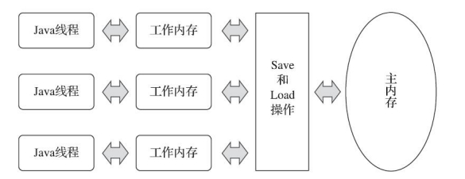

# 第十二章、Java内存模型与线程

## 12.1 概述

并发的根本原因之一是运算速度与存储、通信子系统的速度差距太大，大量时间都花费在磁盘I/O，网络通信或者数据库访问上；其二则是一个服务端要同时对多个客户端提供服务

## 12.2 硬件的效率与一致性

并发任务的复杂性来源于绝大多数的运算任务都不可能只靠处理器计算就能完成，至少要与内存交互，如读取运算数据、存储运算结果等，这个I/O操作很难消除

由于计算机的存储设备和处理器的运算速度有着几个数量级的差距，所以现代计算机系统都不得不加入一层或多层高速缓冲：将运算需要使用的数据复制到缓存中，让运算快速进行，运算结束后再从缓存同步回内存中，这样可以无须等待缓慢的内存读写了。高速缓存的出现，虽然解决了处理器与内存速度之间的矛盾，但也引入了新的问题——缓存一致性，为了解决一致性问题，需要各个处理器访问缓存时都遵循一些协议，在读写时要跟据协议来进行操作

除了增加高速缓存之外，为了使处理器内部的运算单元能尽量被充分利用，处理器可能会对输入代码进行乱序执行优化。与处理器的乱序执行优化类似，Java虚拟机的即时编译器中也有指令重排序优化

## 12.3 Java内存模型

### 12.3.1 主内存与工作内存

Java内存模型的主要目的是定义程序中各种变量的访问规则，即关注在虚拟机中把变量值存储到内存和从内存中取出变量值这样的底层细节(这里的变量指代的是实例字段、静态字段和构成数组对象的元素，即线程共享的变量)

模型规定：

1. 所有变量都存储在主内存中(和物理硬件主内存类比)，每条线程还有自己的工作内存(和高速缓存类比)
2. 线程的工作内存中保存了被该线程使用的变量的主内存副本
3. 线程对变量的所有操作都必须在工作内存中进行，而不能直接读写主内存中的数据
4. 不同的线程之间也无法直接访问对方工作内存中的变量
5. 线程间变量值的传递均需要通过主内存来完成

主内存主要对应于Java堆中的对象实例数据部分，而工作内存则对应于虚拟机栈中的部分区域；更基础的层次上说，主内存直接对应于物理硬件的内存，而为了获取更好的运行速度，虚拟机可能会让工作内存优先存储于寄存器和高速缓存中，因为程序运行时主要访问的是工作内存

### 12.3.2 内存间交互操作

模型定义了8种操作来完成变量从主内存拷贝到工作内存、从工作内存同步回主内存这些操作(最新的JSR-133文档中，已经放弃了8种操作而是缩减为4种，但仅是描述方式改变了，Java内存模型并没有改变)：

- lock锁定：作用于主内存的变量，它把一个变量标识为一个线程独占的状态
- unlock解锁：作用于主内存的变量，它把一个处于锁定状态的变量释放出来，释放后的变量才可以被其他线程锁定
- read读取：作用于主内存的变量，它把一个变量的值从主内存传输到线程的工作内存中，以便随后的load动作使用
- load载入：作用于工作内存的变量，它把read操作从主内存中得到的变量值放入工作内存的变量副本中
- use使用：作用于工作内存的变量，它把工作内存中一个变量的值传递给执行引擎，每当虚拟机遇到一个需要使用变量的值的字节码指令时将会执行这个操作
- assign赋值：作用于工作内存的变量，它把一个从执行引擎接收的值赋给工作内存的变量，每当虚拟机遇到一个给变量赋值的字节码指令时执行这个操作
- store存储：作用于工作内存的变量，它把工作内存中的一个变量的值传送到主内存中，以便随后的write操作使用
- write写入，作用于主内存的变量，它把store操作从工作内存中得到的变量的值放入主内存的变量中

这8种基本操作，必须满足这些规则：

- 不允许read和load、store和write操作之一单独出现
- 不允许一个线程丢弃它最近的assign操作，变量在工作内存种改变了之后必须把该变化同步回主内存
- 不允许一个线程无原因地(没有发生过任何assign操作)把数据从线程的工作内存同步回主内存
- 一个新变量只能在主内存中诞生，不允许在工作内存中直接使用一个未被初始化的变量
- 一个变量在同一时刻只允许一条线程对其进行lock操作，lock可以被同一条线程重复执行多次，多次执行lock后，只有执行相同次数的unlock操作，变量才会被解锁
- 如果对一个变量执行lock操作，那将会清空工作内存中此变量的值，执行引擎使用这个变量前，需要重新执行load或assign操作以初始化变量的值
- 如果一个变量事先没有被lock操作锁定，那就不允许对它执行unlock操作，也不允许去unlock一个被其他线程锁定的变量
- 对一个变量执行unlock前，必须先把此变量同步回主内存中(执行store、write操作)

### 12.3.3 对于volatile型变量的特殊规则

变量定义成volatile后，就具备两项特性：

1. 变量对所有线程的可见性，当一条线程修改这个变量的值后，新值对于其他线程来说是可以立即得知的。但仅仅只使用volatile变量，并不能保证线程安全，还是取决于并发操作是否上锁或者是否具备原子性
2. 禁止指令重排优化，如一些控制变量赋值操作被提前执行就会导致其他线程判定提前，导致出现问题

volatile从基本指令的角度：

- 线程对变量的read、load、use操作必须连续且一起出现，即使用前都必须先从主内存刷新最新的值
- 线程对变量的assign、store、write操作必须连续且一起出现，即变量修改后都必须同步回主内存中
- 如果线程对变量A的use动作先于变量B，那么对变量A的write动作也先于变量B，保证变量不会被指令重排序优化

### 12.3.4 针对long和double型变量的特殊规则

Java内存模型要求lock、unlock、read、 load、assign、use、store、write这八种操作都具有原子性，但是对于64位的数据类型(long和double)，虚拟机将没有被volatile修饰的64位数据的读写操作划分为两次32位操作来进行，这就是所谓的long和double的非原子性协定

而多个线程共享一个并未声明为volatile的long或double类型的变量，并且同时对它们进行读取和修改操作，那么某些线程可能会读取到一个既不是原址，也不是其他线程修改值得代表了半个变量的数值。但这种情况是非常罕见的，主流平台下商用的64位Java虚拟机中并不会出现非原子性访问行为，但32位的Java虚拟机譬如32位x86平台下的HotSpot虚拟机，对long类型的数据确实存在非原子性访问的风险

而针对double类型，由于现代中央处理器中一般都包含专门用于处理浮点数据的浮点运算器，用来专门处理单、双精度的浮点数，所以哪怕是32位虚拟机中也不会出现非原子性访问的问题

因此，除非有明确可知的线程竞争，否则不需要因为非原子性的问题刻意把long、double声明为volatile

### 12.3.5 原子性、可见性与有序性

由Java内存模型来直接保证的原子性变量操作包括read、load、assign、use、store和write这六个。因此基本数据类型的访问、读写都具备原子性。如果应用场景需要一个更大范围的原子性保证，可以通过synchronized关键字，其字节码指令monitorenter和monitorexit则包含了lock和unlock操作

可见性指当一个线程修改了共享变量的值时，其他线程能够立刻得知这个修改。可见性基于线程在修改变量后立刻同步回主内存，而在使用前从主内存刷新变量值。除了volatile之外，synchronized(unlock之前必须先store和write)和final也具备可见性(因为变量值不可变)

有序性指如果在本线程内观察，所有的操作都是有序的；如果在一个线程中观察另一个线程，所有操作都是无序的。前半句指线程内似表现为串行的语义，后半句指指令重排序现象和工作内存与主内存同步延迟现象。volatile和synchronized两个关键字可以保证线程之间操作的有序性

### 12.3.6 先行发生规则

这些先行发生关系无须任何同步器协助就已经存在，可以在编码中直接使用。如果两个操作之间的关系不在此列，并且无法从下列规则推导出来，则它们就没有顺序性保障，虚拟机可以对它们随意地进行重排序

- 程序次序规则：在一个线程内，按照控制流顺序，书写在前面的操作先行发生于书写在后面的操作
- 管程锁定规则：一个unlock操作先行于后面对同一个锁的lock操作
- volatile变量规则：对一个volatile变量的写操作先行发生于后面对这个变量的读操作
- 线程启动规则：Thread对象的start()方法先行发生于此线程的每一个动作
- 线程终止规则：线程中所有操作都先行发生于此线程的终止检测，我们可以通过Thread::join方法是否结束、Thread::isAlive的返回值等手段检测线程是否已经终止执行
- 线程中断规则：对线程interrupt()方法的调用先行发生于被中断线程的代码检测到中断事件的发生
- 对象终结规则：一个对象的初始化完成先行发生于他的finalize()方法的开始
- 传递性：如果操作A先行发生于操作B，操作B先行发生于操作C，那么操作A先行发生于操作C

## 12.4 Java与线程

### 12.4.1 线程的实线

