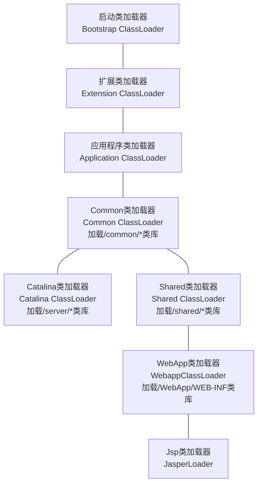

# 第九章、类加载及执行子系统的案例与实战

## 9.1 概述

Class文件格式与执行引擎这部分里，用户的程序能直接参与的内容并不多，主要是字节码生成与类加载器这两部分的功能

## 9.2 案例分析

### 9.2.1 Tomcat正统的类加载器架构

主流的Java Web服务器，如Tomcat、Jetty、 WebLogic、WebSphere等，都实现了自己定义的类加载器，且一般不止一个。因为一个功能健全的Web服务器，都要解决这些问题：

- 部署在同一个服务器上的两个Web应用程序所使用的Java类库可以实现相互隔离
- 部署在同一个服务器上的两个Web应用程序所使用的Java类库可以互相共享
- 服务器需要尽可能地保证自身地安全不受部署Web应用程序影响
- 支持JSP应用的Web服务器，十有八九都需要支持HotSwap功能

为此，单独一个classpath不能满足需求，Web服务器都提供了好几个不同含义的classpath，每一个目录都会有一个相对应的自定义类加载器去加载里面的Java类库

Tomcat中，可以分为4组目录：

- /common/*，类库可被Tomcat和所有的Web应用程序共同使用
- /server/*，类库可被Tomcat使用，对所有的Web应用程序都不可见
- /shared/*，类库可被所有的Web应用程序共同使用，但对Tomcat自己不可见
- /WebApp/WEB-INF，类库仅仅可以被该Web应用程序使用，对Tomcat和其他Web应用程序都不可见

为了支持这套目录结构，并对目录里面的类库进行加载和隔离，Tomcat自定义了多个类加载器：

每一个Web应用程序对应一个WebApp类加载器，每一个JSP文件对应一个JasperLoader类加载器

Tomcat6之后，只有指定了tomcat/conf/catalina.properties配置文件的server.loader和share.loader后才会建立Catalina类加载器和Shared类加载器的实例，否则会用Common类加载器代替。所以Tomcat6之后也将3个目录合并成一个lib目录

::: tip 问题

如果有10个WEB应用程序都是用Spring来进行组织管理的话，可以把Spring放到Common或Shared目录（Tomcat5.0）让这些程序共享。Spring要对用户程序的类进行管理，自然要能访问到用户程序的类，而用户程序显然是放在/WEB-INF目录中的。那么被CommonClassLoader或SharedClassLoader加载的Spring如何访问并不在其加载范围内的用户程序呢？

通过线程上下文类加载器，也就是相当于父类加载器（Spring)请求子类加载器（用户）去完成类加载的动作

:::

### 9.2.2 OSGi灵活的类加载器架构

OSGi是OSGi联盟制订的一个基于Java语言的动态模块化规范，目的是使服务提供商通过住宅网关为各种家用智能设备提供服务，后来这个规范在Java的其他技术领域也有不错的发展，已经成为Java世界中动态模块化标准

### 9.2.3 字节码生成技术与动态代理的实现

### 9.2.4 Backport工具Java的时光机器

## 9.3 实战自己动手实现远程执行功能

