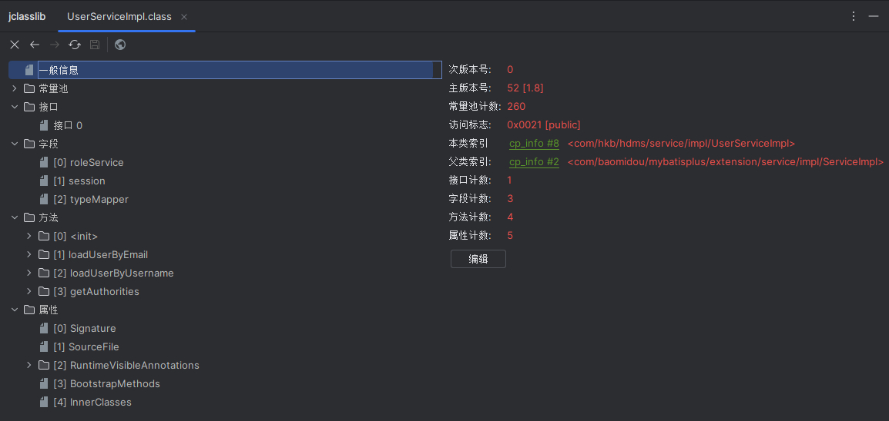

# 第一章、字节码实战

目前的工作中，代码通过Maven打包成jar包后，部署到服务器上运行，而jar包中都是.class文件也就是字节码。字节码也是JVM运行java代码的原材料

本章就从Java源代码入手，将其编译成字节码后，看看字节码中存储了什么信息，能否和源代码对应起来

## 1.1 Java源代码

这里使用到了一段系统登陆验证鉴权的代码：

而这里之所以使用这段代码，是因为这段代码有继承关系、有使用到框架中的类也更贴近业务代码

```java
package com.hkb.hdms.service.impl;

import com.baomidou.mybatisplus.core.conditions.query.QueryWrapper;
import com.baomidou.mybatisplus.extension.service.impl.ServiceImpl;
import com.hkb.hdms.base.Constants;
import com.hkb.hdms.mapper.TypeMapper;
import com.hkb.hdms.mapper.UserMapper;
import com.hkb.hdms.model.pojo.User;
import com.hkb.hdms.model.pojo.UserRole;
import com.hkb.hdms.model.vo.TypeVo;
import com.hkb.hdms.service.RoleService;
import com.hkb.hdms.service.UserService;
import org.springframework.beans.factory.annotation.Autowired;
import org.springframework.security.core.GrantedAuthority;
import org.springframework.security.core.authority.SimpleGrantedAuthority;
import org.springframework.security.core.userdetails.UserDetails;
import org.springframework.security.core.userdetails.UsernameNotFoundException;
import org.springframework.security.crypto.bcrypt.BCryptPasswordEncoder;
import org.springframework.stereotype.Component;

import javax.servlet.http.HttpSession;
import java.util.ArrayList;
import java.util.Collection;
import java.util.List;
import java.util.stream.Collectors;

/**
 * @author huangkebing
 * 2021/03/09
 */
@Component
public class UserServiceImpl extends ServiceImpl<UserMapper, User> implements UserService {

    private final RoleService roleService;

    private final HttpSession session;

    private final TypeMapper typeMapper;

    @Autowired
    public UserServiceImpl(RoleService roleService, HttpSession session, TypeMapper typeMapper) {
        this.roleService = roleService;
        this.session = session;
        this.typeMapper = typeMapper;
    }

    @Override
    public UserDetails loadUserByEmail(String email) {
        email += Constants.EMAIL_SUFFIX;
        User queryUser = this.getOne(new QueryWrapper<User>().eq("email", email));
        session.setAttribute(Constants.LOGIN_USER_KEY, queryUser);
        UserDetails userDetails = null;
        if (queryUser != null) {
            Collection<GrantedAuthority> authorities = getAuthorities(queryUser);
            userDetails = new org.springframework.security.core.userdetails.User(email,
                    new BCryptPasswordEncoder().encode("123456"), authorities);
        }
        return userDetails;
    }

    @Override
    public UserDetails loadUserByUsername(String username) throws UsernameNotFoundException {
        if(!username.contains(Constants.EMAIL_SUFFIX)){
            username += Constants.EMAIL_SUFFIX;
        }
        User queryUser = this.getOne(new QueryWrapper<User>().eq("email", username));
        session.setAttribute(Constants.LOGIN_USER_KEY, queryUser);
        UserDetails userDetails = null;
        if (queryUser != null) {
            String password = queryUser.getPassword();
            //获取权限
            Collection<GrantedAuthority> authorities = getAuthorities(queryUser);
            //账号是否冻结
            boolean live = queryUser.getLive() == 1;
            userDetails = new org.springframework.security.core.userdetails.User(
                    username, password, true, true, true, live, authorities);
        }
        return userDetails;
    }

    //获取用户角色
    private Collection<GrantedAuthority> getAuthorities(User user) {
        ArrayList<GrantedAuthority> authorities = new ArrayList<>();
        UserRole role = roleService.getById(user.getRole());
        authorities.add(new SimpleGrantedAuthority("ROLE_" + role.getName()));

        if(role.getQuestion() == 0){
            authorities.add(new SimpleGrantedAuthority("GROUP_" + "ALL"));

        }
        else{
            List<TypeVo> typeVos = typeMapper.selectTypesWithUser(user.getId());
            List<String> groups = typeVos.stream().map(TypeVo::getName).collect(Collectors.toList());
            for (String group : groups) {
                authorities.add(new SimpleGrantedAuthority("GROUP_" + group));
            }
        }
        return authorities;
    }
}
```

## 1.2 字节码生成

本来想`javac UserServiceImpl.java`直接编译的，但是想起来非标准java库需要引jar包才可以编译，最后还是把整个项目编译。javac编译需要注意一下：

1. 利用javac进行编译时，默认情况下的类搜索路径为当前路径
2. 如果类中包含了Java标准类库中以外的类，则需要利用-cp参数指定类搜索路径
3. 如果需要的类指定了类所在的包，那么-cp参数指定的类搜索路径应包含该类所在的包

接下来就按照字节码结构来阅读

## 1.3 字节码阅读

这里使用了idea的jclasslib插件来阅读(也可以用`javap -verbose .class`来阅读)



### 1.3.1 魔数

Java字节码的前4个字节是固定的`0xCAFEBABE`，用于校验字节码是否合法的

### 1.3.2 次版本号

字节码第5、6个字节是次版本号，用的是JDK8，该版本的次版本号固定为0

### 1.3.3 主版本号

字节码第7、8个字节是主版本号，为52，表示JDK8。用于校验运行环境的JRE版本能否执行字节码，高版本的运行环境JRE可以执行低版本的字节码，反之则不行

### 1.3.4 常量池

常量池开始的2个字节表示常量池的数量，这里是260个

- cp_info#1是CONSTANT_Methodref_info(类中方法的符号引用)，tag标记为10，类名索引指向cp_info#2，名字和描述符索引指向cp_info#3
- cp_info#2是CONSTANT_Class_info(类或接口的符号引用)，tag标记为7，类名索引指向cp_info#4
- cp_info#3是CONSTANT_NameAndType_info(字段或方法的部分符号引用)，tag标记为12，名称索引指向cp_info#5，描述符索引指向cp_info#6
- cp_info#4是CONSTANT_Utf8_info(字符串常量)，tag标记为1，字节数为59，字面量为`com/baomidou/mybatisplus/extension/service/impl/ServiceImpl`
- cp_info#5也是CONSTANT_Utf8_info，字节数为6，字面量为`<init>`
- cp_info#6也是CONSTANT_Utf8_info，字节数为3，字面量为`()V`

这6个常量共同描述了一个方法的符号引用，也就是该类的父类`ServiceImpl`的构造方法

- cp_info#7是CONSTANT_Fieldref_info(字段的符号引用)，tag标记为9，类名索引指向cp_info#8，名字和描述符索引指向cp_info#9
- cp_info#8是CONSTANT_Class_info，类名索引指向cp_info#10
- cp_info#9是CONSTANT_NameAndType_info，名称索引指向cp_info#11，描述符索引指向cp_info#12
- cp_info#10是CONSTANT_Utf8_info，字节数为41，字面量是`com/hkb/hdms/service/impl/UserServiceImpl`
- cp_info#11是CONSTANT_Utf8_info，字节数为11，字面量是`roleService`
- cp_info#12是CONSTANT_Utf8_info，字节数为34，字面量是`Lcom/hkb/hdms/service/RoleService;`

这6个常量则描述了类中的变量：`private final RoleService roleService;`

- cp_info#150是CONSTANT_InvokeDynamic_info(标识一个动态方法调用点)，tag标记为18，Bootstrap方法索引指向BootstrapMethods#0，名字和描述符索引指向cp_info#151
- cp_info#151是CONSTANT_NameAndType_info，名称索引指向cp_info#152，描述符索引指向cp_info#153
- cp_info#152是CONSTANT_Utf8_info，字节数为5，字面量是`apply`
- cp_info#153是CONSTANT_Utf8_info，字节数为31，字面量是`()Ljava/util/function/Function;`
- BootstrapMethods#0，则指向属性表，后面再看

这5个常量则是描述了一个动态方法apply的调用点

- cp_info#154是CONSTANT_InterfaceMethodref_info(接口中方法的符号引用)，tag标记为11，类名索引指向cp_info#155，名字和描述符索引指向cp_info#156
- cp_info#155是CONSTANT_Class_info，类名索引指向cp_info#157
- cp_info#156是CONSTANT_NameAndType_info，名称索引指向cp_info#158，描述符索引指向cp_info#159
- cp_info#157是CONSTANT_Utf8_info，字节数为23，字面量为`java/util/stream/Stream`
- cp_info#158是CONSTANT_Utf8_info，字节数为3，字面量为`map`
- cp_info#159是CONSTANT_Utf8_info，字节数为56，字面量为`(Ljava/util/function/Function;)Ljava/util/stream/Stream;`

这6个常量则是描述了`List<String> groups = typeVos.stream().map(TypeVo::getName).collect(Collectors.toList());`这行代码中用到的map方法

常量池中基本就包含了使用到的类名、接口名、字段描述、方法描述以及常量值

### 1.3.5 访问标志

0x0021，表示是一个public的class，且非final、非abstract。这个即对应源码的`public class`

### 1.3.6 类索引

指向cp_info#8，常量池提到过，最终的字面量是`com/hkb/hdms/service/impl/UserServiceImpl`，也就是本类的全类名

### 1.3.7 父类索引

指向cp_info#2，最终的字面量是`com/baomidou/mybatisplus/extension/service/impl/ServiceImpl`，即父类的全类名

### 1.3.8 接口索引集合

开头2个字节是接口的数量，这里只实现了一个接口，故数量为1

而其接口索引指向cp_info#186，最终字面量是`com/hkb/hdms/service/UserService`

### 1.3.9 字段表集合

开头2个字节是字段的数量，这里是3。这3个变量都没有包含属性，因此只有修饰符、字段名和字段描述3个值，拿roleService为例：

- 名字索引指向cp_info#11，最终的字面量为`roleService`
- 描述符索引指向cp_info#12，最终的字面量为`Lcom/hkb/hdms/service/RoleService;`
- 访问标志为0x0012，即private final

三者结合就是：`private final com.hkb.hdms.service.RoleService roleService;` 

### 1.3.10 方法表集合

开头2个字节是方法的数量，这里是4，即1个构造器+3个方法，这里以loadUserByUsername方法为例：

- 名字索引指向cp_info#211，最终字面量是`loadUserByUsername`
- 描述符指向cp_info#198，最终字面量是`(Ljava/lang/String;)Lorg/springframework/security/core/userdetails/UserDetails;`
- 访问标志0x0001，即public

然后就是方法体的字节码指令，我们来尝试解读一下字节码指令：

```text
Code:
	stack=9, locals=7, args_size=2
```

首先看到执行该段方法所需要的资源，栈深9，局部变量槽7，入参2

```text
// 对应源码 if(!username.contains(Constants.EMAIL_SUFFIX))
0: aload_1	//将下标为1的引用变量推到栈顶，也就是变量username
1: ldc #30  //将常量池cp_info#30推到栈顶，String @163.com
3: invokevirtual #79  //调用实例方法cp_info#79 java/lang/String.contains:(Ljava/lang/CharSequence;)Z
6: ifne 29 //当栈顶的int，即上面的contanis返回内容不为0时(即返回结果不为false时，也就是true时)跳转到29行
```

这里可以看到源码中的非操作，并没有产生额外的指令；且调用方法前都会把需要的入参按参数顺序压入栈中

```text
// 对应源码 username += Constants.EMAIL_SUFFIX;
9: new #21 //创建class java/lang/StringBuilder的对象实例，并将其引用值入栈
12: dup //复制一份StringBuilder的引用，并入栈。因为invokespecial执行init方法需要弹出栈顶元素，会消耗掉一个引用
13: invokespecial #23 //调用实例初始化方法Method java/lang/StringBuilder."<init>":()V
16: aload_1 //变量username推到栈顶
17: invokevirtual #24 //调用实例方法Method java/lang/StringBuilder.append:(Ljava/lang/String;)Ljava/lang/StringBuilder;
20: ldc #30 //常量String @163.com推到栈顶
22: invokevirtual #24 //调用实例 Method java/lang/StringBuilder.append:(Ljava/lang/String;)Ljava/lang/StringBuilder;
25: invokevirtual #32 //调用实例方法Method java/lang/StringBuilder.toString:()Ljava/lang/String;
28: astore_1 //将StringBuilder的执行结果写回到username变量中
```

这行代码是一个字符串拼接操作，可以看到到了字节码层面，字符串拼接是基于StringBuilder实现的

```text
// 对应源码 User queryUser = this.getOne(new QueryWrapper<User>().eq("email", username));
29: aload_0 //将下标为0的引用变量推到栈顶，也就是变量this
30: new #36 //创建class com/baomidou/mybatisplus/core/conditions/query/QueryWrapper对象实例
33: dup
34: invokespecial #38 //执行构造方法Method com/baomidou/mybatisplus/core/conditions/query/QueryWrapper."<init>":()V
37: ldc #39 //常量池cp_info#39推到栈顶：String email
39: aload_1 //变量username推到栈顶
40: invokevirtual #41 //执行实例方法Method com/baomidou/mybatisplus/core/conditions/query/QueryWrapper.eq:(Ljava/lang/Object;Ljava/lang/Object;)Ljava/lang/Object;
43: checkcast #45 //类型转化检验，这里是将QueryWrapper转化成cp_info#45即：class com/baomidou/mybatisplus/core/conditions/Wrapper
46: invokevirtual #47 //调用实例方法Method getOne:(Lcom/baomidou/mybatisplus/core/conditions/Wrapper;)Ljava/lang/Object;
49: checkcast #51 //类型转化检验，将对象转化为class com/hkb/hdms/model/pojo/User
52: astore_2 //将结果存储到局部变量槽下表为2的槽中
```

这是一行数据库查询操作，可以看到这里本来没有类型转化操作，但字节码中却有两个类型转化，这应当是一种语法糖

```text
// 对应源码 session.setAttribute(Constants.LOGIN_USER_KEY, queryUser);
53: aload_0 //变量this推到栈顶
54: getfield #13 //获取cp_info#13的字段，并压入栈顶：Field session:Ljavax/servlet/http/HttpSession;
57: ldc #53 //将常量String loginUser推到栈顶
59: aload_2 //变量queryUser推到栈顶
60: invokeinterface #55,3 //执行接口方法InterfaceMethod javax/servlet/http/HttpSession.setAttribute:(Ljava/lang/String;Ljava/lang/Object;)V
```

```text
// 对应源码 UserDetails userDetails = null;
65: aconst_null //对象引用null推到栈顶
66: astore_3 //保存到局部变量槽下表为3的卡槽，即userDetails
```

```text
// 对应源码 if (queryUser != null)
67: aload_2 //变量queryUser推到栈顶
68: ifnull 120 //如果queryUser为null，跳转到120行
```

```text
// 对应源码 String password = queryUser.getPassword();
71: aload_2 //变量queryUser推到栈顶
72: invokevirtual #85 //执行实例方法Method com/hkb/hdms/model/pojo/User.getPassword:()Ljava/lang/String;
75: astore_4 //方法结果password，保存到局部变量槽中下标为4的槽中
```

```text
// 对应源码 Collection<GrantedAuthority> authorities = getAuthorities(queryUser);
77: aload_0 //变量this推到栈顶
78: aload_2 //变量queryUser推到栈顶
79: invokespecial #61 //调用本类私有方法Method getAuthorities:(Lcom/hkb/hdms/model/pojo/User;)Ljava/util/Collection;
82: astore_5 //将方法结果，保存到局部变量槽中下标为5的槽中
```

这里可以看到，调用类的方法、字段都是通过this来获取的，this即是本类的实例

```text
// 对应源码 boolean live = queryUser.getLive() == 1;
84: aload_2 //变量queryUser推到栈顶
85: invokevirtual #88 //调用方法Method com/hkb/hdms/model/pojo/User.getLive:()Ljava/lang/Integer;
88: invokevirtual #92 //调用方法Method java/lang/Integer.intValue:()I，拆箱操作
91: iconst_1 //int值1，推到栈顶
92: if_icmpne 99 //栈顶两个值比较，结果不相等时跳转到99行，即getLive方法结果和1比较
95: iconst_1 //int值1，推到栈顶
96: goto 100 //无条件跳转，跳到100行
99: iconst_0 //int值0，推到栈顶，这里就是说92行的比较，如果相等则栈顶为1，不相等则栈顶为0
100: istore 6 //将栈顶结果保存到局部变量槽下标为6的槽中
```

```text
// 对应源码 userDetails = new org.springframework.security.core.userdetails.User(username, password, true, true, true, live, authorities);
102: new #65 //创建class org/springframework/security/core/userdetails/User实例
105: dup
106: aload_1 //变量username推到栈顶
107: aload_4 //变量password推到栈顶
109: iconst_1 //int常量1推到栈顶
110: iconst_1 //int常量1推到栈顶
111: iconst_1 //int常量1推到栈顶
112: iload_6 //变量live推到栈顶
114: aload_5 //变量authorities推到栈顶
116: invokespecial #98 //调用方法Method org/springframework/security/core/userdetails/User."<init>":(Ljava/lang/String;Ljava/lang/String;ZZZZLjava/util/Collection;)V
119: astore_3 //方法接口保存至局部变量槽中下标为3的槽中
```

```text
// 对应源码 return userDetails;
120: aload_3 //变量userDetails推到栈顶
121: areturn //携带栈顶对象引用return
```

以及字节码指令行号和源码行号的对应表，应该是当抛出异常时，用来获取源码行号以做提示的

```text
LineNumberTable:
line 63: 0
line 64: 9
line 66: 29
line 67: 53
line 68: 65
line 69: 67
line 70: 71
line 72: 77
line 74: 84
line 75: 102
line 78: 120
```

局部变量表：

```text
LocalVariableTable:
    Start  Length  Slot  Name   Signature
    77      43     4 password   Ljava/lang/String;
    84      36     5 authorities   Ljava/util/Collection;
    102      18     6  live   Z
    0     122     0  this   Lcom/hkb/hdms/service/impl/UserServiceImpl;
    0     122     1 username   Ljava/lang/String;
    53      69     2 queryUser   Lcom/hkb/hdms/model/pojo/User;
    67      55     3 userDetails   Lorg/springframework/security/core/userdetails/UserDetails;
```

局部变量类型表，引入泛型语法之后能够描述泛型参数化类型中：

```text
LocalVariableTypeTable:
    Start  Length  Slot  Name   Signature
    84      36     5 authorities   Ljava/util/Collection<Lorg/springframework/security/core/GrantedAuthority;>;
```

新的类型检查验证器检查和处理目标方法的局部变量和操作数栈所需要的类型是否匹配：

```text
StackMapTable: number_of_entries = 4
    frame_type = 29 /* same */
    frame_type = 255 /* full_frame */
    offset_delta = 69
    locals = [ class com/hkb/hdms/service/impl/UserServiceImpl, class java/lang/String, class com/hkb/hdms/model/pojo/User, class org/springframework/security/core/userdetails/UserDetails, class java/lang/String, class java/util/Collection ]
    stack = []
    frame_type = 64 /* same_locals_1_stack_item */
    stack = [ int ]
    frame_type = 249 /* chop */
    offset_delta = 19
```

方法抛出的异常列表：

```text
Exceptions:
	throws org.springframework.security.core.userdetails.UsernameNotFoundException
```

方法入参表：

```text
MethodParameters:
    Name                           Flags
    username
```

可以看到方法表中的每一个方法，都会把所有的信息都记录在这，方法体、局部变量、异常列表、方法入参等等

### 1.3.11 属性表集合

属性表是最杂的一项，这里共有5个属性

第一个是Signature，用于记录泛型中的相关信息：

```text
Signature: #234  // Lcom/baomidou/mybatisplus/extension/service/impl/ServiceImpl<Lcom/hkb/hdms/mapper/UserMapper;Lcom/hkb/hdms/model/pojo/User;>;Lcom/hkb/hdms/service/UserService;
```

第二项是SourceFile，记录源文件名称

```text
UserServiceImpl.java
```

第三项是RuntimeVisibleAnnotations，记录运行期可见的注解，这里只有1个注解：`@Component`，指向cp_info#237，最终字面量是`Lorg/springframework/stereotype/Component`

第四项是BootstrapMethods，用于保存invokedynamic指令引用的引导方法限定符

```text
BootstrapMethods:
  0: #239 invokestatic java/lang/invoke/LambdaMetafactory.metafactory:(Ljava/lang/invoke/MethodHandles$Lookup;Ljava/lang/String;Ljava/lang/invoke/MethodType;Ljava/lang/invoke/MethodType;Ljava/lang/invoke/MethodHandle;Ljava/lang/invoke/MethodType;)Ljava/lang/invoke/CallSite;
    Method arguments:
      #246 (Ljava/lang/Object;)Ljava/lang/Object;
      #248 invokevirtual com/hkb/hdms/model/vo/TypeVo.getName:()Ljava/lang/String;
      #252 (Lcom/hkb/hdms/model/vo/TypeVo;)Ljava/lang/String;
```

最后一项是InnerClasses，内部类列表：

```text
InnerClasses:
	public static final #259= #255 of #257; //Lookup=class java/lang/invoke/MethodHandles$Lookup of class java/lang/invoke/MethodHandles
```

## 1.4 总结

字节码中存储了代码执行所需要的全部信息，但源码的方法实现会和字节码存在一定的差异，只要是因为语法糖。下一章就来聊聊Java8为止的语法糖，以及其编译之后的字节码