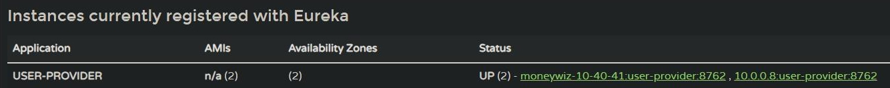
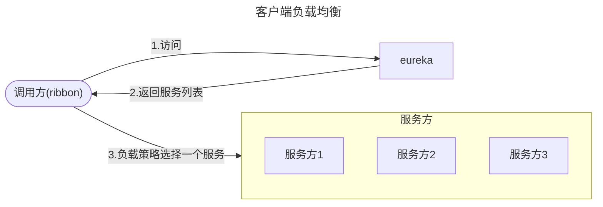
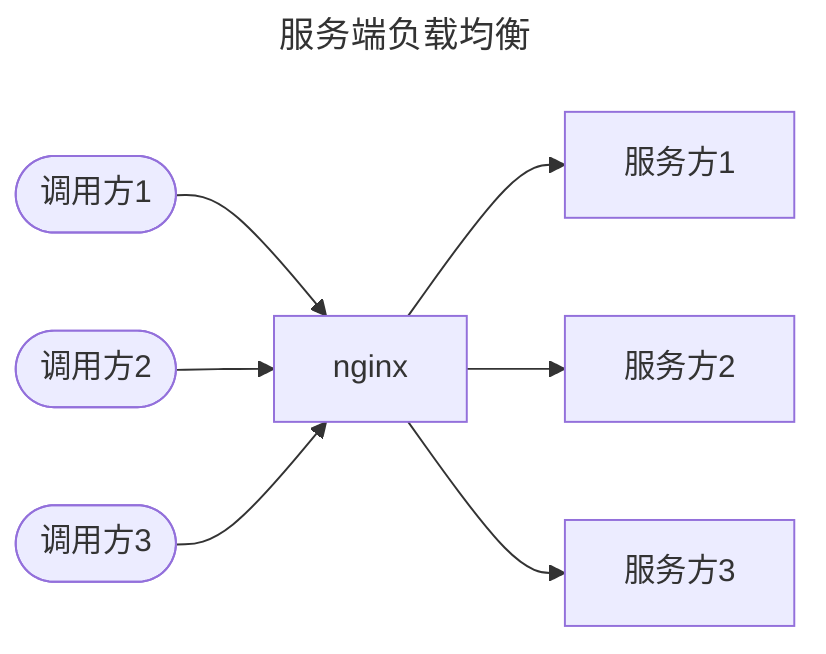

# Spring Cloud尝试

因为Spring Cloud `2022.0.4`版本需要依赖Spring Boot`3.0.9`，而目前更多使用的是Spring Boot 2.x版本

所以这里Spring Cloud版本选用`2021.0.8`，相对应的跟据官方文档，Spring Boot版本选用`2.6.15`，

::: tip
这里Spring Cloud版本号有个命名变更，之前是使用A-Z的伦敦地铁站命名如：`Hoxton.SR1`，而从2020年开始命名改为日期格式如：`2020.0.0-M1`
:::

## 一、概念理解

接触一个新东西就得先理解他的相关概念，然后才能找到门道

### 1.1 什么是Spring Cloud

首先通过Spring文档，可以看到Spring Cloud有很多子模块。如：Spring Cloud Alibaba、Spring Cloud Config、Spring Cloud Netflix等等。这些到底是什么？和Spring Cloud又有什么关系？

通过百度百科了解到：

Spring Cloud是一系列框架的有序集合。它利用Spring Boot的开发便利性巧妙地简化了分布式系统基础设施的开发，如服务发现注册、配置中心、消息总线、负载均衡、断路器、数据监控等，都可以用Spring Boot的开发风格做到一键启动和部署。Spring Cloud并没有重复制造轮子，它只是将各家公司开发的比较成熟、经得起实际考验的服务框架组合起来，通过Spring Boot风格进行再封装屏蔽掉了复杂的配置和实现原理，最终给开发者留出了一套简单易懂、易部署和易维护的分布式系统开发工具包。

也就是说，这些子模块其实就是将优秀的开源框架结构Spring Boot形成的，这些子模块功能各异，并不是说要全部都用上

了解到这么多模块中Spring Cloud Netflix是最常见的一套，因此先从这个模块入手

### 1.2 什么是Spring Cloud Netflix

官方文档中描述到：

该项目通过自动配置和绑定到Spring环境和其他Spring编程模型习惯用法，为Spring Boot应用程序提供Netflix的OSS集成。通过一些简单的注释，您可以快速启用和配置应用程序中的常见模式，并使用久经考验的Netflix组件构建大型分布式系统。

在博客[5.Spring Cloud快速入门-CSDN博客](https://blog.csdn.net/qq_44112474/article/details/109050543)中了解到：

Netflix：微服务大规模的应用，在技术上毫无保留的把一整套微服务架构核心技术栈开源了出来，叫做Netflix OSS

- Eureka：注册中心
- Zuul：服务网关
- Ribbon：负载均衡
- Feign：服务调用
- Hystix：熔断

### 1.3 踩坑了

最初的想法是通过官方文档来学习，但因为不了解cloud的结构和设计，看起来觉得很乱很吃力，然后就想着通过一些博客来先入门，结果第一步就踩到坑了。

就是文章的时效性，加上很多转载文

当feign开启熔断器时，博客上统一都是`feign.hystix.enabled=true`，结果开启后并没有用

查了才知道Spring Cloud2020后feign的jar中移除了hystix，需要额外引入，且开启配置也有变化

## 二、eureka

eureka是一个注册中心，基于心跳机制动态维护一个可用服务列表，比如一个查询服务有哪些实例可用他的ip、端口是多少

eureka分为server和client，server就是记录注册信息的地方，而client就是注册者

### 2.1 server

server使用起来很简单，只需要导入一个jar包：

```xml
<dependencies>
    <dependency>
        <groupId>org.springframework.cloud</groupId>
        <artifactId>spring-cloud-starter-netflix-eureka-server</artifactId>
    </dependency>
</dependencies>
```

然后在Application.Java中添加注解`@EnableEurekaServer`

### 2.2 client

client同样简单，也只需要一个jar包

```xml
<dependencies>
	<dependency>
       <groupId>org.springframework.cloud</groupId>
       <artifactId>spring-cloud-starter-netflix-eureka-client</artifactId>
   </dependency>
</dependencies>
```

在client中随便写一个简单接口用作模拟服务提供者，在云服务器和本地分别启动一个实例来模拟集群，再去eureka控制台查看：



可以看到服务已经注册到了eureka中，且有启动的两个实例

### 2.3 配置

eureka使用的重点在配置文件上，Spring Cloud Eureka为分布式系统外部化配置提供了服务器端和客户端的支持，它包括Eureka Server和Eureka Client两部分，因此Spring Cloud Eureka 配置项比较多。

通过application.yml配置，分为四大部分配置，但通常很多配置使用默认配置即可：

```yaml
eureka:
	instance:
	client:
	server:
	dashboard:
```

具体可以参考：[Eureka配置文件详解-CSDN博客](https://blog.csdn.net/songjianlong/article/details/131315595)

## 三、ribbon

ribbon用作负载均衡，比如某个服务有3个实例，那么通过负载均衡可以将请求通过一定的策略分布到3个实例上。

负载均衡分为服务端和客户端：





其中ribbon就是客户端负载均衡，即由调用方处理负载均衡(和nginx的区别：[Ribbon与Nginx的区别 - 简书 (jianshu.com)](https://www.jianshu.com/p/49b3a22dbec9))

优点是快速上手、成本较小，且相比于服务端统一的负载均衡也更灵活

缺点也很明显业务和负载这些运维属性都在程序中，不容易管理

### 3.1 使用ribbon

eureka-client包中已经包含了ribbon，因此如果使用了eureka就无需再导入jar包

这里使用`RestTemplate`来发起请求，只需要使用`@LoadBalanced`注解即可开启负载均衡

```java
@Configuration
public class RestConfig {

    @Bean
    @LoadBalanced
    public RestTemplate restTemplate(){
        return new RestTemplate();
    }
}
```

### 3.2 负载策略和配置

```yml
springcloud-nacos-provider: # nacos中的服务id
  ribbon:
    NFLoadBalancerRuleClassName: com.netflix.loadbalancer.RoundRobinRule #设置负载均衡
```

| 策略           | 说明                                                         | 配置                                                 |
| -------------- | ------------------------------------------------------------ | ---------------------------------------------------- |
| 轮询策略       | 按照一定的顺序依次调用服务实例，如实例1、2、3                | `com.netflix.loadbalancer.RoundRobinRule`            |
| 权重策略       | 根据每个服务提供者的响应时间分配一个权重，响应时间越长，权重越小，被选中的可能性也就越低 | `com.netflix.loadbalancer.WeightedResponseTimeRule`  |
| 随机策略       | 从服务提供者的列表中随机选择一个服务实例                     | `com.netflix.loadbalancer.RandomRule`                |
| 最小连接数策略 | 选取连接数最小的⼀个服务实例。如果有相同的最小连接数，那么会调用轮询策略进行选取 | `com.netflix.loadbalancer.BestAvailableRule`         |
| 重试策略       | 按照轮询策略来获取服务，如果获取的服务实例为 null 或已经失效，则在指定的时间之内不断地进行重试来获取服务，如果超过指定时间依然没获取到服务实例则返回 null | `com.netflix.loadbalancer.RetryRule`                 |
| 可用性敏感策略 | 先过滤掉非健康的服务实例，然后再选择连接数较小的服务实例     | `com.netflix.loadbalancer.AvailabilityFilteringRule` |
| 区域敏感策略   | 根据服务所在区域(zone)的性能和服务的可用性来选择服务实例，在没有区域的环境下，该策略和轮询策略类似 | `com.netflix.loadbalancer.ZoneAvoidanceRule`         |

其中重试策略需要额外配置超时时间：

```yml
ribbon:
  ConnectTimeout: 2000 # 请求连接的超时时间
  ReadTimeout: 5000 # 请求处理的超时时间
```

## 四、feign

Feign是Netflix开发的声明式、模板化的HTTP客户端，其灵感来自Retrofit、JAXRS-2.0以及WebSocket。Feign可帮助我们更加快捷、优雅地调用HTTP API

相比之前使用的restTemplate，其host、uri、param都是分开的，因此可读性更佳、也更容易维护

### 4.1 使用feign

首先需要引入jar包

```xml
<dependency>
    <groupId>org.springframework.cloud</groupId>
    <artifactId>spring-cloud-starter-openfeign</artifactId>
</dependency>
```

然后编写一个feignclient接口

```java
// 此处name就是eureka中的服务名，也就相当于是ip：port
@FeignClient(name = "user-provider")
public interface RecordFeignClient {
    // 此处是指服务方的uri，方法入参就是http请求的参数
    @GetMapping("/record/{rid}")
    Record getRecord(@PathVariable("rid") String rid);
}
```

然后将controller中的restTemplate替换成定义的feignClient，最后还需要在启动类中加上`@EnableFeignClients`注解

启动程序验证，调用正常，还集成了ribbon负载均衡

### 4.2 配置

feign的配置和其他配置类似，有Java Bean和yml配置文件两种形式。因为只是了解一下，并不是要使用feign，就不过多去看配置了

具体可以看：[SpringCloud：Feign的使用及配置_feignclient配置_Poetry-Distance的博客-CSDN博客](https://blog.csdn.net/qi341500/article/details/129300783)

## 五、Hystrix

Hystrix是一个实现了超时机制和断路器模式的工具类库，用于隔离访问远程系统、服务或者第三方库，防止级联失败，从而提升系统的可用性与容错性

也就是针对服务调用的一个断路器，当依赖服务出现问题时，切断链路减少本服务受到的影响。可以结合feign使用，也可以单独使用

结合feign使用或者单独使用都很简单，具体使用可以参考：[Hystrix入门实战(完整版)_hystrix教程-CSDN博客](https://blog.csdn.net/qq_44112474/article/details/109094254)

注意新版本和文中有些出入

## 六、Zuul

[Zuul入门实战(完整版)-CSDN博客](https://blog.csdn.net/qq_44112474/article/details/109094775)

## 七、感受

Spring Cloud Netflix算是一套比较完整的微服务框架，搭建也很快、成本很低，适合小型企业快速启动

至于性能上，没有能够验证的环境与流量，无法验证他和其他框架的差别，但至少使用上来说还算便捷