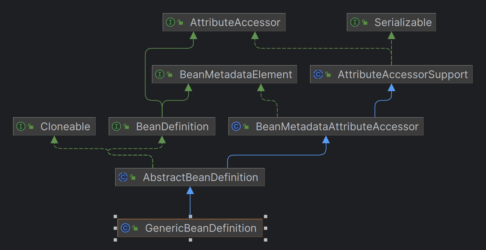
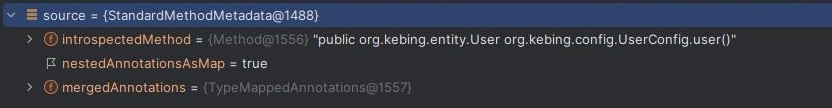

# 第一章、BeanDefinition概览
跟据官方文档，配置最终会被解析成`BeanDefinition`

找到这个类，发现是个接口，通过单步调式找到了实现类`GenericBeanDefinition`。并且可以大概知晓一些IoC容器创建bean的流程：


目前尝试读了几个源码，发现记录的方式很有问题。先在是从顶层开始，记录接口的每个方法，然后再写实现类，问题在于感觉很冗余，所以想调整一下。改成只记录实现类的实现、以及接口的default实现，并且按照方法的功用做分类

## 一、简单示例

既然xml配置或者是注解都是为了生成`BeanDefinition`实例，那么是否可以直接通过`BeanDefinition`，来实现创建bean呢？

```java
public class BeanDefinitionTests {
	public static void main(String[] args) {
		example();
	}

	private static void example() {
		DefaultListableBeanFactory beanFactory = new DefaultListableBeanFactory();

		GenericBeanDefinition beanDefinition = new GenericBeanDefinition();
		beanDefinition.setBeanClass(User.class);
		// 设置属性
		List<PropertyValue> propertyValues = new ArrayList<>();
		propertyValues.add(new PropertyValue("id", "6"));
		propertyValues.add(new PropertyValue("userName", "spring"));
		beanDefinition.setPropertyValues(new MutablePropertyValues(propertyValues));

		//注册到环境上下文
		beanFactory.registerBeanDefinition("user", beanDefinition);

		// 通过class取得bean
		User user = beanFactory.getBean(User.class);
		System.out.println(user);
	}
}
```

答案是可行的。那么我们就可以先忽略如果处理配置这一步，从`BeanDefinition`开始入手，了解IoC容器是如何创建bean的

## 二、GenericBeanDefinition继承关系



## 三、基础服务

BeanDefinition涉及到了一些Spring的底层基础类，这里是AttributeAccessor、BeanMetadataElement两个

### 3.1 AttributeAccessor

`AttributeAccessor`，属性访问器，实现该接口就具备了储存、访问元素的能力，而`AttributeAccessorSupport`是其实现类，都在spring-core包中

首先是元素存放的变量，是一个`LinkedHashMap`：

```java
private final Map<String, Object> attributes = new LinkedHashMap<>();
```

然后是几个方法的实现，先是添加元素，有一个注意点：

- 如果这样调用`setAttribute("spring", null);`，不是说将key为spring的value设置为null，而是直接移除spring这个key

```java
@Override
public void setAttribute(String name, @Nullable Object value) {
    // name需要非null，如果给null会抛出IllegalArgumentException，是spring封装的一个判空方法
    Assert.notNull(name, "Name must not be null");
    if (value != null) {
        this.attributes.put(name, value);
	 }
    else {
        // 如果value为null，不是说将这个key的value设为null，而是移除这个key
        removeAttribute(name);
    }
}
```

获取元素：

- 因为set方法不会保存value为null的key，所以这里如果返回null了，就是没有这个元素

```java
@Override
@Nullable
public Object getAttribute(String name) {
    Assert.notNull(name, "Name must not be null");
    return this.attributes.get(name);
}
```

移除元素

```java
@Override
@Nullable
public Object removeAttribute(String name) {
    Assert.notNull(name, "Name must not be null");
    return this.attributes.remove(name);
}
```

判断是否包含元素

```java
@Override
public boolean hasAttribute(String name) {
    Assert.notNull(name, "Name must not be null");
    return this.attributes.containsKey(name);
}
```

获取所有元素名

```java
@Override
public String[] attributeNames() {
    return StringUtils.toStringArray(this.attributes.keySet());
}
```

除了以上这些接口中定义的方法外，`AttributeAccessorSupport`还重写了equals和hashcode方法，使用attributes字段来实现。另外还有一个拷贝方法，属于浅拷贝

```java
protected void copyAttributesFrom(AttributeAccessor source) {
    Assert.notNull(source, "Source must not be null");
    String[] attributeNames = source.attributeNames();
    for (String attributeName : attributeNames) {
        setAttribute(attributeName, source.getAttribute(attributeName));
    }
}
```

### 3.2 BeanMetadataElement

`BeanMetadataElement`，实现这个接口就具备了返回源对象的能力。`BeanMetadataAttributeAccessor`是其实现类。

首先有个问题：



那么问题来了？这个源对象是什么东西？



```java
public class BeanDefinitionTests {
	public static void main(String[] args) {
		AnnotationTest();
	}

	private static void AnnotationTest(){
		AnnotationConfigApplicationContext context = new AnnotationConfigApplicationContext(UserConfig.class);
		ConfigurableListableBeanFactory beanFactory = context.getBeanFactory();
		BeanDefinition userService = beanFactory.getBeanDefinition("user");
		Object source = userService.getSource();
		System.out.println(userService.getSource());
	}
}
```

使用代码来看看这个source里是什么，运行后发现：



可以看到记录了全类名的方法名，这个方法正是`@Bean`注解下的方法，也就是说这个source中存储的就是bean被定义的地方

`BeanMetadataAttributeAccessor`中定义3个变量

```java
private final String name;
@Nullable
private final Object value;
@Nullable
private Object source;
```

除了`BeanMetadataElement`中要求的source外，还增加了一个键值对，需要注意的是：

- source有get和set方法
- name，value只能通过构造器赋值，并没有提供set方法，只有get方法

`BeanMetadataAttributeAccessor`这个类是对`AttributeAccessorSupport`的扩展，有两点扩展：

- 新增了source字段
- 所有保存的元素，其value的类型都是`BeanMetadataAttribute`

## 四、BeanDefinition

从官方文档中得知，bean的所有信息都存储在BeanDefinition中，当然实际上肯定是他的实现类来实现存储。接口中定义的两组成员变量，先来看看：

| 变量                                                         | 说明                     |
| ------------------------------------------------------------ | ------------------------ |
| `String SCOPE_SINGLETON = ConfigurableBeanFactory.SCOPE_SINGLETON;` | 单例作用域的作用域标识符 |
| `String SCOPE_PROTOTYPE = ConfigurableBeanFactory.SCOPE_PROTOTYPE;` | 原型作用域的作用域标识符 |

这两个变量是bean的作用域标识符，简单来说单例作用域就是不管获取多少次bean都是同一个实例；而原型作用域，每次获取都会创建一个新的实例

| 变量                           | 说明                                               |
| ------------------------------ | -------------------------------------------------- |
| `int ROLE_APPLICATION = 0;`    | 角色定义，应用程序的主要bean，通常是用户定义的bean |
| `int ROLE_SUPPORT = 1;`        | 角色定义，通常是某些较大配置的支持部分             |
| `int ROLE_INFRASTRUCTURE = 2;` | 角色定义，基础设施，即内部工作的bean               |

这三个变量将bean划分为了3个角色，我们定义的bean通常就是`ROLE_APPLICATION`。

然后方法这块定义了很多get、set方法，有点类似实体类，这里直接看BeanDefinition的实现类，了解每个字段的含义即可

## 五、各个字段概览

从代码上看，绝大部分字段都集中在`AbstractBeanDefinition`，而该抽象类的扩展类基本都在其基础上做一些小扩展。

### beanClass

```java
@Nullable
private volatile Object beanClass;
```

从变量名看，是bean的class，也就是bean的类信息。涉及到6个方法，其中5个属于字段的get、set以及类型判断方法。还有一个，是将`beanClass`从全类名转化为Class类

```java
@Nullable
public Class<?> resolveBeanClass(@Nullable ClassLoader classLoader) throws ClassNotFoundException {
    String className = getBeanClassName();
    if (className == null) {
        return null;
    }
    Class<?> resolvedClass = ClassUtils.forName(className, classLoader);
    this.beanClass = resolvedClass;
    return resolvedClass;
}
```

从这个方法中可以得出，`beanClass`可能存放Class类，也可能存放bean的全类名

### scope

```java
@Nullable
private String scope = SCOPE_DEFAULT;
```

即bean的作用域，通常就是SINGLETON和PROTOTYPE

### abstractFlag

```java
private boolean abstractFlag = false;
```

表示 Bean 是否为抽象的。如果为 true，表示该 Bean 是一个抽象 Bean，不能被实例化，只能被用作其他 Bean 的父类。

### lazyInit

```java
@Nullable
private Boolean lazyInit;
```

表示是否延迟初始化，如果为 true，表示容器将在第一次请求该 Bean 时才进行实例化。

### autowireMode

```java
private int autowireMode = AUTOWIRE_NO;
```

表示自动装配模式，指定自动装配的方式，如通过名称、类型等。通过定义的常量可以看到有5种取值

```java
/**
 * 禁用自动装配
 */
public static final int AUTOWIRE_NO = AutowireCapableBeanFactory.AUTOWIRE_NO;

/**
 * 按照 Bean 的名称自动装配
 */
public static final int AUTOWIRE_BY_NAME = AutowireCapableBeanFactory.AUTOWIRE_BY_NAME;

/**
 * 按照 Bean 的类型自动装配
 */
public static final int AUTOWIRE_BY_TYPE = AutowireCapableBeanFactory.AUTOWIRE_BY_TYPE;

/**
 * 使用构造器自动装配
 */
public static final int AUTOWIRE_CONSTRUCTOR = AutowireCapableBeanFactory.AUTOWIRE_CONSTRUCTOR;

/**
 * 自动检测自动装配模式。在这种模式下，Spring 容器会根据属性类型和名称进行自动装配，优先按照类型进行匹配，如果无法唯一确定，则再按照名称进行匹配
 * 已废弃
 */
@Deprecated
public static final int AUTOWIRE_AUTODETECT = AutowireCapableBeanFactory.AUTOWIRE_AUTODETECT;
```

看到这里想起来一件事情，关于`AUTOWIRE_AUTODETECT`，这个应当是较早版本spring自动装配的默认项。

曾经对一个老项目做改造时有这样一个问题：

```java
@Autowired
private DataSource aaaDataSource;
@Autowired
private DataSource bbbDataSource;
```

就是配置了多个连接池，然后取其中两个。在改造成Spring Boot(归结到底是升了Spring版本)后这样写就报错了！

应该就是自动注入模式变化引起的，原先是跟据type找到多个DataSource再跟据name匹配，因此可以找到目标bean

变更后只跟据type匹配(如果要跟据name匹配，需要配合注解`@Qualifier`)，匹配到多个bean导致报错

另外存在一个方法，将`AUTOWIRE_AUTODETECT`解析为`AUTOWIRE_BY_TYPE`或`AUTOWIRE_CONSTRUCTOR`：

```java
public int getResolvedAutowireMode() {
    if (this.autowireMode == AUTOWIRE_AUTODETECT) {
        // 有一个无参构造使用set方法type匹配，否则使用构造器模式
        Constructor<?>[] constructors = getBeanClass().getConstructors();
        for (Constructor<?> constructor : constructors) {
            if (constructor.getParameterCount() == 0) {
                return AUTOWIRE_BY_TYPE;
            }
        }
        return AUTOWIRE_CONSTRUCTOR;
    }
    else {
        return this.autowireMode;
    }
}
```

### dependencyCheck

```java
private int dependencyCheck = DEPENDENCY_CHECK_NONE;
```

表示依赖检查模式，用于指定容器是否在实例化 Bean 时检查其依赖关系，有4种取值：

```java
/**
 * 不检查依赖项
 */
public static final int DEPENDENCY_CHECK_NONE = 0;

/**
 * 检查对象引用类型依赖性
 */
public static final int DEPENDENCY_CHECK_OBJECTS = 1;

/**
 * 检查简单数据类型依赖性，大概是基本数据类型
 */
public static final int DEPENDENCY_CHECK_SIMPLE = 2;

/**
 * 检查全部依赖项
 */
public static final int DEPENDENCY_CHECK_ALL = 3;
```

### dependsOn

```java
@Nullable
private String[] dependsOn;
```

表示 Bean 的依赖项，指定 Bean 创建之前需要先创建的 Bean 的名称

### autowireCandidate

```java
private boolean autowireCandidate = true;
```

表示是否作为自动装配的候选，如果为 false，表示该 Bean 不会参与自动装配

也就是说该bean是否会被自动注入进其他bean中

### primary

```java
private boolean primary = false;
```

表示是否为首选的 Bean，如果为 true，表示该 Bean 是自动装配时的首选项

### qualifiers

```java
private final Map<String, AutowireCandidateQualifier> qualifiers = new LinkedHashMap<>();
```

自动注入时，用于beanName匹配，和`@Qualifier`有关

### instanceSupplier

```java
@Nullable
private Supplier<?> instanceSupplier;
```

创建 Bean 实例的回调

### nonPublicAccessAllowed

```java
private boolean nonPublicAccessAllowed = true;
```

是否允许访问非公共构造函数和方法

### lenientConstructorResolution

```java
private boolean lenientConstructorResolution = true;
```

宽松模式还是在严格模式下解析构造函数，这里又引入了两个概念：宽松和严格模式，暂时不太明白

### factoryBeanName

```java
@Nullable
private String factoryBeanName;
```

工厂 Bean 的名称，用于指定用于创建当前 Bean 的工厂 Bean 的名称

### factoryMethodName

```java
@Nullable
private String factoryMethodName;
```

工厂方法的名称，指定用于创建当前 Bean 的工厂方法的名称

### constructorArgumentValues

```java
@Nullable
private ConstructorArgumentValues constructorArgumentValues;
```

构造函数参数值，用于存储构造函数参数的值

### propertyValues

```java
@Nullable
private MutablePropertyValues propertyValues;
```

属性值，用于存储 Bean 的属性值

### methodOverrides

```java
private MethodOverrides methodOverrides = new MethodOverrides();
```

有关要由 IoC 容器重写的方法的信息。如果没有方法重写，这将是空的

### initMethodName

```java
@Nullable
private String initMethodName;
```

初始化方法的名称，指定 Bean 实例化后调用的初始化方法的名称

### destroyMethodName

```java
@Nullable
private String destroyMethodName;
```

销毁方法的名称，指定 Bean 销毁前调用的方法的名称

### enforceInitMethod

```java
private boolean enforceInitMethod = true;
```

指定配置的初始值设定项方法是否为默认值

### enforceDestroyMethod

```java
private boolean enforceDestroyMethod = true;
```

指示配置的销毁方法是否为默认值

### synthetic

```java
private boolean synthetic = false;
```

是否为合成的 Bean，如果为 true，表示该 Bean 是由容器自动创建的，而不是由用户显式定义的

### role

```java
private int role = BeanDefinition.ROLE_APPLICATION;
```

表示bean的角色

### description

```java
@Nullable
private String description;
```

人类可读描述。。

### resource

```java
@Nullable
private Resource resource;
```

BeanDefinition的来源