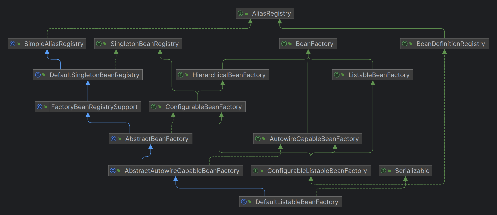

# 第一章、BeanFactory概述

BeanFactory，找了一些资料后，看到有人说是Spring的心脏、IoC容器的真面目

同样的，需要先找到完整的继承关系，通过调试，最终找到了一个BeanFactory的实现类：

位于`AbstractRefreshableApplicationContext.java`中

```java
protected DefaultListableBeanFactory createBeanFactory() {
    return new DefaultListableBeanFactory(getInternalParentBeanFactory());
}
```

## 一、继承关系



正如这个类图所示，涉及的类非常多，而且这只涉及到一些顶层接口和抽象类，很多实现类都没有列出来。

## 二、基础服务AliasRegistry
继承关系中可以看到，有一个基础服务`AliasRegistry`，意为别名注册。有一个实现类`SimpleAliasRegistry`。

## 三、SingletonBeanRegistry系列类

### 3.1 singletonBeanRegistry

定义共享 Bean 实例的注册接口。可以通过{@link org.springframework.beans.factory.BeanFactory}实现，以便以统一的方式公开其单例管理工具。意思是该接口提供了单例bean的注册能力，但需要由BeanFactory来实现，以便统一去管理bean

| 方法                                                         | 说明                                                         |
| ------------------------------------------------------------ | ------------------------------------------------------------ |
| `void registerSingleton(String beanName, Object singletonObject);` | 将对象注册为单例，不会执行初始化和销毁的回调，通常是容器在基于 BeanDefinition 创建 singleton 时调用该方法 |
| `@Nullable Object getSingleton(String beanName);`            | 获取bean，但有很多限制：只有已经实例化的，且无法识别FactoryBean前缀和别名 |
| `boolean containsSingleton(String beanName);`                |                                                              |
| `String[] getSingletonNames();`                              |                                                              |
| `int getSingletonCount();`                                   |                                                              |
| `Object getSingletonMutex();`                                |                                                              |

这里的方法不太理解，只知道是管理单例实例，需要结合具体实现来理解

## 四、BeanDefinitionRegistry系列类

| 方法                                                         | 说明 |
| ------------------------------------------------------------ | ---- |
| `void registerBeanDefinition(String beanName, BeanDefinition beanDefinition) throws BeanDefinitionStoreException;` |      |
| `void removeBeanDefinition(String beanName) throws NoSuchBeanDefinitionException;` |      |
| `BeanDefinition getBeanDefinition(String beanName) throws NoSuchBeanDefinitionException;` |      |
| `boolean containsBeanDefinition(String beanName);`           |      |
| `String[] getBeanDefinitionNames();`                         |      |
| `int getBeanDefinitionCount();`                              |      |
| `boolean isBeanNameInUse(String beanName);`                  |      |

## 五、BeanFactory系列类

```java
String FACTORY_BEAN_PREFIX = "&";
```

变量定义了一个前缀，用于区分factoryBean和BeanFactory实例化的bean

| 方法                                                         | 说明                                                         |
| ------------------------------------------------------------ | ------------------------------------------------------------ |
| `Object getBean(String name) throws BeansException;`         | 跟据name返回bean，可以是singleton也可以是prototype。支持别名，如果匹配不到bean会尝试匹配父工厂 |
| `<T> T getBean(String name, Class<T> requiredType) throws BeansException;` | 和getBean(String)一样，但是需要给定类型(requiredType)，相应的返回的类型和给定类型一致 |
| `Object getBean(String name, Object... args) throws BeansException;` | 为使用显式参数创建 Bean 实例时要使用的参数，测试出如果是prototype作用域，args会注入到bean中，而singleton不会 |
| `<T> T getBean(Class<T> requiredType) throws BeansException;` | 返回与给定对象类型唯一匹配的 Bean 实例（如果有）             |
| `<T> T getBean(Class<T> requiredType, Object... args) throws BeansException;` | 对象类型查找bean，且提供参数，和第三个方法类似               |
| `<T> ObjectProvider<T> getBeanProvider(Class<T> requiredType);` |                                                              |
| `<T> ObjectProvider<T> getBeanProvider(ResolvableType requiredType);` |                                                              |
| `boolean containsBean(String name);`                         |                                                              |
| `boolean isSingleton(String name) throws NoSuchBeanDefinitionException;` |                                                              |
| `boolean isPrototype(String name) throws NoSuchBeanDefinitionException;` |                                                              |
| `boolean isTypeMatch(String name, ResolvableType typeToMatch) throws NoSuchBeanDefinitionException;` |                                                              |
| `boolean isTypeMatch(String name, Class<?> typeToMatch) throws NoSuchBeanDefinitionException;` |                                                              |
| `@Nullable Class<?> getType(String name) throws NoSuchBeanDefinitionException;` |                                                              |
| `@Nullable Class<?> getType(String name, boolean allowFactoryBeanInit) throws NoSuchBeanDefinitionException;` |                                                              |
| `String[] getAliases(String name);`                          |                                                              |

