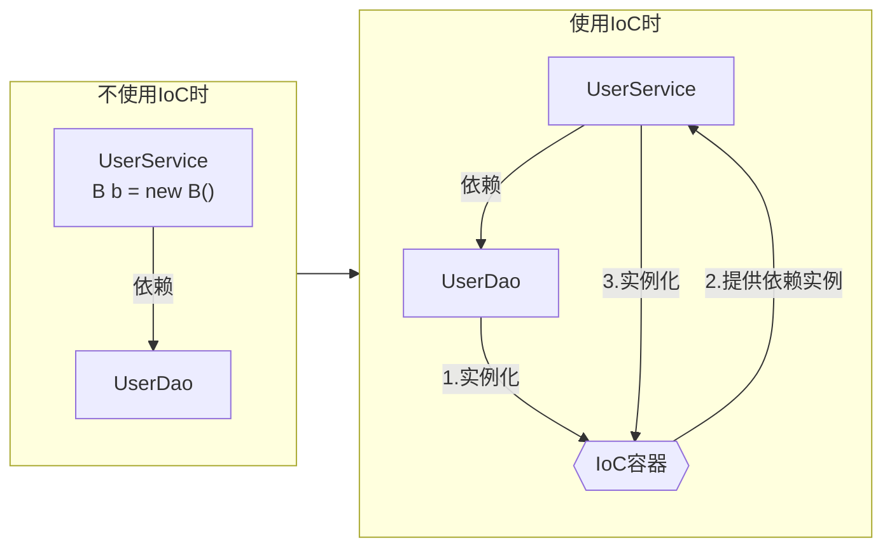

## 一、什么是IoC



只要提到spring，肯定能听到IoC、AOP这两个词。这里我们先学习IoC，先从了解到底什么是IoC开始



IoC全称Inversion of Control，意为控制反转



IoC也被称为依赖注入（DI）。它是一个过程，对象仅通过构造参数、工厂方法的参数或在对象实例被构造或从工厂方法返回后在其上设置的属性来定义其依赖关系（即它们与之合作的其他对象）。然后容器在创建 bean 时注入这些依赖关系。这个过程从根本上说是Bean本身通过使用直接构建类或诸如服务定位模式的机制来控制其依赖关系的实例化或位置的逆过程（因此被称为控制反转）。



先看一个示例，比如一个dao层：

```java
public class userDaoImpl implements userDao{
}
```

在传统设计中，service依赖了dao，就需要自己new：

```java
public class userService{
    private UserDao userDao = new UserDaoImpl();
}
```

而有了IoC之后，结合自动注入：

```java
public class userService{
    @Autowired
    private UserDao userDao;
}
```

可以看到原先需要我们自行new对象来建构调用链路，现在就交给了框架来构建



IoC是一种设计思想，而不是一个具体的技术实现。IoC 的思想就是将原本在程序中手动创建对象的控制权，交由 Spring 框架来管理

- **控制**：指的是对象创建（实例化、管理）的权力
- **反转**：控制权交给外部环境（Spring 框架、IoC 容器）



有了IoC，我们可以免于系统大部分类的实例化，简化开发(当然排除一些实体类)



## 二、容器

依照官方文档，构成你的应用程序的骨干并由Spring IoC容器管理的对象被称为Bean。Bean是一个由Spring IoC容器实例化、组装和管理的对象。那么这个容器到底是什么？如何实现的呢？

简单猜想：我们知道可以通过beanName来获取bean，那就有点类似是k-v键值对，所以可以先推测spring是使用map来存储bean的

首先，编写一个简单测试，通过ApplicationContext来获取bean。

```java
@Data
@AllArgsConstructor
public class User {
	private String id;
	private String userName;
}

@Configuration
public class UserConfig {
	@Bean
	public User user(){
		return new User("1","spring");
	}
}
```

因为这里不是用xml定义bean而是注解，所以需要使用`AnnotationConfigApplicationContext`

```java
public class Main {
	public static void main(String[] args) {
		AnnotationConfigApplicationContext context = new AnnotationConfigApplicationContext(UserConfig.class);
		// 此处打断点，进行单步调试
      User user = (User) context.getBean("user");
		System.out.println(user);
	}
}
```

在注释处打断点，进行单步调试

最终在`DefaultSingletonBeanRegistry`的`getSingleton(String, boolean)`方法中取到了bean，也见到了bean存放的地方：

```java
/** Cache of singleton objects: bean name to bean instance. */
private final Map<String, Object> singletonObjects = new ConcurrentHashMap<>(256);
```

在知道了bean容器是`ConcurrentHashMap`之外，还发现不管是类名、方法名还是变量名都有`singleton`，这很自然可以联想到`@Scope`作用域注解，可能不同作用域的bean存放在不同的地方，这一点后续再验证

## 三、bean简单了解

官方文档中有这样一张图，从图中我们可以获得的信息：

- 想要创建bean，需要business objects，也就是我们的业务类
- 还需要configuration metadata，也就是配置元数据
- 有以上两者后，spring容器会替我们实例化，让我们可以直接拿来使用


基于xml的配置是spring最初的唯一配置方式，但随着spring的发展，注解配置逐渐兴起。现在更多是使用注解的形式，相比于xml更加方便(尤其是Spring Boot兴起后)。这里我想把各种定义bean的方式都尝试一遍，这样对这一块的认知会比较完整，但先还是跟着官方文档走，用最初的定义方式，后面会涉及。

关于spring注解的发展可以看：[Spring注解编程的发展过程](https://juejin.cn/post/7277799132110569533)

关于bean的定义方式：[面试官：spring中定义bean的方法有哪些? 我一口气说出了12种，把面试官彻底征服了。 - 掘金 (juejin.cn)](https://juejin.cn/post/6981815953784995847)

### 3.1 bean的定义和使用

首先，先编写一个初始用例。UserService依赖UserDao实现了一个用户查询逻辑：

```java
public interface UserService {
	User queryUser(String id);
}

public class UserServiceImpl implements UserService {
	private final UserDao userDao;
	// 这里必须提供set方法或者构造器，否则无法注入依赖
	public UserServiceImpl(UserDao userDao) {
		this.userDao = userDao;
	}

	@Override
	public User queryUser(String id) {
		return userDao.queryById(id);
	}
}
```

```java
public interface UserDao {
	User queryById(String id);
}

public class UserDaoImpl implements UserDao {
	@Override
	public User queryById(String id) {
		return new User(id, "Spring Framework");
	}
}
```

在resources目录下，创建spring.xml，把两面两个类注册为bean

```xml
<?xml version="1.0" encoding="UTF-8"?>
<beans xmlns="http://www.springframework.org/schema/beans"
	   xmlns:xsi="http://www.w3.org/2001/XMLSchema-instance"
	   xsi:schemaLocation="http://www.springframework.org/schema/beans
        https://www.springframework.org/schema/beans/spring-beans.xsd">

	<bean id="userDao" class="org.kebing.dao.impl.UserDaoImpl"/>

	<bean id="userService" class="org.kebing.service.impl.UserServiceImpl">
        <!--这个和类提供了构造器还是set方法有关，这里是通过构造器注入，使用property实现set方法注入-->
        <!--name字段是userService中的成员变量名，ref是另一个bean的id-->
        <constructor-arg ref="userDao"/>
        <property name="userDao" ref="userDao"/>
	</bean>
</beans>
```

通过ApplicationContext来获取bean：

这里有一个点，正常情况下我们的项目里是不需要自己调ApplicationContext.getBean来获取bean的

```java
public class Main {
	public static void main(String[] args) {
		ApplicationContext context = new ClassPathXmlApplicationContext("spring.xml");
		UserService userService = context.getBean("userService", UserService.class);
		System.out.println(userService.queryUser("3"));
	}
}
```

可以看到控制台打印：

```txt
User{id='3', userName='Spring Framework'}
```

### 3.2 BeanDefinition

文档中提到：在容器本身中，这些Bean定义被表示为 `BeanDefinition` 对象，它包含（除其他信息外）以下元数据。

- 一个全路径类名：通常，被定义的Bean的实际实现类。
- Bean的行为配置元素，它说明了Bean在容器中的行为方式（scope、生命周期回调，等等）。
- 对其他Bean的引用，这些Bean需要做它的工作。这些引用也被称为合作者或依赖。
- 要在新创建的对象中设置的其他配置设置—例如，pool的大小限制或在管理连接池的Bean中使用的连接数。

文中并没有提到太多内容，可以知道的是，我们提供的配置最终被解析到了这里

而至于类中每个变量对应哪个配置，或者说每个变量如何配置，计划等到注解时再来一一核对

## 四、IoC过程

结合文档学习后，对IoC已经有了一定理解，是时候从入口着手研究整个流程了，带上问题开始调试



通过前面的简单了解，我们知道了IoC容器的数据结构，也知道配置最终解析成了BeanDefinition，那么实例是如何创建的呢？ApplicationContext、BeanFactory这些类又是做什么的呢？



```java
public class BeanDefinitionTests {
	public static void main(String[] args) {
		xmlTest();
	}

	private static void xmlTest(){
		ClassPathXmlApplicationContext context = new ClassPathXmlApplicationContext("spring.xml");
		UserService userService = context.getBean("userService", UserService.class);
		userService.queryUser("3");
	}
}
```

从`ApplicationContext`入手，两行代码就从配置文件变成了实例对象，那么IoC的过程肯定也就在这两行中

进入`ApplicationContext`的源码，发现很多都是调用了`BeanFactory`的实现，可以理解为`ApplicationContext`基于`BeanFactory`的能力进行了扩展


