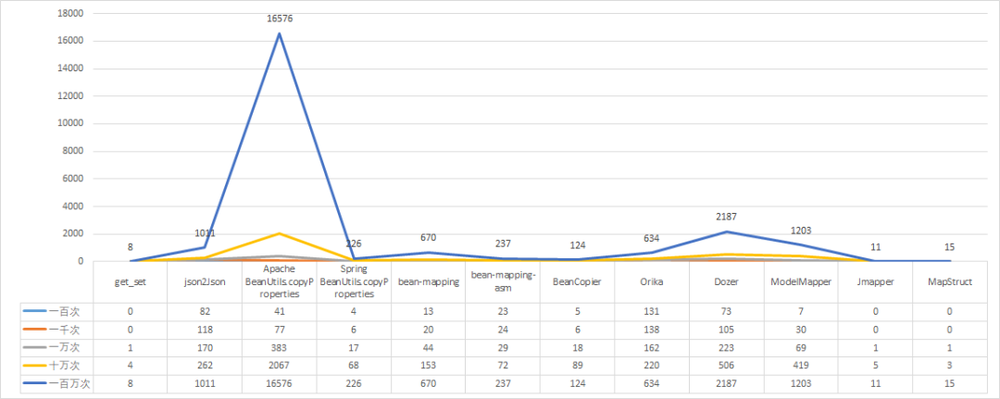

# Apache Commons Lang3
## 一、Apache Commons简介

官方文档：[Apache Commons](https://commons.apache.org/)

`Apache Commons`是Apache软件基金会的项目，Commons的目的是提供开源的、可重用的Java组件

`Apache Commons`项目由三部分组成：

### 1.1 The Commons Proper

The Commons Proper提供非常多可重用的、稳定的Java组件库。

其子项目如下：

| 包名          | 作用                                                         |
| ------------- | ------------------------------------------------------------ |
| BCEL          | 字节码工程库——分析、创建和操作 Java 类字节码工程库——分析、创建和操作 Java 类文文件BeanUtils围绕 Java 反射和内省 API 的易于使用的包装器 |
| BeanUtils     | 围绕 Java 反射和内省 API 的易于使用的包装器                  |
| CLI           | 命令行参数解析器。Codec通用编码/解码算法（例如语音、base64、URL） |
| Collections   | 扩展或增强 Java 集合框架                                     |
| Compress      | 定义用于处理 tar、zip 和 bzip2 文件的 API                    |
| Configuration | 读取各种格式的配置/首选项文件                                |
| Crypto        | 使用 AES-NI 包装 Openssl 或 JCE  算法实现优化的加密库        |
| CSV           | 用于读写逗号分隔值文件的组件                                 |
| Daemon        | unix-daemon-like java 代码的替代调用机制                     |
| DBCP          | 数据库连接池服务                                             |
| DbUtils       | JDBC 帮助程序库                                              |
| Email         | 用于从 Java 发送电子邮件的库                                 |
| Exec          | 用于处理 Java 中外部进程执行和环境管理的 API                 |
| FileUpload    | servlet 和 Web 应用程序的文件上传功能                        |
| Geometry      | 空间和坐标                                                   |
| Imaging       | 纯 Java 图像库                                               |
| IO            | I/O 实用程序的集合                                           |
| JCI           | Java 编译器接口JCSJava缓存系统Jelly基于 XML 的脚本和处理引擎 |
| Jexl          | 表达式语言，它扩展了 JSTL 的表达式语言                       |
| Lang          | 为 java.lang 中的类提供额外的功能                            |
| Logging       | 包装各种日志 API 实现                                        |
| Math          | 轻量级、自包含的数学和统计组件                               |
| Net           | 网络实用程序和协议实现的集合                                 |
| Numbers       | 数字类型（复数、四元数、分数）和实用程序（数组、组合）       |
| Pool          | 通用对象池组件                                               |
| RDF           | 可由 JVM 上的系统实现的 RDF 1.1 的通用实现                   |
| RNG           | 随机数生成器的实现                                           |
| Text          | Apache Commons Text  是一个专注于处理字符串的算法的库        |
| Validator     | 在 xml 文件中定义验证器和验证规则的框架                      |
| VFS           | 用于将文件、FTP、SMB、ZIP  等视为单个逻辑文件系统的虚拟文件系统组件 |
| Weaver        | 提供一种简单的方法来增强（编织）已编译的字节码               |

可以跟据需要去挑选对应的包，但需要注意鉴别

### 1.2 The Commons Sandbox

The Commons Sandbox是一个临时的项目，其中包含社区成员正在探索和测试新的功能和实用程序。它为Apache Commons社区提供了一个试验新想法的地方，收集并评估新代码，并在尝试维护新代码时为项目管理人员提供时间。新的实用程序可能会在更大的Apache Commons项目中成为一个独立的单元，也可能会闲置

### 1.3 The Commons Dormant 

The Commons Dormant的主要作用是维护那些不再活跃或已经过时的项目。这些项目可能已经失去了活跃的贡献者或用户，也可能已经与其他项目合并或重命名。The Commons Dormant通过提供必要的维护和文档资源，确保这些项目仍然能够持续保持可用和可维护。

### 1.4 优缺点

提供了丰富工具类，能够减少开发人员的工作量，避免重复造轮子

经过广泛的使用和测试，具有一定的可靠性

------

工具包的质量参差不齐，引入工具包或工具方法前需要深入调研后才能使用，就这要求我们平时有一定的积累

如Apache commons的BeanUtils，虽然实现了对象的拷贝，但其中使用到了性能较差的反射，所以性能不佳：



## 二、主要内容 lang简介

`Apache commons lang`为java.lang API提供了大量工具方法，例如：字符串操作、数组操作、随机数生成、反射、时间日期处理等等

注意点：Commons Lang 3.0（及后续版本）与之前的版本（org.apache.commons.lang）使用不同的包（org.apache.commons.lang3），且允许Commons Lang 3与Commons Lang 同时使用，但一般都是使用lang3

lang3中有非常多的工具类和工具方法，但并不是所有的内容都能在日常开发中使用，其包结构如下：

```html
├─org.apache.commons 
│  ├─lang3 // 提供很多静态工具方法，比较著名的如StringUtils、ArrayUtils
│  │  ├─arch // 配合ArchUtils使用，可以获取处理器的体系结构和类型，并提供方法判断处理器是否是某个结构、某个类型
│  │  ├─builder // 协助实现对象的toString()、hashCode()、equals()和compareTo()方法
│  │  ├─compare // 封装了compareTo方法，提供Predicate实例
│  │  ├─concurrent // 提供了一些并发的工具
│  │  ├─event // 提供一些基于事件的工具
│  │  ├─exception // 提供一些Exception相关的方法
│  │  ├─function // 提供允许抛出异常的函数式接口，以补充java.lang.function和实用程序以与Java 8 Lambdas一起使用
│  │  ├─math // 提供了分数类和一些数字工具方法
│  │  ├─mutable // 为基本数据类型和不可变对象提供可变的包装类
│  │  ├─reflect // 反射
│  │  ├─stream // 补充java.util.stream
│  │  ├─time // 提供使用日期和持续时间的类和方法
│  │  ├─tuple // 元组类，提供了Pair和Triple
```

## 三、代码

引入lang包：

```xml
<dependency>
    <groupId>org.apache.commons</groupId>
    <artifactId>commons-lang3</artifactId>
    <version>3.12.0</version>
</dependency>
```

摘选了一些日常业务开发中可能会使用到的，或者是有一些启发意义的类

### 3.1 NumberUtils

提供数值操作的工具方法

#### 3.1.1 判断是否是数值

```java
public void isNumberTest() {
    // 是否为数字，不支持十六进制和科学计数法(常用)
    System.out.println(NumberUtils.isParsable("3.14"));//true
    System.out.println(NumberUtils.isParsable("0X2F"));//false
    System.out.println(NumberUtils.isParsable("12345E-10"));//false
    // 判断str的每一个是否都是数字，即正整数
    System.out.println(NumberUtils.isDigits("3.14"));//false
    System.out.println(NumberUtils.isDigits("-3"));//false
    System.out.println(NumberUtils.isDigits("30"));//true
    // 是否为数字，支持十六进制和科学计数法
    System.out.println(NumberUtils.isCreatable("3.14"));//true
    System.out.println(NumberUtils.isCreatable("0X2F"));//true
    System.out.println(NumberUtils.isCreatable("12345E-10"));//true
}
```

#### 3.1.2 max/min

```java
/**
 * 以Integer为例
 */
public void maxMinTest() {
    // JDK方法，只支持两个值比较
    System.out.println(Integer.max(3, 4));
    // NumberUtils，支持3个甚至是数组
    System.out.println(NumberUtils.max(3, 4, 5));
    System.out.println(NumberUtils.min(3, 4, 5));
    System.out.println(NumberUtils.max(3, 4, 5, 6));
    int[] ints = {3, 4, 5, 6, 7, 8, 9};
    System.out.println(NumberUtils.max(ints));
}
```

#### 3.1.3 toNumber

```java
/**
 * 字符串转化为数值类
 */
public void toNumberTest() {
    // createXXX，支持十六进制、八进制的数值转化;如Integer，即是在Integer.decode基础上加了一道判空
    System.out.println(NumberUtils.createInteger("0X2F"));
    System.out.println(NumberUtils.createInteger("0777"));
    System.out.println(Integer.decode("0X2F"));
    // 比较实用，当字符串不为数值时，使用默认数值
    System.out.println(NumberUtils.toInt("abc", 0));
    // 和Java原生实现相比，代码更简洁，且效果相同
    int i;
    try {
        i = Integer.parseInt("abc");
    } catch (NumberFormatException e) {
        i = 0;
    }
    System.out.println(i);
}
```

### 3.2 ArrayUtils

目前的日常开发中数组使用的不多，如数据库查询、Json格式化得到的都是List等容器，基本上只有字符串的拆分操作(split)会产生数组。ArrayUtils提供了以下两类方法
* 部分方法和Arrays提供的方法重复(如toString())(不讲述)
* 提供的一些方法，可以将数组像List那样使用

#### 3.2.1 判空方法

```java
/**
 * 数组判空，针对null或者空的情况，以及将null转化为空数组
 */
public void emptyTest(){
    int[] array1 = {};
    System.out.println(ArrayUtils.isEmpty(array1));
    System.out.println(array1 == null || array1.length == 0);
    int[] array2 = null;
    System.out.println(ArrayUtils.isNotEmpty(array2));
    System.out.println(Arrays.toString(ArrayUtils.nullToEmpty(array2)));
    System.out.println(array2 != null && array2.length != 0);
}
```

#### 3.2.2 查找元素下标

```java
/**
 * 数组元素查找下标
 * jdk中没有提供相关方法，如果想实现这些功能，需要自己使用循环遍历数组或者将数组转化为List
 */
public void searchTest(){
    int[] array = {1,1,2,3,5,8,13,21,34,55};
    // 寻找元素在数组中的下标，只取第一个
    System.out.println(ArrayUtils.indexOf(array, 1));
    // 从下标1(包括1)的元素开始查找，只取第一个
    System.out.println(ArrayUtils.indexOf(array, 1, 1));
    System.out.println(ArrayUtils.indexesOf(array, 1));
    // 寻找元素在数组中的下标，只取最后一个
    System.out.println(ArrayUtils.lastIndexOf(array, 1));
    // 判断数组中是否有该元素
    System.out.println(ArrayUtils.contains(array, 1));
}
```

#### 3.2.3 修改数组

```java
/**
 * 类似List的方式来操作数组，但要注意：
 * 例如add方法(向数组尾部加一个元素)，每次插入都是扩容一次且只扩容1个长度，因此如果频繁插入更推荐将数组转化为List来操作
 */
public void modifyTest(){
    int[] array = {1,1,2,3,5,8,13,21,34,55};
    //------------insert------------
    // 向数组尾部插入一个元素，会自动扩容，但和ArrayList不同，每次只会扩容1
    System.out.println(Arrays.toString(ArrayUtils.add(array, 89)));
    // 向数组首部插入一个元素
    System.out.println(Arrays.toString(ArrayUtils.addFirst(array, 0)));
    // 向指定位置插入任意数量的元素
    System.out.println(Arrays.toString(ArrayUtils.insert(2, array, 10, 11)));
    // 向数组尾部插入另一个数组
    int[] array2 = {89, 144, 233};
    System.out.println(Arrays.toString(ArrayUtils.addAll(array, array2)));
    //-----------remove------------
    // 移除指定下标的元素
    System.out.println(Arrays.toString(ArrayUtils.remove(array, 0)));
    // 移除多个指定下标的元素，也可以直接传数组
    System.out.println(Arrays.toString(ArrayUtils.removeAll(array, 0, 1, 2)));
    // 移除从头至尾，第一个出现的指定元素
    System.out.println(Arrays.toString(ArrayUtils.removeElement(array, 1)));
    // 移除所有指定的元素
    System.out.println(Arrays.toString(ArrayUtils.removeAllOccurrences(array, 1)));
    //------------sub---------------
    // 切子数组，如下即下标在区间[0,5)内的元素
    System.out.println(Arrays.toString(ArrayUtils.subarray(array, 0, 5)));
}
```

#### 3.2.4 其他方法

```java
/**
 * 一些其他的方法，可以跟据具体场景来使用
 */
public void otherTest(){
    int[] array = {1,1,2,3,5,8,13,21,34,55};
    int[] array2 = {55,34,21,13,8,5,3,2,1,1};
    // 判断两个数组长度是否相等
    System.out.println(ArrayUtils.isSameLength(array, array2));
    // 判断数组内元素是否是按大小顺序排列的，提供的基本数据类型方法只能判断升序
    System.out.println(ArrayUtils.isSorted(array));
    System.out.println(ArrayUtils.isSorted(array2));
    // 可以自己定义排序方法，但需要将数组转化为包装类数组
    System.out.println(ArrayUtils.isSorted(ArrayUtils.toObject(array), (i1, i2) -> i2 - i1));
    System.out.println(ArrayUtils.isSorted(ArrayUtils.toObject(array2), (i1, i2) -> i2 - i1));
    // 数组倒序
    ArrayUtils.reverse(array);
    System.out.println(Arrays.toString(array));
    // 数组平移，offset为正数则向右平移，为负数则向左平移
    ArrayUtils.shift(array, -1);
    System.out.println(Arrays.toString(array));
    // 交换数组指定下标元素位置
    ArrayUtils.swap(array, 2,3);
    System.out.println(Arrays.toString(array));
    // 按每个数组元素生成随机数
    ArrayUtils.shuffle(array);
    System.out.println(Arrays.toString(array));
}
```

### 3.3 StringUtils

使用非常多，且比较可靠，但坑也很多，使用前一定要先理解

#### 3.3.1 判空

```java
/**
 * 判空方法
 * 1. isEmpty只判断字符串是否为空字符串或者null
 * 2. isBlank除空字符串和null外，还会判断空格、tab、换行符甚至包含了unicode格式的空字符，基于Character.isWhitespace
 * 3. 还有isNotEmpty和isNotBlank分别和isEmpty和isBlank对应
 * 4. isAllEmpty、isAllBlank、isNoneEmpty、isNoneBlank，支持多个字符串判空
 */
public void emptyOrBlankTest(){
    String empty1 = "";
    String empty2 = null;
    String empty3 = " \n    \u2009";
    // isEmpty
    System.out.println(StringUtils.isEmpty(empty1));//true
    System.out.println(StringUtils.isEmpty(empty2));//true
    System.out.println(StringUtils.isEmpty(empty3));//false
    // isBlank
    System.out.println(StringUtils.isBlank(empty1));//true
    System.out.println(StringUtils.isBlank(empty2));//true
    System.out.println(StringUtils.isBlank(empty3));//true
    // isNoneEmpty，比如有多个入参需要判断非空
    String notEmpty = "Hello";
    System.out.println(StringUtils.isNoneEmpty(empty1, notEmpty));//false
}
```

#### 3.3.2 contains

```java
/**
 * contains系列方法，StringUtils.contains()和jdk用法相同(多了一道null值校验)
 * 此外，还提供了一些contains的扩展方法
 */
public void containsTest(){
    String str = "Hello World!";
    System.out.println(StringUtils.contains(str, "Hello"));
    // 忽略大小写的contains
    System.out.println(StringUtils.containsIgnoreCase(str, "hello"));
    // 判断是否包含空白字符，包括空格、tab、换行符等
    System.out.println(StringUtils.containsWhitespace(str));
    // 判断字符串是否只包含给定的字符，也可以给字符串
    System.out.println(StringUtils.containsOnly(str, 'H', 'e', 'l', 'o', ' ', 'W', 'r', 'd', '!'));
    // 判断字符串是否不包含给定的字符，也可以给字符串
    System.out.println(StringUtils.containsNone(str, "\n"));
    // 给多个字符串，判断是否包含其中任意一个
    System.out.println(StringUtils.containsAny(str, "hello", "Hello"));
    // 注意：如果containsAny只给一个字符串，那么会把字符串拆分成单个字符，只要一个字符在str中即返回true
    System.out.println(StringUtils.containsAny(str, "hello"));
}
```

#### 3.3.3 startsWith

```java
/**
 * startsWith、endsWith系列方法,支持了忽略大小写和支持多个
 */
public void startEndWithTest(){
    String str = "Hello World!";
    System.out.println(StringUtils.startsWithIgnoreCase(str, "hello"));
    System.out.println(StringUtils.startsWithAny(str, "Hello", "hello"));
    System.out.println(StringUtils.endsWithIgnoreCase(str, "world!"));
    System.out.println(StringUtils.endsWithAny(str, "World!", "world!"));
}
```

#### 3.3.4 处理首尾空白符

```java
/**
 * 去除首尾的空白字符，trim和jdk中类似，strip提供了一些扩展
 */
public void removeWhite(){
    String str = " Hello World!\u2009\u2009 ";
    String str2 = " Hello World!\u2009\u2009 ";
    // trim，调用了String中的trim，去除首位字符，chars <= 32
    System.out.println(StringUtils.trim(str));
    // strip，使用Character.isWhitespace方法判断空字符，能够去掉unicode的空白字符
    System.out.println(StringUtils.strip(str));
    // 去除空字符前为null，则返回null；去除后，若字符串为空，则返回null
    System.out.println(StringUtils.stripToNull(str));
    // 去除空字符前为null，则返回空字符串；去除后，若字符串为空，则返回空字符串
    System.out.println(StringUtils.stripToEmpty(str));
    // 支持去除首尾的指定字符串
    System.out.println(StringUtils.strip(str, " Hel"));
    // 去除首部的指定字符串
    System.out.println(StringUtils.stripStart(str, " "));
    // 去除尾部的指定字符串
    System.out.println(StringUtils.stripEnd(str, " "));
    // 批量去除，返回的是一个String数组
    System.out.println(Arrays.toString(StringUtils.stripAll(str, str2)));
}
```

#### 3.3.5 其他去除方法

```java
/**
 * 其他的一些去除方法
 */
public void removeOther(){
    // chomp,去除结尾的一处换行符，包括三种情况 \r、\n、\r\n
    System.out.println(StringUtils.chomp("abc\r\n\r\n"));
    // 去除末尾的一个字符，\r\n会当成一个字符
    System.out.println(StringUtils.chop("1,2,3,"));
    // 去除非数字字符
    System.out.println(StringUtils.getDigits("1,2,3,"));
}
```

#### 3.3.6 indexOf

```java
/**
 * indexOf系列方法，lastIndexOf也有相同的方法，以indexOf为例
 */
public void indexOfTest(){
    String str = "Hello World!";
    // 和jdk类似，查找字符在字符串中的位置
    System.out.println(StringUtils.indexOf(str, "o"));
    System.out.println(StringUtils.indexOf(str, "o", 6));
    // 忽略大小写版的indexOf
    System.out.println(StringUtils.indexOfIgnoreCase(str, "h"));
    // 查找指定字符出现指定次数时的下标
    System.out.println(StringUtils.ordinalIndexOf(str, "l", 3));
    // 查找给定的多个字符中，第一个出现的下标
    System.out.println(StringUtils.indexOfAny(str, "lo"));
    // 查找除了给定的多个字符之外的字符，第一个出现的下标
    System.out.println(StringUtils.indexOfAnyBut(str, "lo"));
}
```

#### 3.3.7 split

```java
/**
 * split系列方法,
 */
public void splitTest(){
    String str = "a.b.;.;e.f..g.h";
    // JDK, 按正则'.;'分割字符串 [a.b, , e.f..g.h]，性能很差
    System.out.println(Arrays.toString(str.split(".;")));
    // 按照字符'.',';'来分割字符串 [a, b, e, f, g, h]
    System.out.println(Arrays.toString(StringUtils.split(str, ".;")));
    // 按照字符'.',';'来分割字符串，但会保留空字符[a, b, , , , e, f, , g, h]
    System.out.println(Arrays.toString(StringUtils.splitPreserveAllTokens(str, ".;")));
    // 按照字符串".;"分割字符串 [a.b, e.f..g.h]
    System.out.println(Arrays.toString(StringUtils.splitByWholeSeparator(str, ".;")));
    // 按照字符串".;"分割字符串，但会保留空字符 [a.b, , e.f..g.h]
    System.out.println(Arrays.toString(StringUtils.splitByWholeSeparatorPreserveAllTokens(str, ".;")));
    // 按照字符类型来分割，大写字母、小写字母、数字、空格、各类符号 [foo, 200, B, ar, BB, ar, !,  , ;]
    System.out.println(Arrays.toString(StringUtils.splitByCharacterType("foo200BarBBar! ;")));
    // 驼峰分割，大写字母后面是小写字母，则会分割到一起 [foo, 200, B, Bar, Bar, !,  , ;]
    System.out.println(Arrays.toString(StringUtils.splitByCharacterTypeCamelCase("foo200BBarBar! ;")));
}
```

#### 3.3.8 substring

```java
/**
 * subString系列方法，subString方法和jdk使用方式相同
 * 还提供了一些快捷的切割方法
 */
public void subStringTest(){
    String str = "Hello World!";
    // 首部取5个字符
    System.out.println(StringUtils.left(str, 5));
    // 尾部取6个字符
    System.out.println(StringUtils.right(str, 6));
    // 从小标3开始的字符(包括)，取5个字符
    System.out.println(StringUtils.mid(str, 3, 5));
}
```

#### 3.3.9 replace

```java
/**
 * 替换操作，String提供的方法使用了正则
 * 此外还提供了忽略大小写的替换
 */
public void replaceTest(){
    String str = "Hello World!";
    System.out.println(StringUtils.replace(str, "Hello", "hello"));
    System.out.println(StringUtils.replaceIgnoreCase(str, "hello", "hello"));
}
```

#### 3.3.10 其他编辑操作

```java
/**
 * 其他字符串编辑操作，移除、覆盖、重复
 */
public void editTest(){
    String str = "Hello World!";
    // 移除remove操作
    System.out.println(StringUtils.remove(str, "l"));
    // 覆盖overlay操作，即将str中的[6,9)的字符替换为abc
    System.out.println(StringUtils.overlay(str, "abc", 6, 9));
    // 重复repeat操作
    System.out.println(StringUtils.repeat(str, 2));
}
```

### 3.4 compare

代码可读性很强，但每次使用都要创建一个对象，比较鸡肋。。

#### 3.4.1 普通用法

```java
public void compareTest() {
    BigDecimal a = new BigDecimal("3.14");
    BigDecimal b = new BigDecimal("5.14");
    BigDecimal c = new BigDecimal("3.14");
    ComparableUtils.ComparableCheckBuilder<BigDecimal> aCompare = ComparableUtils.is(a);
    // a在[b,c]或[c,b]区间内？
    System.out.println(aCompare.between(b, c));
    System.out.println(a.compareTo(c) >= 0 && a.compareTo(b) <= 0);
    // a在(b,c)或(c,b)区间内？
    System.out.println(aCompare.betweenExclusive(b, c));
    System.out.println(a.compareTo(c) > 0 && a.compareTo(b) < 0);
    // a等于b？
    System.out.println(aCompare.equalTo(b));
    System.out.println(a.compareTo(b) == 0);
    // a大于b？
    System.out.println(aCompare.greaterThan(b));
    System.out.println(a.compareTo(b) > 0);
    // a大于等于b？
    System.out.println(aCompare.greaterThanOrEqualTo(b));
    System.out.println(a.compareTo(b) >= 0);
    // a小于b？
    System.out.println(aCompare.lessThan(b));
    System.out.println(a.compareTo(b) < 0);
    // a小于等于b？
    System.out.println(aCompare.lessThanOrEqualTo(b));
    System.out.println(a.compareTo(b) <= 0);
}
```

#### 3.4.2 function用法

```java
public void functionTest() {
    List<BigDecimal> list = Arrays.asList(new BigDecimal("1"), new BigDecimal("2"), new BigDecimal("3"),
            new BigDecimal("4"), new BigDecimal("5"), new BigDecimal("6"));
    // 过滤出list中大于3.14的值
    System.out.println(list.stream().filter(ComparableUtils.gt(new BigDecimal("3.14"))).collect(Collectors.toList()));
    System.out.println(list.stream().filter(a -> a.compareTo(new BigDecimal("3.14")) > 0)
            .collect(Collectors.toList()));
    // 过滤出list中在[3.14,5.18]中的值
    System.out.println(list.stream().filter(ComparableUtils.between(new BigDecimal("3.14"), new BigDecimal("5.18")))
            .collect(Collectors.toList()));
}
```

### 3.5 function

可以在stream中抛出checked异常来终止stream操作，想不到使用场景

```java
public void test(){
    List<Integer> list = Arrays.asList(1, 2, 3, 4, 5, 6, 7, 8);
    try {
        BufferedWriter writer = new BufferedWriter(new FileWriter("D:\\work\\function.txt"));
        list.forEach(Failable.asConsumer(i -> {
            writer.write(String.valueOf(i));
            writer.flush();
        }));
        writer.close();
    } catch (IOException e) {
        e.printStackTrace();
    }
}
```

### 3.6 Fraction

分数类，可以在一定程度上代替BigDecimal，但需要进一步验证

#### 3.6.1 用法

```java
public void fractionTest(){
    // 2/6，分子分母必须为int
    Fraction f1 = Fraction.getFraction(2, 6);
    // 1/3，使用continued fraction algorithm算法，分母最大为10000
    Fraction f2 = Fraction.getFraction("0.3333333");
    // 3333/10000，和f2类似
    Fraction f3 = Fraction.getFraction(0.3333);
    // 生成带分数 2又1/3
    Fraction f4 = Fraction.getFraction(2, 1, 3);
    // 1/4，会进行约分操作
    Fraction f5 = Fraction.getReducedFraction(3, 12);
    // 加减乘除运算
    System.out.println(f1.add(f2).toProperString());
    System.out.println(f1.subtract(f3).toProperString());
    System.out.println(f1.multiplyBy(f4).toProperString());
    System.out.println(f1.divideBy(f5).toProperString());
    // 倒数、约分、绝对值、幂、取反
    System.out.println(f1.invert().toProperString());
    System.out.println(f1.reduce().toProperString());
    System.out.println(f1.abs().toProperString());
    System.out.println(f1.pow(2).toString());
    System.out.println(f1.negate().toProperString());
}
```

#### 3.6.2 使用场景

计算两个均价的差值，BigDecimal执行除法为避免出现除不尽情况都需要指定小数位，导致精度损失，而Fraction就不会有这个问题

```java
public void precisionTest() {
    BigDecimal cost1 = new BigDecimal("3451.21");
    BigDecimal count1 = new BigDecimal("110");
    BigDecimal cost2 = new BigDecimal("6553.21");
    BigDecimal count2 = new BigDecimal("70");
    BigDecimal avg1 = cost1.divide(count1, 4, RoundingMode.HALF_UP);
    BigDecimal avg2 = cost2.divide(count2, 4, RoundingMode.HALF_UP);
    //-62.2427
    System.out.println(avg1.subtract(avg2));
    Fraction cost3 = Fraction.getFraction("3451.21");
    Fraction count3 = Fraction.getFraction("110");
    Fraction cost4 = Fraction.getFraction("6553.21");
    Fraction count4 = Fraction.getFraction("70");
    Fraction avg3 = cost3.divideBy(count3);
    Fraction avg4 = cost4.divideBy(count4);
    //-62.2426
    System.out.println(BigDecimal.valueOf(avg3.subtract(avg4).doubleValue()).setScale(4, RoundingMode.HALF_UP));
}
```

### 3.7 mutable

提供了基本数据类型和不可变对象的包装，通常有两种使用场景

#### 3.7.1 修改入参

```java
/**
 * 场景1，如果方法入参为不可变对象，而方法中需要修改入参且外部方法需要感知时
 */
public void methodParamTest(){
    // 通过方法的return重新赋值
    String param = "outside";
    String param1 = editParam(param);
    System.out.println(param);
    System.out.println(param1);
    // 使用MutableObject
    MutableObject<String> mutableParam = new MutableObject<>(param);
    editMutableParam(mutableParam);
    System.out.println(mutableParam.getValue());
}

public String editParam(String param){
    param = "inside";
    return param;
}

public void editMutableParam(MutableObject<String> param){
    param.setValue("inside");
}
```

#### 3.7.2 集合修改基本数据类型

```java
/**
 * 场景2，在集合中使用基本数据类型时，若值需要经常变动，可以使用可变对象
 * 和在循环中执行字符串+=操作类似
 */
@Test
public void collectionTest(){
    Map<String, Integer> map1 = new HashMap<>();
    map1.put("key", 128);
    for (int i = 0; i < 3; i++) {
        map1.put("key", map1.get("key") + 1);
        System.out.println(System.identityHashCode(map1.get("key")));
    }
    System.out.println(map1.get("key"));
    Map<String, MutableInt> map2 = new HashMap<>();
    map2.put("key", new MutableInt(128));
    for (int i = 0; i < 3; i++) {
        map2.get("key").increment();
        System.out.println(System.identityHashCode(map2.get("key")));
    }
    System.out.println(map2.get("key"));
}
```

## 四、简单总结

使用好工具类可以达到事半功倍、简化代码的效果。但使用前需要深入调研，充分了解后再觉得是否使用，考验平时的积累