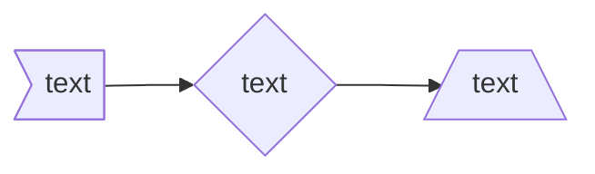
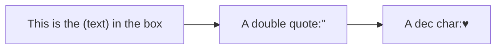
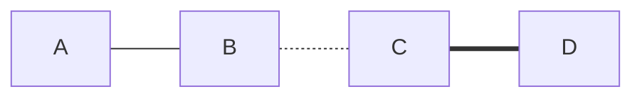
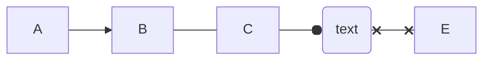
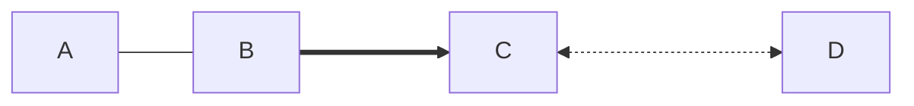
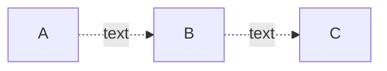
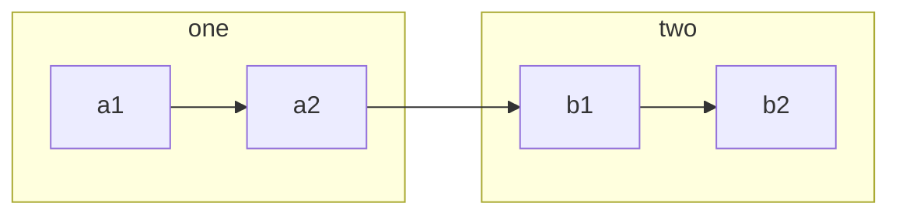
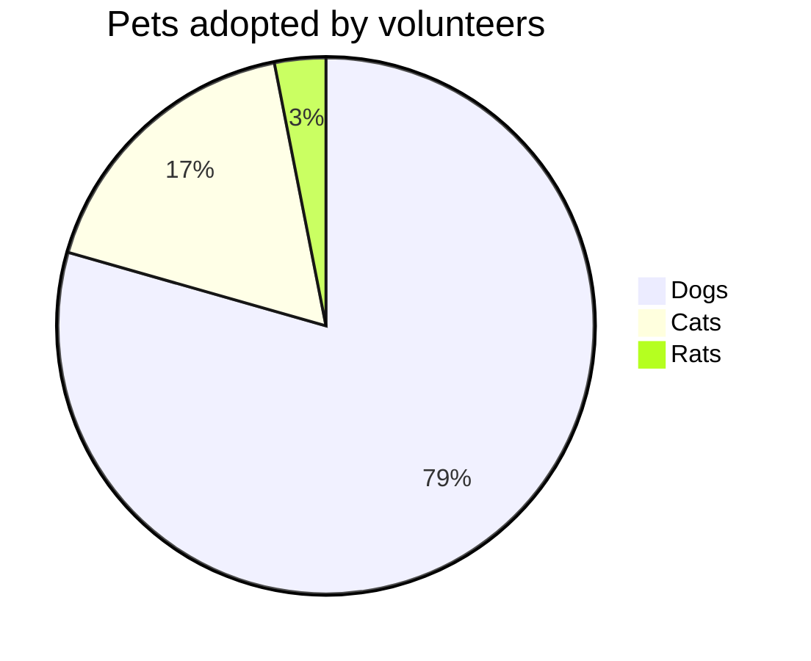

# mermaid语法浅尝
官方文档：[About Mermaid | Mermaid](https://mermaid.js.org/intro/)

mermaid中提供了10+种图形，但一些图形用的比较少。另外奇怪的是，为什么没有提供柱状图和折线图

使用过程中typora经常会报错，但是在idea中又能正常渲染，感觉是版本兼容问题，解决方案：[typora不支持mermaid 问题记录 - 是秃子总会发光- 博客园 (cnblogs.com)](https://www.cnblogs.com/learn-gz/p/17566881.html)

## 一、流程图

流程图使用非常多，当一些逻辑比较复杂时，用一堆文字去描述的效果往往不如一张流程图

使用`flowchart`来定义流程图

### 1.1 绘图方向

| 方向代码 | 方向                  |
| -------- | --------------------- |
| TB       | 从上到下              |
| TD       | 自上而下/与上到下相同 |
| BT       | 从下到上              |
| RL       | 从右到左              |
| LR       | 从左到右              |

示例：LR即从左到右
```
flowchart LR
    Start --> Stop
```


### 1.2 结点形状

在方向示例中可以看到，结点的默认形状是一个矩形，而例如流程图中形状也有不同含义

| 形状代码         | 形状                                      |
| ---------------- | ----------------------------------------- |
| `node`           | 默认矩形，但图形内的文字就是node          |
| `node[text]`     | 矩形，图形内文字为括号[]中的文字          |
| `node(text)`     | 圆角矩形                                  |
| `node([text])`   | 半圆矩阵，即常用的流程图中的开始/结束结点 |
| `node[[text]]`   | 子程序形状                                |
| `node[(text)]`   | 圆柱形状，通常是数据库会使用该形状        |
| `node((text))`   | 圆形                                      |
| `node>text]`     | 不对称形状                                |
| `node{text}`     | 菱形，通常用作流程图中的判断              |
| `node{{text}}`   | 菱边矩形                                  |
| `node[/text/]`   | 平行四边形                                |
| `node[\text\]`   | 反平行四边形                              |
| `node[/text\]`   | 梯形                                      |
| `node[\text/]`   | 倒梯形                                    |
| `node(((text)))` | 双圆                                      |

示例：

```
flowchart LR
	A>text] --> B{text}-->C[/text\]
```



而当文字可能会破坏mermaid语法时，还需要使用兼容语法，即使用引号将文本圈起来：

```
flowchart LR
    id1["This is the (text) in the box"]-->A["A double quote:#quot;"] --> B["A dec char:#9829;"]
```



### 1.3 连接样式

#### 1.3.1 线条样式

线条样式分为3种：实线、虚线和粗实线：

| 线条代码 | 样式   |
| -------- | ------ |
| `A---B`  | 实线   |
| `A-.-B`  | 虚线   |
| `A===B`  | 粗实线 |

示例：

```
flowchart LR
	A---B-.-C===D
```



#### 1.3.2 箭头样式

箭头样式有4种：箭头、无箭头、圆形和x形

| 箭头代码 | 样式   |
| -------- | ------ |
| `A-->B`  | 箭头   |
| `A---B`  | 无箭头 |
| `A--oB`  | 圆形   |
| `A--xB`  | x形    |
| `A<-->B` | 双箭头 |
| `Ao--oB` | 双圆形 |
| `Ax--xB` | 双x形  |



使用中发现，如Dx--xE，并不会解析为双x形，而是会认为Dx是一个结点



示例：

```
flowchart LR
	A-->B---C--oD(text)x--xE
```



#### 1.3.3 线条长度

添加符号数量来增加连接线长度，实线增加`-`，虚线增加`.`，粗实线增加`=`

| 长度           |   1    |    2    |    3     |
| :------------- | :----: | :-----: | :------: |
| 实线           | `---`  | `----`  | `-----`  |
| 带箭头的实线   | `-->`  | `--->`  | `---->`  |
| 粗实线         | `===`  | `====`  | `=====`  |
| 带箭头的粗实线 | `==>`  | `===>`  | `====>`  |
| 虚线           | `-.-`  | `-..-`  | `-...-`  |
| 带箭头的虚线   | `-.->` | `-..->` | `-...->` |

示例：

```
flowchart LR
	A---B===>C<-...->D
```



#### 1.3.4 线条文字

通常连接线上，还需要添加说明文字，按官方文档中有两种写法：

- `A-->|text|B`
- `A--text-->B`

这里我个人感觉使用第一种更清晰一些，因为使用`|`符号来表示文字，而线条的代码照旧。但第二种却需要变化线条的代码，增加了记忆上的难度。

如示例中，展示了带文字的虚线箭头，相比较下第一种写法更简单一些：

```
flowchart LR
	A-.text.->B-.->|text|C
```



### 1.4 子图

当流程图复杂到一定程度后，我们往往会用模块化的思想，将一些结点放在一个大结点中，使得流程图结构更清晰一些。这就是子图，使用`subgraph`来定义子图：

子图之间、各个结点之间乃至子图和结点之间都可以用连接线连接

```
flowchart LR
    subgraph A [one]
    a1-->a2
    end
    subgraph B [two]
    b1-->b2
    end
   	a2-->b1
```



### 1.5 较冷门用法

除了上面这些最基本的绘图语法外，流程图还支持markdown中的粗体、斜体语法，js回调方法以及css样式

日常中应该很少会用到，就不一一记录了，如果以后真的使用到了再行补充

## 二、饼图

使用`pie`定义

```
pie title Pets adopted by volunteers
    "Dogs" : 386
    "Cats" : 85
    "Rats" : 15
```

